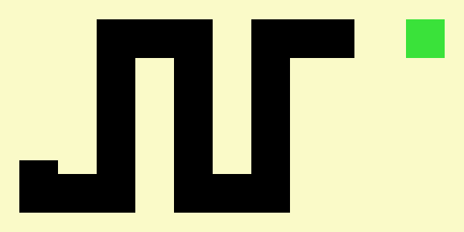
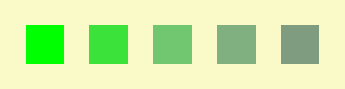
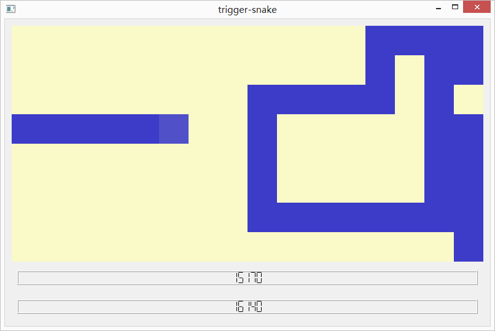

*Trigger snake* is a snake game introducing new features making it fast, lively and challenging. You can <a href="https://github.com/ahstat/trigger-snake/blob/master/release/trigger-snake_win8.zip">download it here (Windows 8)</a>, or compile <a href="https://github.com/ahstat/trigger-snake">C++/Qt4 sources yourself</a>.

Snake is a game concept where player controls a line which increases in size when eating scoring elements. Usually, the line represents a snake and scoring elements are apples. Player loses game when snake hits its own tail. Many versions exist of this classic game, for example Nokia developed a popular version in 1997.

Concept is great, however two drawbacks are recurrent in most versions:
<ul>
<li>
Most of apples do not reward player for quickness. Consequently, a player is not encouraged to consider the torus topology of the board.
</li>
<li>
Gameplay becomes repetitive when the snake has reached a large length. In that case, player must zigzag for a long time, which has nothing fun;
</li>
</ul>

In *trigger snake*, the game is kept as simple as possible without introducing fancy elements. We only add a few features to make the game fast and challenging.

First,

Then,

Finally,

New main features

Statistic features

About programmation and sources

The game can be <a href="https://github.com/ahstat/trigger-snake/blob/master/release/trigger-snake_win8.zip">downloaded here for Windows</a>. If you are interested in the source code, follow <a href="https://github.com/ahstat/trigger-snake">this github link</a>. The game was made with C++/Qt4, so you can compile code to run it with Linux.

