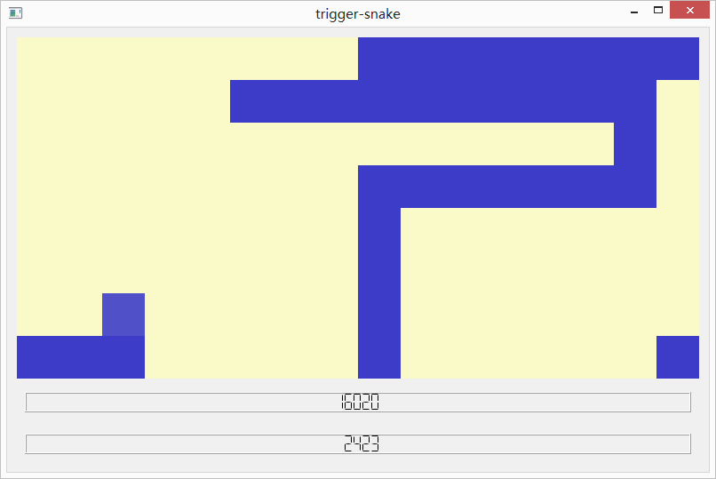
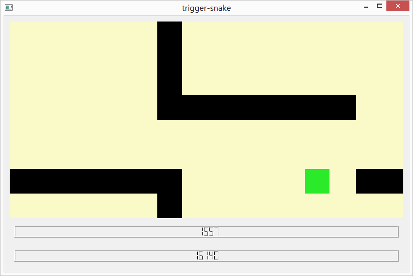
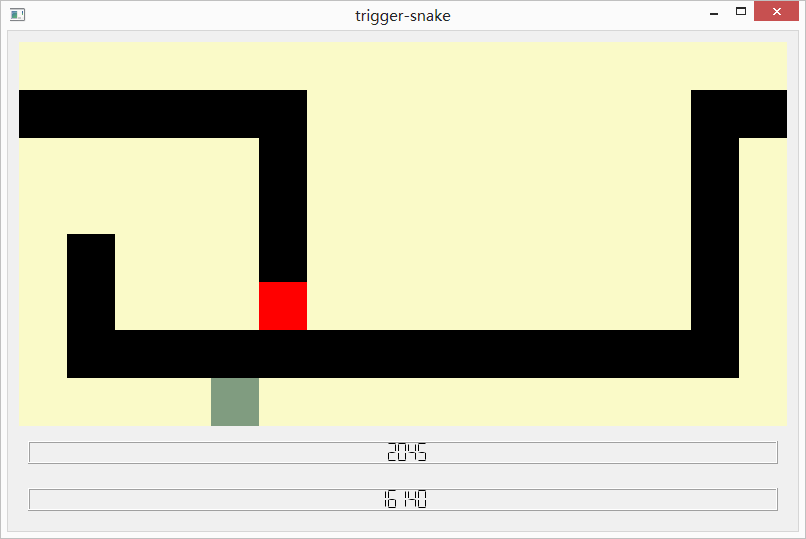
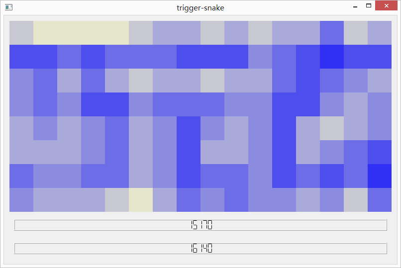
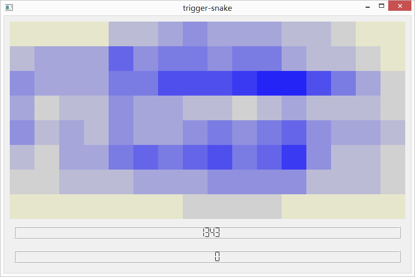
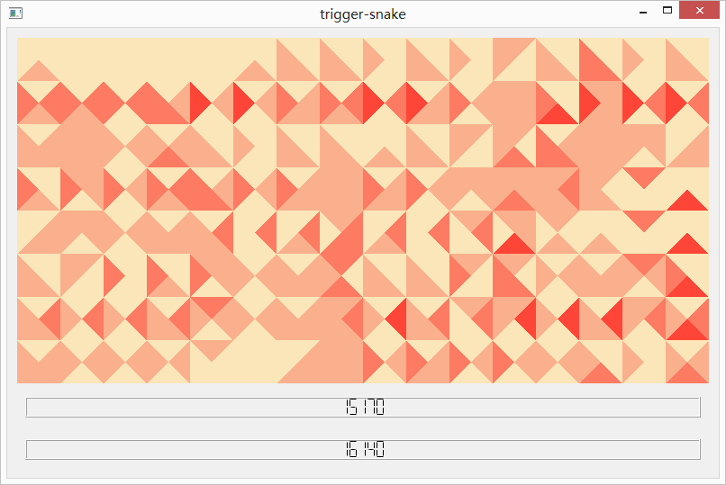
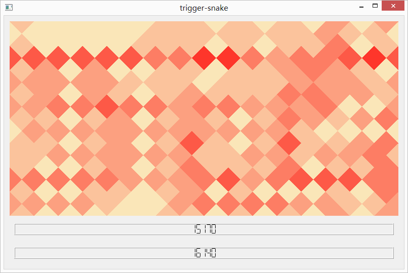
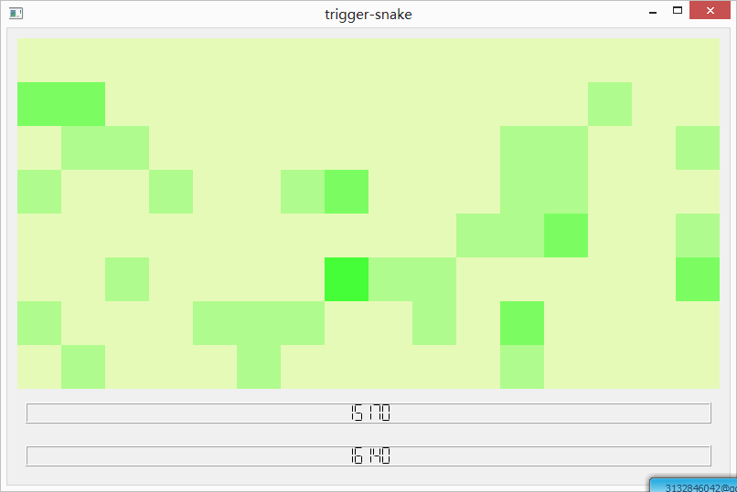

*Trigger snake* is a snake game with new features, making it fast, lively and challenging. You can <a href="https://github.com/ahstat/trigger-snake/raw/master/release/trigger-snake_win8.zip">download it here (Windows)</a>, or compile <a href="https://github.com/ahstat/trigger-snake">C++/Qt4 sources yourself</a>. The software contains a component to display graphical statistics in-game. It can be used to follow player's behavior, for example by showing preference to some regions or directions.

Snake is a game concept where the player controls a line which increases in size when eating scoring elements. Usually, the line represents a snake and scoring elements are apples. Player loses game when the snake hits its own tail. Many versions exist of this classic game, for example Nokia developed a popular version in 1997.

Concept is great, however two drawbacks are recurrent in most versions:
<ul>
<li>
Most of apples do not reward player for quickness. Consequently, a player is not encouraged to consider the torus topology of the board;
</li>
<li>
Gameplay becomes repetitive when the snake has reached a large length. In that case, player must zigzag for a long time, which has nothing fun.
</li>
</ul>

In *trigger snake*, the game is kept as simple as possible without introducing fancy gameplay elements. We only add a few features to make the game fast and challenging.

**Reward for speed.**
There is a reward for speed. The apple appears fresh and green, yielding potentially 100 points. Then, apple begins to fade away, and score slowly decreases. After a while, apple eventually turn into a gray shape making only 1 point. This behavior encourages player to take the shortest path on the torus.

<em>Apple fading away, from 100 points to 1 point</em>

**Score limit.**
The game stops after reaching a score of 3000. This usually prevents the snake to have an unreasonable length. We offer bonus for this performance, based on two components: How much time it took? How many apples have been eaten? If the game was quick enough, final score can attain 15000 or 16000.

<em>End of the game after winning</em>

No more gameplay elements are added.

**In-game pictures.**
Here are two screenshots of the game.

<em>Screenshot of game during a play</em>

 

<em>Screenshot of game after losing</em>

**Statistic component.**
A component allows the player to display various graphical statistics in-game. In all graphs, the darkest color corresponds to the highest value.

*By typing "D"*, density of snake's head positions appears. Good players may show a rather uniform distribution. Novice players tend to stay in the center of the board.

<em>Density of each cell (good player)</em>

 

<em>Density of each cell (novice player)</em>

*By typing E*, density of snake's head directions appears. For each cell, there are four edges represented with four triangles.

<em>Density of directions</em>

*By typing W*, density of non-oriented directions appears. Each edge of the board is represented with a square.

*By typing "A"*, density of apples' positions appears. 

**Sources.**
This game can be <a href="https://github.com/ahstat/trigger-snake/blob/master/release/trigger-snake_win8.zip">downloaded here for Windows</a>. If you are interested in the source code, follow <a href="https://github.com/ahstat/trigger-snake">this github link</a>. The game was made with C++/Qt4, so you can compile code to run it with Linux.
