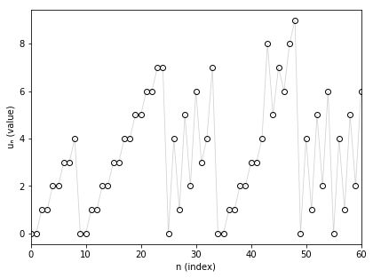

<script src="https://cdn.mathjax.org/mathjax/latest/MathJax.js?config=TeX-AMS-MML_HTMLorMML" type="text/javascript"></script>
The *Nim function for take-a-prime game* is a math sequence with interesting patterns. 
We define this sequence $$(u_n)$$ recursively. For all $$n$$ in $$\mathbb{N}$$ (the set of non-negative integers), $$u_n$$ is the lowest number in $$\mathbb{N}$$ such that for all prime numbers $$p$$ (with $$n-p \geq 0$$), $$u_n \neq u_{n-p}$$.

<center></center>


To understand this definition, we detail how to compute the first terms. For $$n=0$$, no prime number verifies $$n-p \geq 0$$, then $$u_n$$ is the lowest number in $$\mathbb{N}$$ and $$u_0=0$$. We get the same for $$n=1$$ and obtain $$u_1=0$$.

For $$n=2$$, the only prime number $$p$$ which verifies $$n-p \geq 0$$ is $$p=2$$. Then, the condition means that we have to find the lowest number in $$\mathbb{N}$$ which is different from $$u_{n-p} = u_{2-2} = u_0 = 0$$. We finally have $$u_2=1$$.

For $$n=3$$, $$u_3$$ has to differ from $$u_{3-2}=0$$ and $$u_{3-3}=0$$, then $$u_3=1$$.

For $$n=4$$, $$u_4$$ has to differ from $$u_{4-2}=1$$ and $$u_{4-3}=0$$, then $$u_4=2$$.

For now, the sequence doesn't seem very strange. But if we look at the first 100 terms from $$u_0$$ to $$u_{99}$$, we get (I skipped lines to reveal some patterns of the sequence):

```
0, 0, 1, 1, 2, 2, 3, 3, 4, 
0, 0, 1, 1, 2, 2, 3, 3, 4, 4, 5, 5, 6, 6, 7, 7, 
0, 4, 1, 5, 2, 6, 3, 4, 7, 
0, 0, 1, 1, 2, 2, 3, 3, 
4, 8, 5, 7, 6, 8, 9, 
0, 4, 1, 5, 2, 6, 
0, 4, 1, 5, 2, 6, 3, 
4, 7, 5, 8, 4, 10, 5, 7, 6, 8, 
4, 7, 5, 8, 6, 10, 9, 7, 
4, 8, 5, 10, 6, 
0, 4, 1, 5, 2, 6, 
0, 4, 1, 5, 2, 6, 3, 4, 7.
```

We show that the recursion definition of the sequence makes it to adopt some patterns like "0, 4, 1, 5, 2, 6".

To go forward in the computational way, we write a program to obtain a few million terms of the sequence (see <a href="https://github.com/ahstat/nim-take-a-prime" target="_blank">outputs and code in C++ in my github</a>). We can make two interesting conjectures:
<ul>
	<li>First, the proportions of 0, 1, 2, etc. in the sequence (between 0 and an integer N) seem to tend towards constant proportions (as N goes to infinity), as we can see in the following plot.</li>
</ul>

<a href="../images/2014-11-11-Nim-take-a-prime/percent_stack_large.png" target="_blank">

</a>

Legend: stacked plot of proportions to obtain values from 0 to 11 as the length of the sequence increases. The proportions are stacked from 0 to 11: 0 is on the bottom (in dark orange) and 11 is on the top (in pink).

<ul>
	<li>Next, the sequence seems to only take values between 0 and 11. Actually, by showing at the index of the first occurence of values, we speculate that no new value (above 11) appears after the site 156.</li>
</ul>

<table border="0" cellspacing="0" cellpadding="0">
<tbody>
<tr>
<td align="right">value</td>
<td>site of first apparition</td>
</tr>
<tr>
<td align="right">0</td>
<td>0</td>
</tr>
<tr>
<td align="right">1</td>
<td>2</td>
</tr>
<tr>
<td align="right">2</td>
<td>4</td>
</tr>
<tr>
<td align="right">3</td>
<td>6</td>
</tr>
<tr>
<td align="right">4</td>
<td>8</td>
</tr>
<tr>
<td align="right">5</td>
<td>19</td>
</tr>
<tr>
<td align="right">6</td>
<td>21</td>
</tr>
<tr>
<td align="right">7</td>
<td>23</td>
</tr>
<tr>
<td align="right">8</td>
<td>43</td>
</tr>
<tr>
<td align="right">9</td>
<td>48</td>
</tr>
<tr>
<td align="right">10</td>
<td>67</td>
</tr>
<tr>
<td align="right">11</td>
<td>156</td>
</tr>
</tbody>
</table>

From a mathematical perspective, the problem seems really difficult to solve! I went to <a href="https://oeis.org/" target="_blank">the encyclopedia of integer sequences</a> (OEIS) and found the sequence and its name: <a href="https://oeis.org/A014589" target="_blank">Nim function for take-a-prime game</a>.

A common method to go further is to generalize the problem, that is to study the sequence (a Nim function) for each subset of $$\mathbb{N}$$. Some of them are easy to solve (take $$\mathbb{N}$$ as a subset...) and others seems very chaotic (with the set of prime numbers for example). Insights have been done in the dissertation of Achim Flammenkamp (see here, "<a href="https://wwwhomes.uni-bielefeld.de/cgi-bin/cgiwrap/achim/index.cgi#longperiods" target="_blank">Long periods in subtraction games</a>"), where many subsets of $$\mathbb{N}$$ are considered. But I was not able to find more information related to "my" conjectures.

Finally, we can see that if we append the number 1 in addition with the set of the prime numbers, we get a really simple pattern of "0, 1, 2, 3" (and it's easy to prove it).
On the contrary, if we remove 2 of the set of the prime numbers, we still get a sequence with strange patterns (beginning with "0, 0, 0, 1, 1, 1, 2, 2, 2, 3, 0, 3, 4, 1, 4, 3")!
Related contents:
<ul>
	<li>C++ code (with an easy way to change the set of numbers chosen) and R script for plots are <a href="https://github.com/ahstat/nim-take-a-prime" target="_blank">on my github</a>.</li>
	<li>Computations of <a href="https://github.com/ahstat/nim-take-a-prime/tree/master/outputs/primes/nims" target="_blank">the 32452843 first terms of the sequence</a> (i.e. up to the two millionth prime number).</li>
	<li><a href="../images/2014-11-11-Nim-take-a-prime/diss.ps.gz" target="_blank">Dissertation of Achim Flammenkamp</a> (in German), which talks amongst others of the period lengths of those Nim functions (bounds, etc.).</li>
</ul>
