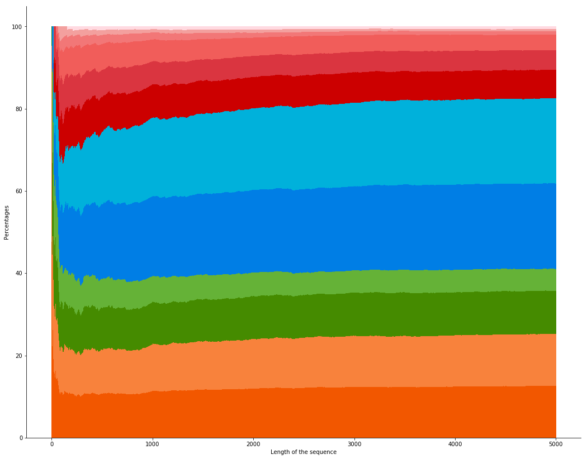

<script src="https://cdn.mathjax.org/mathjax/latest/MathJax.js?config=TeX-AMS-MML_HTMLorMML" type="text/javascript"></script>
The *Nim function for take-a-prime game* is a math sequence with interesting patterns. 
We define this sequence $$(u_n)$$ recursively. For all $$n$$ in $$\mathbb{N}$$ (the set of non-negative integers), $$u_n$$ is the lowest number in $$\mathbb{N}$$ such that for all prime number $$p$$ (with $$n-p \geq 0$$), $$u_n \neq u_{n-p}$$.

<center></center>


To understand this definition, we detail how to compute the first terms. For $$n=0$$, no prime number verifies $$n-p \geq 0$$, then $$u_n$$ is the lowest number in $$\mathbb{N}$$ and $$u_0=0$$. We get the same for $$n=1$$ and get $$u_1=0$$.

For $$n=2$$, the only prime number $$p$$ which verifies $$n-p \geq 0$$ is $$p=2$$. Then, the condition means that we have to find the lowest number in $$\mathbb{N}$$ which is different from $$u_{n¨Cp} = u_{2¨C2} = u_0 = 0$$. We finally select $$u_2=1$$.

For $$n=3$$, $$u_3$$ has to differ from $$u_{3-2}=0$$ and $$u_{3-3}=0$$, then $$u_3=1$$.

For $$n=4$$, $$u_4$$ has to differ from $$u_{4-2}=1$$ and $$u_{4-3}=0$$, then $$u_4=2$$.

For now, this sequence doesn't seem very strange. But if we look at the first 100 terms from $$u_0$$ to $$u_{99}$$, we get (I skipped lines to reveal some patterns of the sequence):

```
0, 0, 1, 1, 2, 2, 3, 3, 4, 
0, 0, 1, 1, 2, 2, 3, 3, 4, 4, 5, 5, 6, 6, 7, 7, 
0, 4, 1, 5, 2, 6, 3, 4, 7, 
0, 0, 1, 1, 2, 2, 3, 3, 
4, 8, 5, 7, 6, 8, 9, 
0, 4, 1, 5, 2, 6, 
0, 4, 1, 5, 2, 6, 3, 
4, 7, 5, 8, 4, 10, 5, 7, 6, 8, 
4, 7, 5, 8, 6, 10, 9, 7, 
4, 8, 5, 10, 6, 
0, 4, 1, 5, 2, 6, 
0, 4, 1, 5, 2, 6, 3, 4, 7.
```

We show that the recursion definition of the sequence makes it to adopt some patterns like "0, 4, 1, 5, 2, 6".

To go forward in the computational way, we write a program to obtain a few million terms of the sequence (see <a href="https://github.com/ahstat/nim-take-a-prime" target="_blank">outputs and code in C++ in my github</a>). We can make two interesting conjectures:
<ul>
	<li>First, the proportions of 0, 1, 2, etc. in the sequence (between 0 and an integer $$n$$) seem to tend towards constant proportions (as $$n$$ goes to infinity), as we can see on the following plot.</li>
</ul>



Legend: stacked plot of proportions to obtain values from 0 to 11 as the length of the sequence increases. The proportions are stacked from 0 to 11: 0 is on the bottom (in dark orange) and 11 is on the top (in pink).

<ul>
	<li>Next, the sequence seems to take only values from 0 to 11. Actually, by showing at the index of the first occurence of values, we speculate that no new value (above 11) appears after the site 156.</li>
</ul>