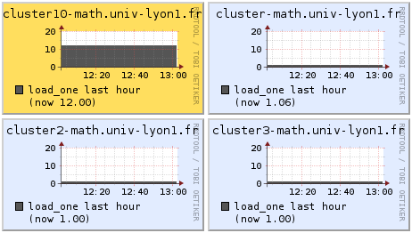

Using a computer cluster to run some program is useful if your program needs:
<ul>
	<li>a large amount of CPU or memory resources,</li>
	<li>to run during a large amount of time.</li>
</ul>
In those cases, you can follow this short tutorial, designed for the <a title="ICJ website" href="http://math.univ-lyon1.fr/" target="_blank" rel="noopener noreferrer">ICJ</a> cluster.

<strong>Step one:</strong> find an available cluster on <a href="http://cluster-math.univ-lyon1.fr/" target="_blank" rel="noopener noreferrer">http://cluster-math.univ-lyon1.fr/</a>.

By clicking on the name of a cluster, you can get more information about the memory and the CPU speed.

You also find how the memory and the CPU are used (for the memory, white and green colours correspond to available memory). For example, we get that about 3GB of memory and 50% of the CPU are used for the cluster 10.

<strong>Step two:</strong> connect yourself to the cluster. Open a terminal and type (where X is the chosen cluster number):
<pre>ssh clusterX-math.univ-lyon1.fr</pre>
You then have to confirm the access and then enter your password. If you are outside the university, you can use this command:
<pre>ssh username@clusterX-math.univ-lyon1.fr</pre>
<strong>Step three:</strong> browse directories to find your program, using "cd", for example:
<pre>cd ~/Desktop/myprogram/</pre>
<strong>Step four:</strong> launch your program. First, you can test that your program runs correctly using:
<pre>./myprogram.exe</pre>
If you want to stop your program before the end, you can break it with "Ctrl+C".

Then, if your program only take a few minutes, you can run it and write the output in output.txt.
<pre>./myprogram.exe >output.txt</pre>
On the contrary, if your program take hours or days, you should use the "nohup" command to allow your program to run only on the cluster.
<pre>nohup ./myprogram.exe &</pre>
With "nohup", you can disconnect yourself from the cluster (typing "exit") and even shutdown your computer.

<strong>Step five:</strong> verify that your program does not use too much memory and CPU. You can check this on <a href="http://cluster-math.univ-lyon1.fr/" target="_blank" rel="noopener noreferrer">http://cluster-math.univ-lyon1.fr/</a>. If a problem occurs, you can "kill" your program. Reconnect on the cluster and then type:
<pre>top</pre>
to show all launched processes on the cluster. Type "u", your username and then "Enter" to find which program you're actually running. Then press "q" to go out.

Find the PID of the problematic program (for example 23927) and kill it with
<pre>kill 23927</pre>
If you want to kill all your programs on the cluster, type
<pre>killall -u username</pre>
Related posts:
<ul>
	<li>More about ssh on <a href="http://www.tuteurs.ens.fr/internet/loin/ssh.html">tuteurs.ens.fr</a> (in french).</li>
	<li>For ICJ users, you can also see <a href="http://math.univ-lyon1.fr/intranet/spip.php?article52">this</a> and <a href="http://math.univ-lyon1.fr/intranet/spip.php?article300">this for Matlab users </a>(in french).</li>
</ul>