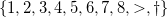

<a title="FlapMMO game" href="http://flapmmo.com/" target="_blank">F</a><a title="FlapMMO game" href="http://flapmmo.com/" target="_blank">lapMMO</a> is an online game similar to Flappy Bird. The player controls a bird and the aim is to fly as far as possible, avoiding the pipes. At the same time, you see other players playing.

In this post, an exploration of a dataset of scores is performed, using descriptive statistics and testing some probabilistic models.

<strong>Retrieving data.</strong> Thanks to the work of <a href="http://t3hz0r.com/post/analysis-flapmmo-attempts" target="_blank">Connor Sauve</a>, it is possible to retrieve the flow of data, which contains for each attempt useful information as:
<ul>
	<li>an id field, which uniquely identify the player,</li>
	<li>a nickname,</li>
	<li>a date,</li>
	<li>a list of dates of jump (from the beginning to the end of the attempt).</li>
</ul>
Finally, I get two datasets:
<ul>
	<li><em>data0</em>, obtained by Connor Sauve on 13 Feb 2014, which contains about 400,000 attempts with more than 18,000 different players,</li>
	<li><em>data1</em>, obtained by myself on 2 Mar 2014, which contains about 100,000 attempts with more than 5,000 players.</li>
</ul>
In the next plots, <em>data1</em> will be used. In the last paragraph, a brief comparison between the two datasets is done.

<strong>Variable of interest.</strong> For each id, I only focus on the successive pipes where the bird bangs. Then, I transform my datasets to obtain something like this:

<table>
<tbody>
<tr>
<th>id</th>
<th style="text-align:left;">attempt 1</th>
<th style="text-align:left;">attempt 2</th>
<th style="text-align:left;">attempt 3</th>
<th style="text-align:left;">attempt 4</th>
</tr>
<tr>
<td>3266</td>
<td style="text-align:left;">2</td>
<td style="text-align:left;">1</td>
<td style="text-align:left;"></td>
<td style="text-align:right;"></td>
</tr>
<tr>
<td>3267</td>
<td>1</td>
<td>6</td>
<td>2</td>
<td>3</td>
</tr>
<tr>
<td>3268</td>
<td>1</td>
<td></td>
<td></td>
<td></td>
</tr>
<tr>
<td>3269</td>
<td>1</td>
<td>1</td>
<td>1</td>
<td></td>
</tr>
<tr>
<td>3270</td>
<td>2</td>
<td>10</td>
<td>5</td>
<td>1</td>
</tr>
</tbody>
</table>

For example, we can see that player with the id 3266 played 2 times. In his first try, his bird banged the second pipe. In his next try, his bird banged the first pipe. Then he stopped to play.

Note that I removed the attempts which do not reach the first pipe.

<strong>How much time each player continues to play?</strong> In the following graph, I plot the frequency of players as a function of the number of attempts.<strong>
</strong>

We observe that most of people only play a few times: 50% of the players play 10 times or less, and 75% of the them try less than 25 attempts.

From this plot, we deduce the probability that a player plays again as a function of the number of attempts done.

This plot suggests that the more a player tries the game, the more he continues to play. It might reveal that the game is addictive.

<strong>How far each player go?</strong> The next descriptive graph represents the frequency of players as a function of the pipe reached in their best play.<strong>
</strong>

Here, we observe that most players are able to pass a pipe, but 50% of them don't reach the fifth pipe and 75% lose before the eighth pipe. It is noteworthy that someone reached the 140th pipe (outside of the graph).

<strong>Evolution of the score between two consecutive tries.</strong> Knowing the score (the pipe where the bird bangs) of a player for an attempt, we want to infer the score of the next try. For this purpose, we use a homogeneous Markov model. This is a simplistic model, because the next score may depend on all the history of scores (not a one step Markov model), and on the number of attempts the player has already done (not a homogeneous model).

An empirical transition matrix is obtained, where each cell  represents the probability that a player who scores  in a try will score  in the next try. Only 10 states are kept:

.

Here '' represents a score greater than 8 and '' means that the player stopped to play.
The matrix is given by:

For example, the probability that a player who scores 1 in a try will score 6 in the next try is 0.02=2%. The probability that a player who scores greater than 8 will leave the game is 0.09=9%.

From this matrix, we represent the probability to score 1 (respectively to score greater than 8) in the next try as a function of the current try.

We deduce that players who score high for a try tend to score high in the next try, and <a href="http://www.youtube.com/watch?v=ZTeqM5gciH8" target="_blank">vice versa</a>. Then, this game is not a random game.

Also from the matrix, we plot the probability to leave the game as a function of the current try.

Thus, people who reach great scores are more likely to leave the game.

<strong>Skill of players.</strong> Now, we take players individually and for each of them, we want to measure his skill. Letting  the players, we only make the following assumption:

"when the bird of the player k is in front of a pipe, it dies with probability ".

Then for the player , each score follow a geometric distribution (on ) with rate . After estimation of the rates for all players, we plot the histogram of rates for players who make more than 30 attempts.

 

The distribution of rates is not uniform and most of players (with more than 30 attempts) have a rate around 0.5.

Note that the geometric hypothesis was tested with the Cramer-von Mises test, and for almost all the players, the hypothesis of geometric distribution could not be rejected with this test (even for players who play many times).

<strong>Evolution of the skill.</strong> The previous model could not exhibit the evolution of the skill when a player is making many attempts. To fix that, we modify the previous assumption by:

"when the bird of the player  is in front of a pipe, letting  the number of attempts already done by the player, it dies with probability ".

We use a <a title="convolution is used to smooth functions" href="http://en.wikipedia.org/wiki/File:Convolution_of_box_signal_with_itself2.gif" target="_blank">uniform convolution</a> to estimate each rate . Then, for players who make many attempts, we can observe if their skills increase well or not. Here the plots for players 1725, 1433 and 4147.

Player 1725 begins without knowing how to play and then constantly improves his performance.

Player 1433 knows how to play, and his skill improvment is slow.

Player 4147 played many times but its skill remains more or less constant.

<strong>Comparison between <em>data0</em> and <em>data1</em>.</strong> The shape of all plots looks similar, except that in data1 the skill of players is greater.

Related contents:
<ul>
	<li><a href="http://t3hz0r.com/post/analysis-flapmmo-attempts" target="_blank">Connor Sauve</a> post, about how to retrieve data.</li>
	<li>How <a href="http://sekati.com/etc/install-nodejs-on-debian-squeeze" target="_blank">to install node.js on Debian</a>.</li>
	<li>How <a href="http://fr.openclassrooms.com/informatique/cours/des-applications-ultra-rapides-avec-node-js" target="_blank">to use node.js</a>. (in French)</li>
	<li>How <a href="http://tuts.syrinxoon.net/tuts/installation-et-bases-de-mongodb" target="_blank">to install and use MongoDB</a>. (in French)</li>
	<li>How<a href="http://cwbuecheler.com/web/tutorials/2013/node-express-mongo/" target="_blank"> to use MongoDB for node.js</a>.</li>
</ul>
<ul>
	<li>An article performing <a href="http://www-ljk.imag.fr/SMS/ftp/BraCreGau02.pdf" target="_blank">a comparative study of goodness-of-fit tests for the geometric distribution</a>.</li>
	<li>How to obtain <a href="http://math.stackexchange.com/questions/647845/95-confidence-interval-for-geometric-distribution" target="_blank">confidence intervals for the rate of a geometric sample</a>.</li>
	<li><a href="http://vserver1.cscs.lsa.umich.edu/~crshalizi/weblog/491.html" target="_blank">Be cautious with log/log graphs</a> and fitting...</li>
</ul>
Data:
<ul>
	<li><a href="http://ahstat.free.fr/4-flappy/data0.tar.gz" target="_blank">data0</a>,</li>
	<li><a href="http://ahstat.free.fr/4-flappy/data1.tar.gz" target="_blank">data1</a>.</li>
</ul>
Requests:
<ul>
	<li>How to find reasonable ways to fit my plots of sections "How much time each player continues to play?", "How far each player go?" and "Skill of players" ?</li>
</ul>