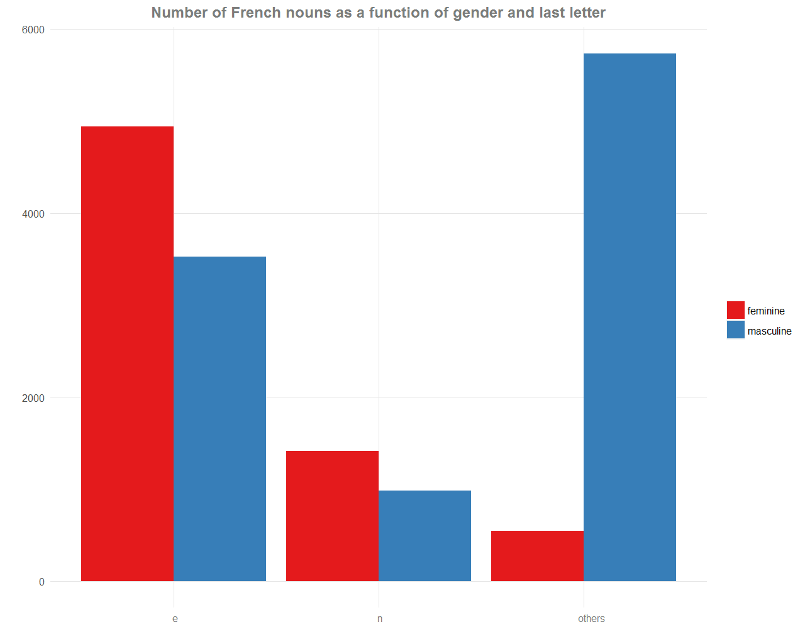
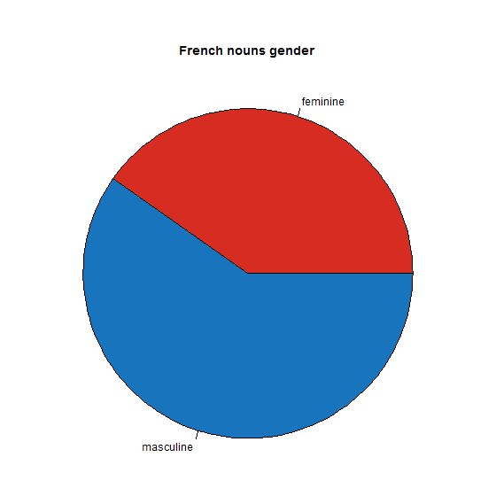
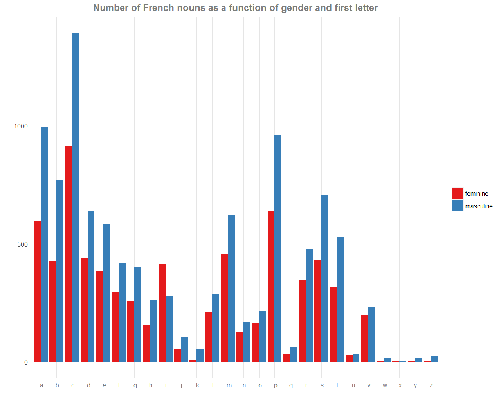
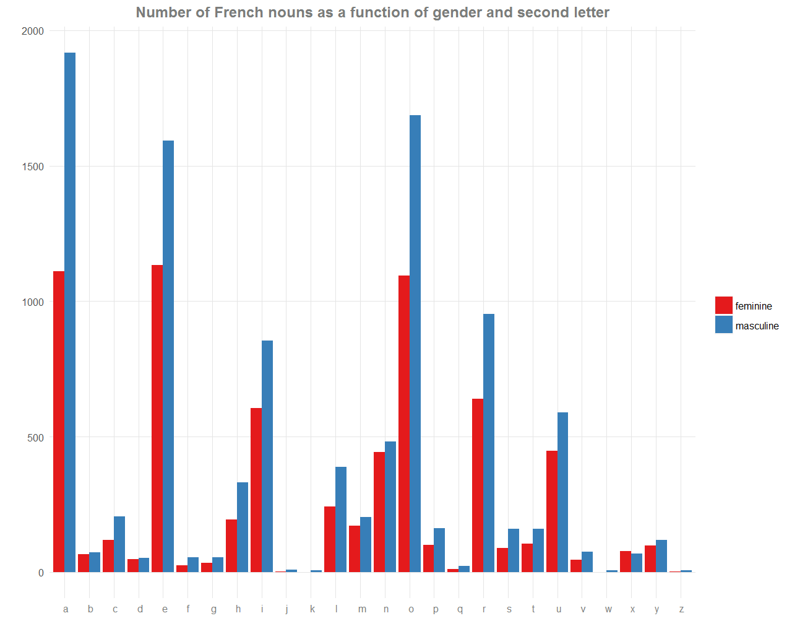
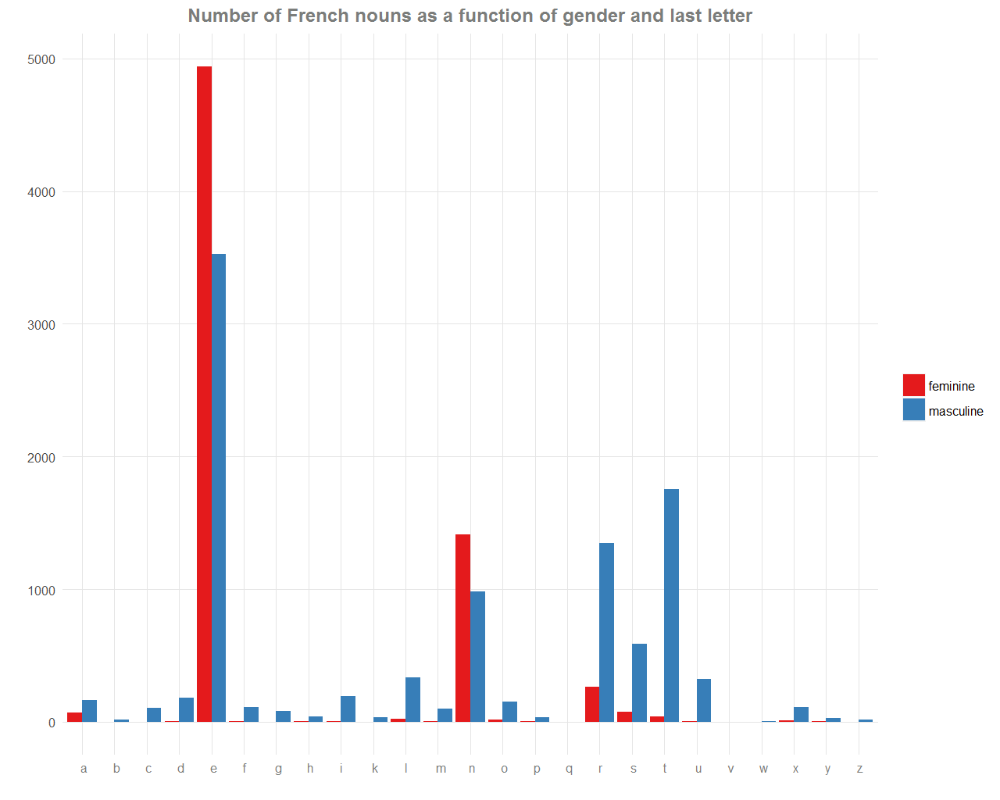
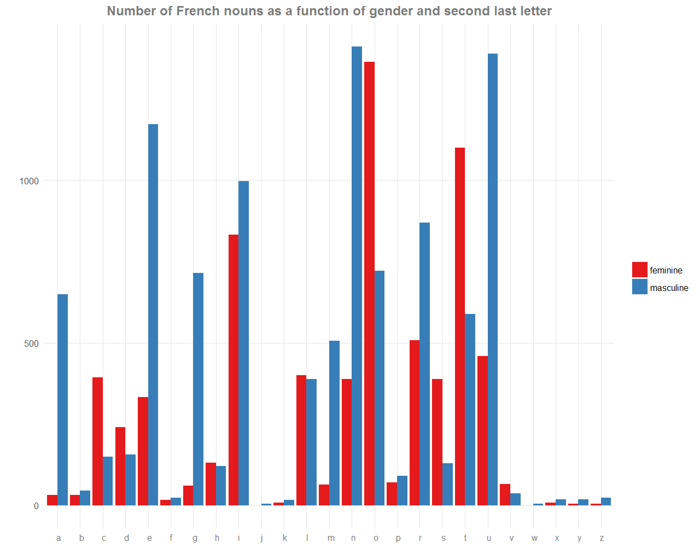

Like other Romance languages, French nouns are divided in two almost distinct genders: feminine and masculine. Deciding the gender of a word is not obvious. For example, a table is feminine (“une table”) but an acid is masculine (“un acide”).

On the following plots, we check out the distribution of the gender across the letters. We then learn a simple tip to choose the gender of an unknown noun.

We first draw with a pie chart the general repartition of the gender from 17147 nouns of a French dictionary.

We observe that there are slighty more masculine nouns (about 60/40) in the French language. To go further, let’s plot the distribution of the gender across the first letter of each noun. Click to enlarge the plot.

It is not really informative for our purpose, except for the letter ‘i’ where contrary to the global trend, there are more feminine nouns.

We may try for the second letter of each noun by plotting similar barplots. Click to enlarge the plot.

But, this isn’t really good too… We only check that because most of nouns begin with a consonant, the second letter is often a vowel.

Another approach, more fruitful, is to see the distribution by taking the last letter of each word. Click to enlarge the plot.

This approach seems better, because most of the feminine nouns end by “e” or “n”. Furthermore, they are more feminine nouns ending with “e” and “n” than masculine nouns.

Taking only the letters where at least 2000 nouns end, we obtain this cool plot. Click to enlarge the plot.

An easy tip to guess the gender of a French noun which is not ending by “e” or “n” is then to say that it is masculine.

Okay, this is not a rule, and some common words break this tip: the forest, the sea, the mouse (“la forêt”, “la mer”, “la souris”). However, this is simple to remember and to try!

More generally, if we have to guess the gender of a French unknown noun, we might say that it is feminine if the last letter is “e” or “n” (with no really good expectation), and masculine else.

We can build more complex rules. For example, when we see the distribution for the second last letter, we can understand that the nouns ending by “on” or “te” are mostly feminine. Click to enlarge the plot.

More complicated patterns can be found and have been found, but they become difficult to learn, see <a href="http://www.fourmilab.ch/francais/gender.html" target="_blank">here</a>, <a href="http://french.about.com/od/grammar/a/genderpatterns.htm" target="_blank">here</a> and <a href="http://www.french-linguistics.co.uk/grammar/le_or_la_in_french.shtml" target="_blank">here</a>.

Finally, a well prospect could be to try to draw the distribution for other languages. I give all the code I used to make those plots <a href="https://github.com/ahstat/gender-french-nouns" target="_blank">here</a> (coded in R).

Related posts:
<ul>
	<li>The dictionary was downloaded from this website: <a href="http://www.webcontentspinning.com/langage/" target="_blank">webcontentspinning</a>. Some mistakes appear in the words, such as wrong diacritics, but it seems correct.</li>
	<li>A gif on <a href="../images/2014-4-11-Gender-french-nouns/data-ink.gif" target="_blank">how to improve visualisation</a>, from the <a href="http://darkhorseanalytics.com/blog/data-looks-better-naked/" target="_blank">Darkhorse Analytics blog</a>,</li>
	<li>An opinion about <a href="http://www.businessinsider.com/pie-charts-are-the-worst-2013-6" target="_blank">why pie charts are the worst</a>.</li>
</ul>