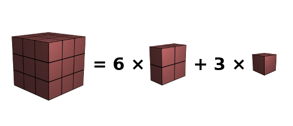

How to make a 3×3×3 cube with six 2×2×1 cuboids and three 1×1×1 cubes, i.e. to show the following "equation"? You can move them, change their orientation, but splitting is not allowed.

Related sites:
<ul>
	<li><a href="https://www.experiencingmaths.org/" target="_blank">Experiencing mathematics</a>,a good website with initiations to many fields of mathematics. You can play this cube problem in the section "filling space", subsection "complex problems", but it's more fun to play with real cubes,</li>
	<li>How <a href="https://www.gimptalk.com/index.php?/topic/49179-3d-realistic-rubiks-cube-tutorial/" target="_blank">to make 3D cubes with GIMP</a>.</li>
</ul>
