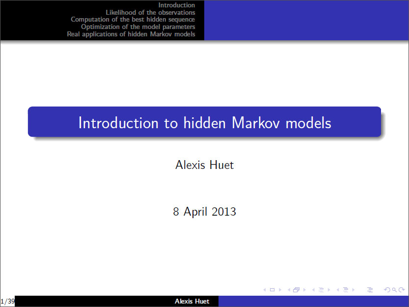

Here is my slides of a talk given for doctoral students in 2013. It is an introduction to hidden Markov models (on finite state spaces), following the <a href="../images/2014-6-11-Introduction-hmm/rabiner1989tutorial_hmm.pdf" target="_blank">tutorial of L. R. Rabiner</a>.

I explain what is a hidden Markov model and what are common issues with these objects. Then, some algorithms are taken into consideration: Forward decomposition, Viterbi algorithm and a simple EM algorithm.

Those algorithms are illustrated step by step through the following homemade toy example: a consumer walks everyday between three places A, B and a shopping center C. A marketer, standing at C, only gets a noisy information about the position of the consumer. He tries to identify where the consumer is located.

For the slides 32 and 34, green point is true parameters (used to simulate the sequence of hidden states), blue point is estimated parameters (on a grid) and red points are those obtained with the EM algorithm (from different initial conditions).

Related content:
<ul>
	<li><a href="../images/2014-6-11-Introduction-hmm/rabiner1989tutorial_hmm.pdf" target="_blank">A Tutorial on Hidden Markov Models and Selected Applications in Speech Recognition, L. R. Rabiner, 1989</a>.</li>
</ul>