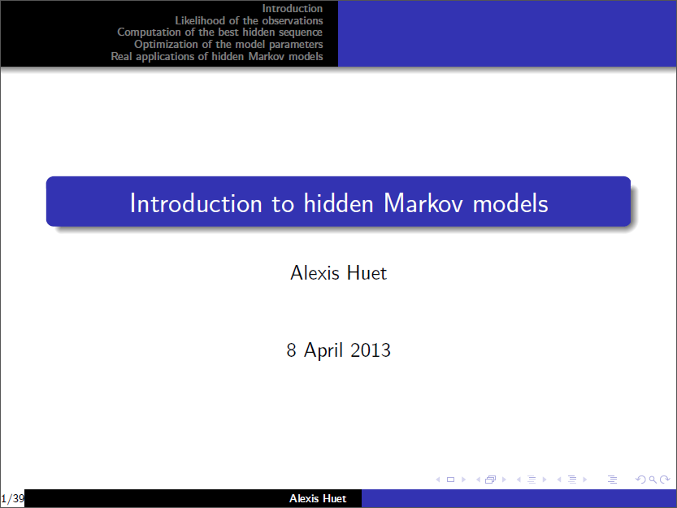

This is a draft in progress.

## General idea as a mixture

## Case in $$\mathbb{R}^n$$

Let $$g$$ a function on $$\mathbb{R}^{+}$$ such that $$g(0) = 0$$.
Possibly the derivative of a density function, for example the density of a Gaussian distribution.
Let $$x_1, \ldots, x_m \in \mathbb{R}^n$$ points of the space.
Let $$\tau_1, \ldots, \tau_m \in \lbrace -1, 1 \rbrace$$ the type of each point.
Let $$\upsilon_1, \ldots, \upsilon_m \in \lbrace -1, 1 \rbrace$$ the densitype of each point.

### Action of the points on $$x_i$$

Consider $$x_i$$ one of the points. We can look at the vector space centered on it, so $$x_i$$ is our new origin $$O$$: The position of $$x_j$$ as seen by $$x_i$$ is $$x_j - x_i$$ (* this is Log function)

The unit vector from $$x_i$$ to $$x_j$$ is $$(x_j - x_i) / \| x_j - x_i \|$$.

We define the force of the action as proportional to $$g$$ of the distance between $$x_i$$ and $$x_j$$ i.e.  $$g(\| x_j - x_i \|)$$.

We also multiply by $$\upsilon_j$$ the densitype of $$x_j$$.

Finally, the action of $$x_j$$ on $$x_i$$ is given by:

$$\upsilon_j \times g(|| x_j - x_i ||) \times (x_j - x_i) / || x_j - x_i ||.$$

The global action of all the points is given by:

$$\frac{1}{n} \sum_{j=1}^{n} \upsilon_j \times g(|| x_j - x_i ||) \times (x_j - x_i) / || x_j - x_i ||.$$

Note that in this formula we let the action of $$i$$ on itself at $$0$$. This is why $$g(0)$$ must be $$0$$.
Better, we would like $$x \times g(|| x ||) / || x || --> 0$$ when $$|| x || --> 0$$, so
$$g(|| x ||) --> 0$$ when $$|| x || --> 0$$

The global action with $$\tau_i$$ is given by:

$$F_i := \tau_i \times \frac{1}{n} \sum_{j=1}^{n} \upsilon_j \times g(|| x_j - x_i ||) \times (x_j - x_i) / || x_j - x_i ||.$$

If we take $$\tau = \upsilon = 1$$, and $$f$$ is a density function, interpretation as a mixture, and the movement is for each point to follow the resulting density function.

### Movement

Let $$\alpha > 0$$ as small as possible the speed rate and $$N$$ a number of steps.

$$x_i$$ was one of the points. We looked at the vector space centered on it, so $$x_i$$ was our origin $$O$$: The position of $$x_i$$ after applying $$F_i$$ is $$x_i + \alpha F_i$$ (** this is Exp function).

We do it for all points and we get one step. We repeat this $$N$$ times.

## Todo

$$\mathbb{R}^n$$ can be easily a field $$K$$, $$\mathbb{C}^n$$, or $$\mathbb{H}^n$$?

$$\tau, \upsilon$$ can easily lives in the scalar $$K$$, not only $$\lbrace -1, 1 \rbrace$$?

In the general case, ok with the sphere, but in general the maps Exp, Log are local only, must sum over all possible paths? Etc not so straightforward.
Better only to get $$2$$ cases (Euclidian and spherical).
Here: https://ronnybergmann.net/mvirt/manifolds/Hn.html Very good to get Euclidian, sphere, hyperbolic, and we can see how to do torus.

Look the EDO linked with those steps, not so difficult:
+: close to what is done, so allows to compare dynamic systems and see if it already exists. Possible to solve it in special cases!
-: probably cannot be solved in general

## General case

Let $$M$$ be a Riemannian manifold like $$\mathbb{R}^n$$ or $$\mathbb{S}^{n-1}$$.

We are able to compute the exponential map locally. 
https://math.stackexchange.com/questions/2538499

https://fr.wikipedia.org/wiki/Vari%C3%A9t%C3%A9_riemannienne
https://en.wikipedia.org/wiki/Riemannian_manifold
https://en.wikipedia.org/wiki/Geodesic
https://math.stackexchange.com/questions/1708146/shortest-path-between-two-points-on-a-surface
topology/dim

Df (or multiple Df?)

init / number of elements

types / densitypes / Nsteps / alpha

Description:

#[0,pi[ --> [0,+inf[
#x |--> tan(x/2)
x = seq(from = 0, to = pi, length.out = 1000)
plot(tan(x/2), tan(-sin(x)/2), xlim = c(0,20))

y = tan(x/2)
plot(y, tan(-sin(2*atan(y))/2), xlim = c(0,20))
plot(y, tan(-y/(1+y^2)), xlim = c(0,20))
lines(y, -y/(1+y^2), xlim = c(0,20), col = "blue")

