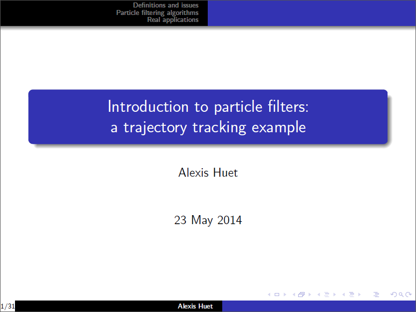

Those slides are an introduction to particle filters, with an homemade example of trajectory tracking. The presentation has been given in 2014 for the <a href="https://interactions14.sciencesconf.org/" target="_blank">Colloque Inter’Actions 2014</a>.

Source code of simulations are available <a href="https://github.com/ahstat/introduction-particle-filters">on my github</a>.

In the slides, I describe two important algorithms for particle filtering: the Sequential Importance Sampling algorithm (SIS) and the Sequential Importance Sampling Resampling algorithm (SISR). The example intends to show how the algorithms work, and to focus on the difference between them, especially through the weights degeneracy problem.

I think it’s preferable to have read <a href="https://ahstat.github.io/Introduction-hmm/">the previous presentation (on discrete hidden Markov models)</a> before this one (on continuous hidden Markov models).

Related contents:
<ul>
	<li>O. Cappé, E. Moulines, and T. Rydén. Inference in hidden Markov models. Springer, 2005.</li>
	<li><a href="../images/2014-7-11-Introduction-particle-filters/arulampalam2002tutorial_particle_filters.pdf" target="_blank">M. S. Arulampalam, S. Maskell, N. Gordon, and T. Clapp. A tutorial on particle filters for online nonlinear/non-gaussian Bayesian tracking. IEEE Transactions on Signal Processing, 2002</a>.</li>
	<li><a href="../images/2014-7-11-Introduction-particle-filters/gordon1993_particle_filters.pdf" target="_blank">N. J. Gordon, D. J. Salmond, and A. F. Smith. Novel approach to nonlinear/non-Gaussian Bayesian state estimation. IEE Proceedings F, 1993</a>.</li>
</ul>
