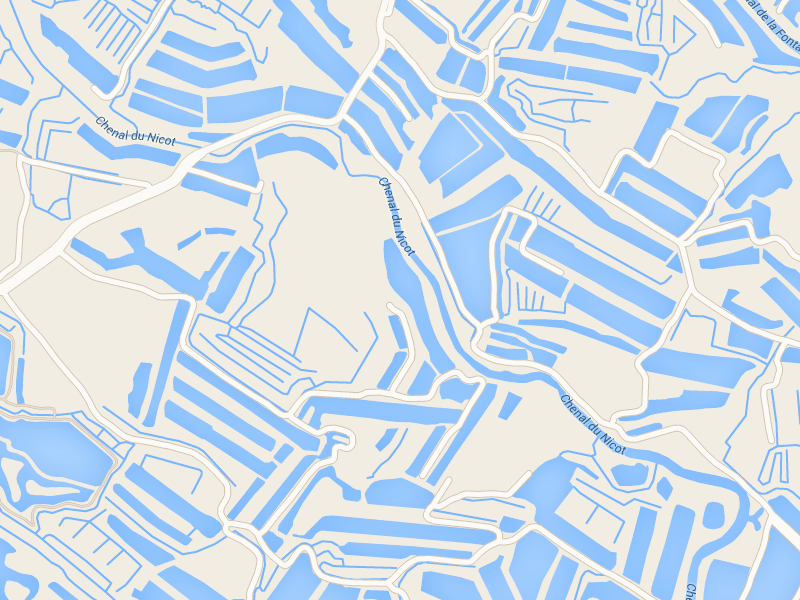
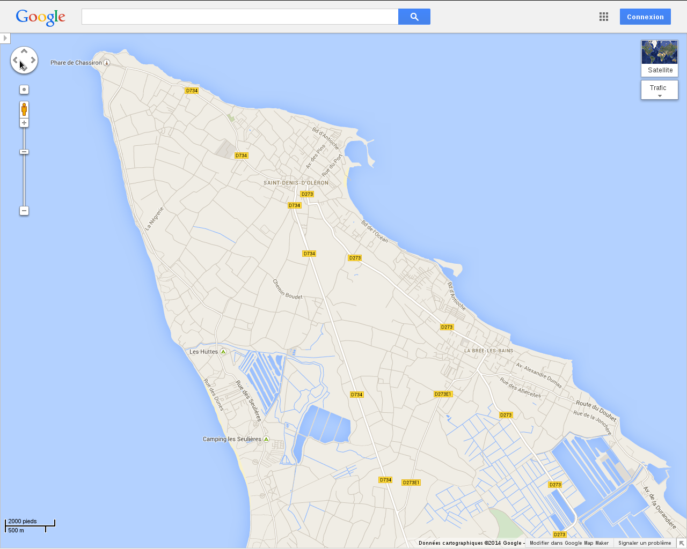
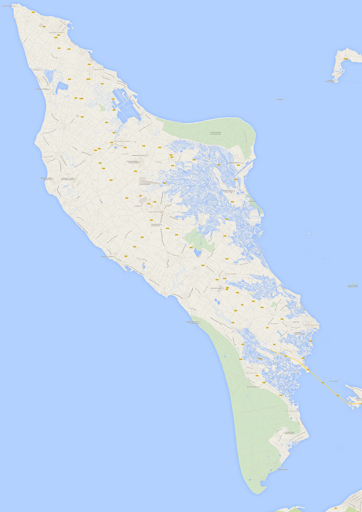

Sikuli is a software controlling your keyboard/mouse devices in order to do some automatic tasks. It works on all platforms and is available <a href="http://www.sikuli.org/" target="_blank">here</a>.

In the sequel, I show an example to collect images from Google Maps and make a map from them. The aim is to draw <a href="http://www.ile-oleron-marennes.com/" target="_blank">a French island, l’île d’Oléron</a>.




Such a software is useful when those tasks cannot be done through an <a href="https://en.wikipedia.org/wiki/Application_programming_interface" target="_blank">API</a> (e.g. for flash websites); or when you don’t want to learn an API (e.g.for a single work).

**1 – Sikuli script.** I launch Google Maps and set my position where I want to begin the map.



Then, I use Sikuli to make print screens and to click on the arrows, using the following code (the written language is Python).

    horizontal = 4
    vertical = 5
    for x in range(vertical):
        type(Key.PRINTSCREEN)
        for y in range(horizontal-1):     
            click(1409401927009); click(1409401927009)
            sleep(2)
            type(Key.PRINTSCREEN)
        for y in range(horizontal-1):
            click(1409401945762); click(1409401945762)        
        click(1409395141546); click(1409395141546); click(1409395141546)
        sleep(2)
    for x in range(vertical):
        click(1409404805602); click(1409404805602); click(1409404805602)


ddd


 `horizontal = 4`
 `vertical = 5`
 `for x in range(vertical):`
 `    type(Key.PRINTSCREEN)`
 `    for y in range(horizontal-1):`
 `        click(``); click(``)`
            sleep(2)
            type(Key.PRINTSCREEN)`
			

A`horizontal = 4`
A`vertical = 5`
A`for x in range(vertical):`
A`    type(Key.PRINTSCREEN)`
A`    for y in range(horizontal-1):`
A`        click(``); click(``)`
A           sleep(2)
A           type(Key.PRINTSCREEN)`


```
    horizontal = 4
    vertical = 5
    for x in range(vertical):
        type(Key.PRINTSCREEN)
        for y in range(horizontal-1):     
            click(); click()
            sleep(2)
            type(Key.PRINTSCREEN)
        for y in range(horizontal-1):
            click(); click()        
        click(); click(); click()
        sleep(2)
    for x in range(vertical):
        click(); click(); click()
```

		
kfkfkffkfk (you are reading this??)


```
<pre>horizontal = 4
vertical = 5
for x in range(vertical):
    type(Key.PRINTSCREEN)
    for y in range(horizontal-1):     
        click(<a href="https://ahstat.files.wordpress.com/2014/09/1409401927009.png"></a>); click(<a href="https://ahstat.files.wordpress.com/2014/09/1409401927009.png"></a>)
        sleep(2)
        type(Key.PRINTSCREEN)
    for y in range(horizontal-1):
        click(<a href="https://ahstat.files.wordpress.com/2014/09/1409401945762.png"></a>); click(<a href="https://ahstat.files.wordpress.com/2014/09/1409401945762.png"></a>)        
    click(<a href="https://ahstat.files.wordpress.com/2014/09/1409395141546.png"></a>); click(<a href="https://ahstat.files.wordpress.com/2014/09/1409395141546.png"></a>); click(<a href="https://ahstat.files.wordpress.com/2014/09/1409395141546.png"></a>)
    sleep(2)
for x in range(vertical):
    click(<a href="https://ahstat.files.wordpress.com/2014/09/1409404805602.png"></a>); click(<a href="https://ahstat.files.wordpress.com/2014/09/1409404805602.png"></a>); click(<a href="https://ahstat.files.wordpress.com/2014/09/1409404805602.png"></a>)

</pre>
```

**2- Rename, crop and merge.** I take all the screens and rename them with R:

    my_list = list.files()
    file.rename(my_list, paste0(1:length(my_list), ".png"))

Then I cut the borders with Image Magick:

    mogrify -crop 768x867+75+65 *.png

Finally, I merge images with Image Magick:

    montage -mode concatenate -tile 4x5 *.png output.png

**3- Final output** (click to enlarge, 3Mo).

<a href="../images/2014-9-11-Sikuli/oleron1.png" target="_blank"></a>

Related contents:
<ul>
	<li>the <a href="http://www.sikuli.org/" target="_blank">webpage of the Sikuli project</a>.</li>
	<li>the <a href="../images/2014-9-11-Sikuli/oleron2.png" target="_blank">Oléron map in hi-res</a> (10Mo file).</li>
</ul>