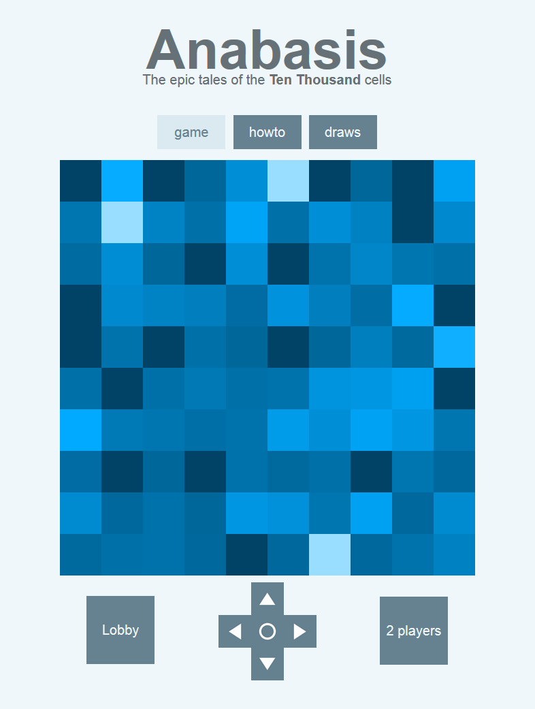

*Anabasis* is a webapp where players can draw collaborative paintings. Each draw stands on a board containing ten thousand cells. Every player contributes at the same time on the same drawing. When a player clicks on a dark cell, it transforms to a light cell.

The work is finished when one special cell among ten thousand has been found. At this moment, the lucky player can choose the name of the draw. Finished artworks are therefore available in the draws section.

Click on the screen to launch the game in your browser. The loading may take some seconds.

This app follows <a href="https://ahstat.github.io/Bankvault/" target="_blank">Bankvault webapp</a> and shares a great part of the code. I released the whole source of Anabasis <a href="https://github.com/ahstat/anabasis" target="_blank">in my github</a>!