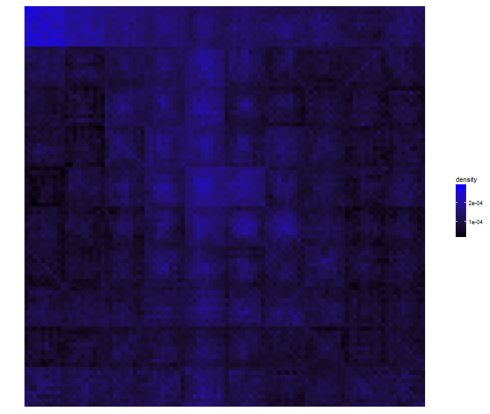
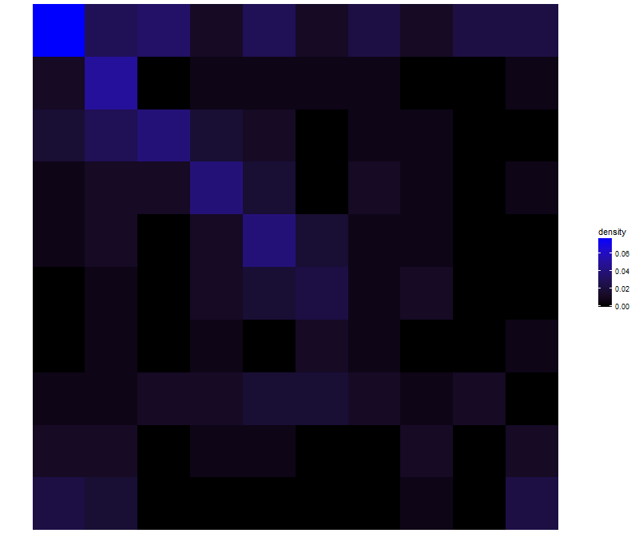
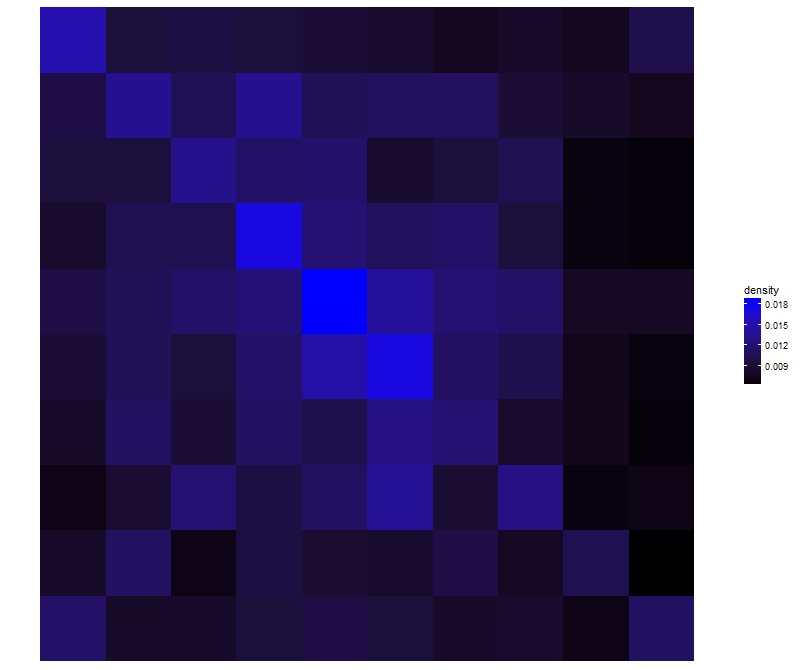
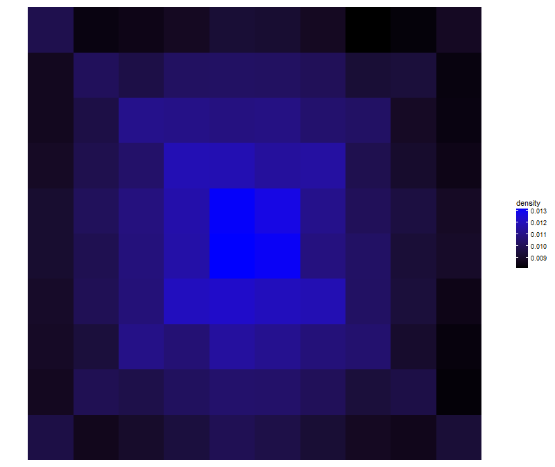
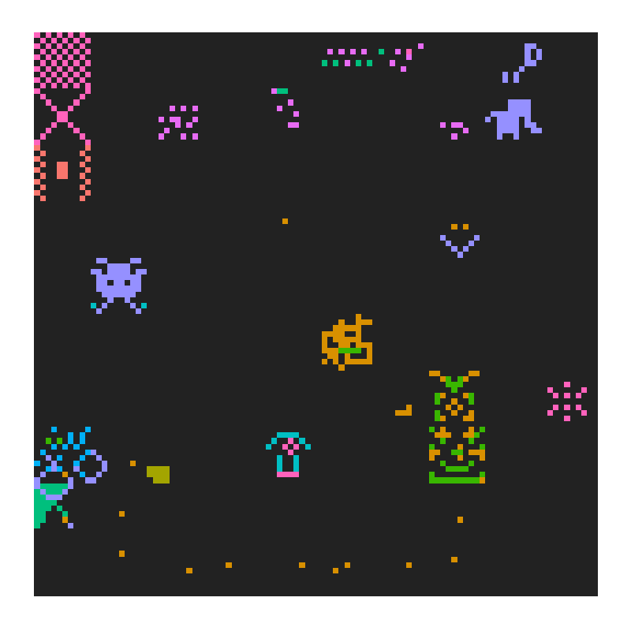
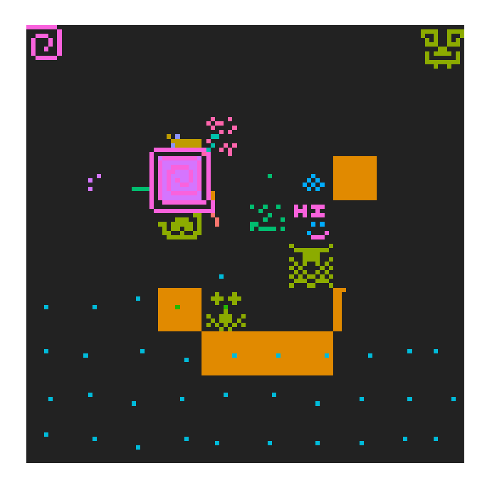
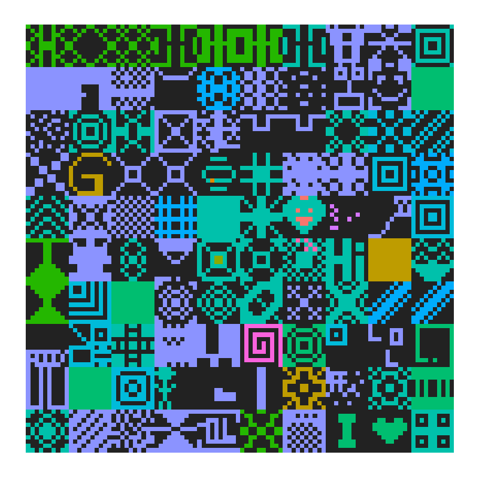

*Anabasis* is a webapp where players can draw collaborative paintings. Each draw stands on a board containing ten thousand cells. Every player contributes at the same time on the same drawing. When a player clicks on a dark cell, it transforms to a light cell.

The work is finished when one special cell among ten thousand has been found. At this moment, the lucky player can choose the name of the draw. Finished artworks are therefore available in the draws section.

Click on the screen to launch the game in your browser. The loading may take some seconds.

This app follows <a href="https://ahstat.github.io/Bankvault/" target="_blank">Bankvault webapp</a> and shares a great part of the code. I released the whole source of Anabasis <a href="https://github.com/ahstat/anabasis" target="_blank">in my github</a>!

In this post, we explore data collected with the app. 144674 records have been retrieved consisting of date, picture number, cell position and user id. First, we get density plots to know where players prefer to click. Then, we show how players share the work together on some selected pictures.

**Where players prefer to click in the whole area?**

For each drawing, we collect the first 5000 cells discovered and obtain density plot of cells:

If cells were selected uniformly, each one should have density of 1e-4. We observe that densities for cells in the top-left room are mostly over 2e-4. The rooms located in the first row have many cells with density over 1e-4, with a progressive fading over columns. Middle-left (5th) column has higher densities compared to middle-right (6th) column. Concentric circles from the center with decaying densites seem appearent. Finally, cells located in rooms in middle-left and middle-right have lower densities (under 1e-4), especially for column 1, 2 and 9.

**Where players prefer to click click inside a room?**

For each drawing, we collect the first cells discovered. We obtain density plots of each cell inside a room. If cells were selected uniformly, each should have density of 0.01.

Legend: Density plot inside a room where data are the first 5 cells of each drawing.

When a player arrives in a room, there is a strong preference for selecting top-left cell, and then drawing a diagonal towards the center.

Legend: Density plot inside a room where data are the first 100 cells of each drawing.

After 100 cells discovered (among 10000), density concentrates on the center cells and on diagonals.

Legend: Density plot inside a room where data are the first 5000 cells of each drawing.

When many cells have been discovered, concentric circles from the center with decaying densites clearly appear, with a preference for diagonals and the middle cross cells (columns and rows 5 and 6).

**How players share the work**

The following pictures show four draws where one color is assigned to (almost) one id. I let you observe them.

Work 1: ""

Work 9: "anonymous"

Work 25: "anonymous"

Work 29: "FINALLY"

I hope you have enjoyed this content! If you decide to modify or build a new app from my code, please let me in touch!

Related content:
<ul>
	<li>Some players informed me there was a game from Peter Molyneux with a related concept and called <a href="https://en.wikipedia.org/wiki/Curiosity_%E2%80%93_What%27s_Inside_the_Cube%3F" target="_blank">Curiosity – What's Inside the Cube?</a>.</li>
	<li>Plots in this post have been done with ggplot, code is available <a href="https://github.com/ahstat/warehouse/blob/master/Anabasis_ggplot.R" target="_blank">here</a>.</li>
</ul>

