And then:

And then:

So blablabla

About rules,

&nbsp;&nbsp;&nbsp;&nbsp;&nbsp;&nbsp;&nbsp;&nbsp;&nbsp;&nbsp;&nbsp;

&nbsp;&nbsp;&nbsp;&nbsp;&nbsp;&nbsp;&nbsp;&nbsp;&nbsp;&nbsp;&nbsp;
&nbsp;&nbsp;&nbsp;&nbsp;&nbsp;&nbsp;

Ok
and then can get results

Better rendering with Firefox over Chrome...

For SP

And for RL

And for SR

And for SL

And with translated SP

And with translated RL

And with translated SR

And with translated SL

And evolution for one SP

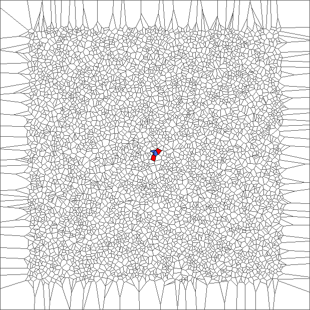
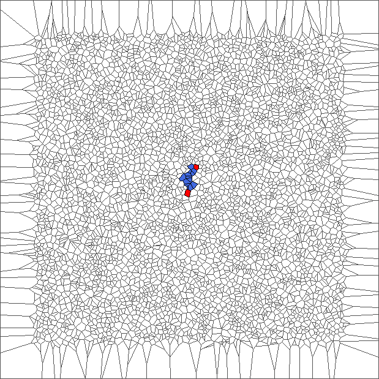
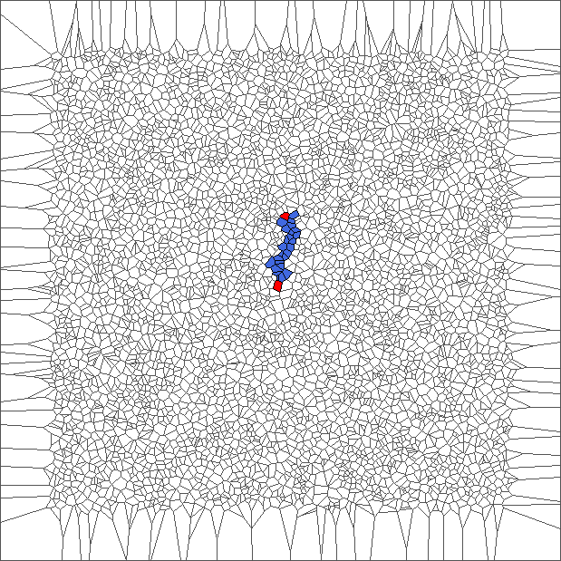
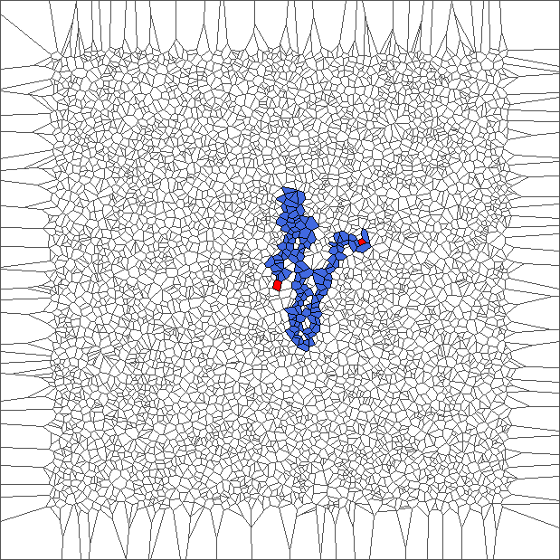
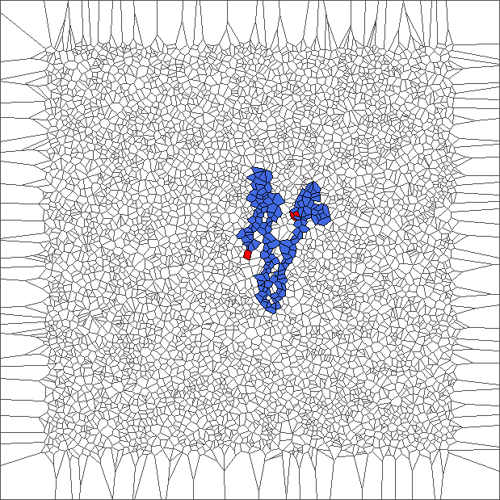
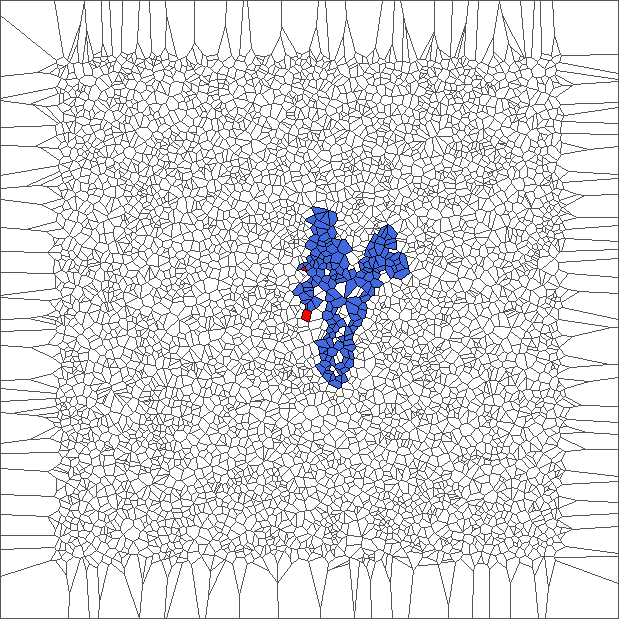
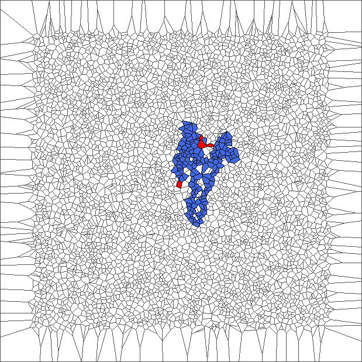
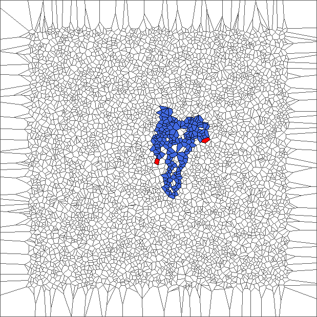
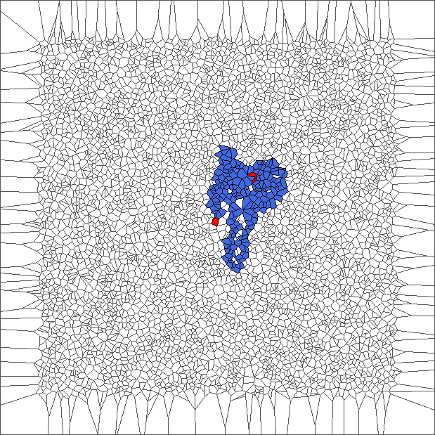
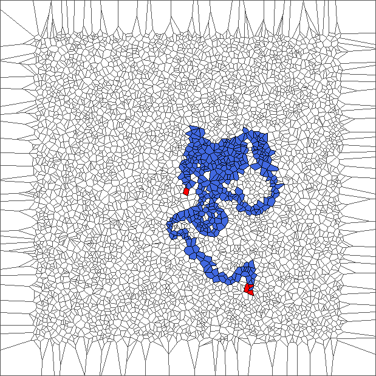

And evolution for one RL

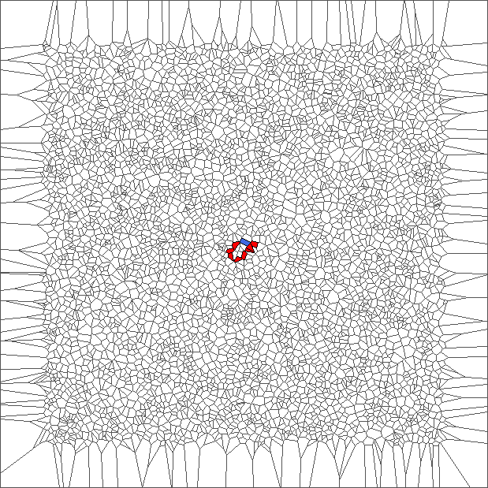
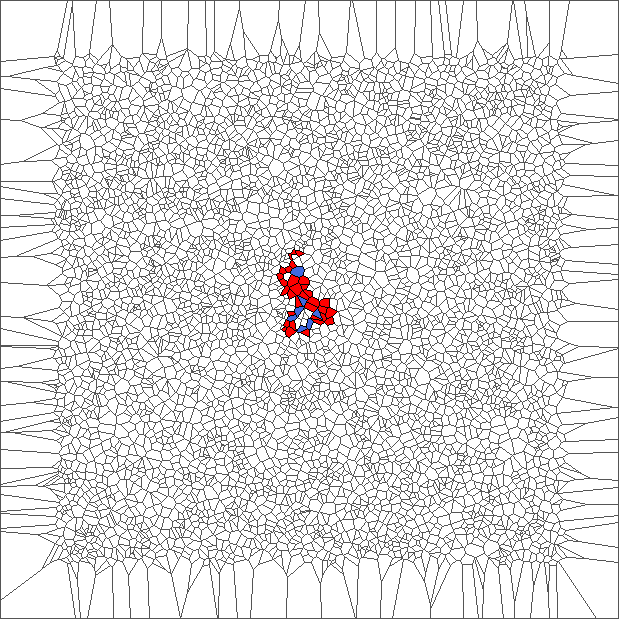
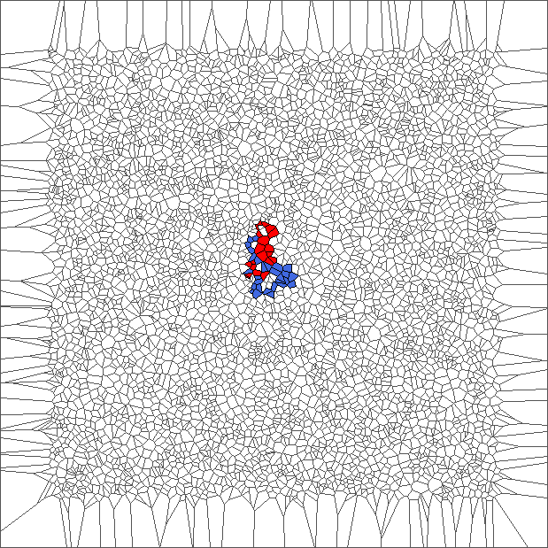
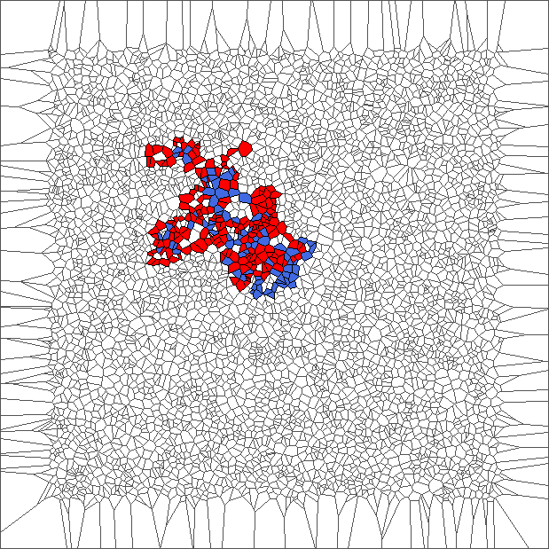
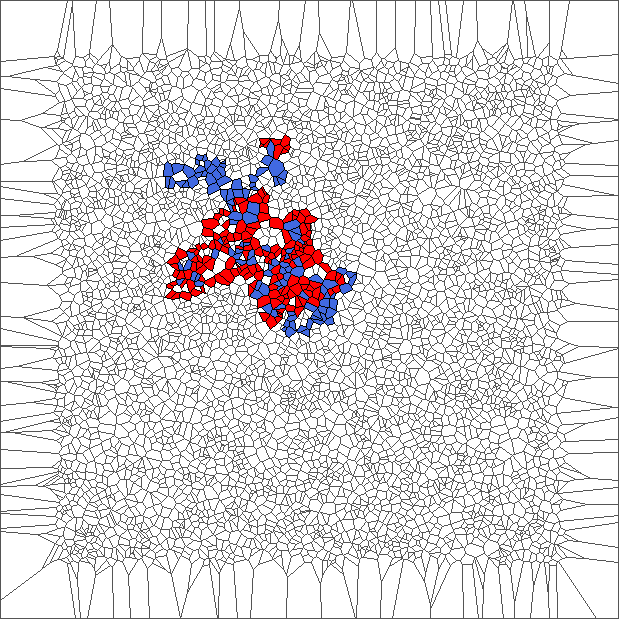
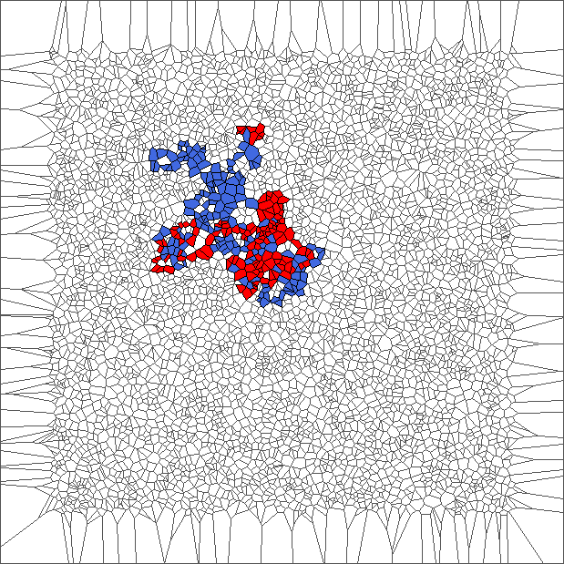
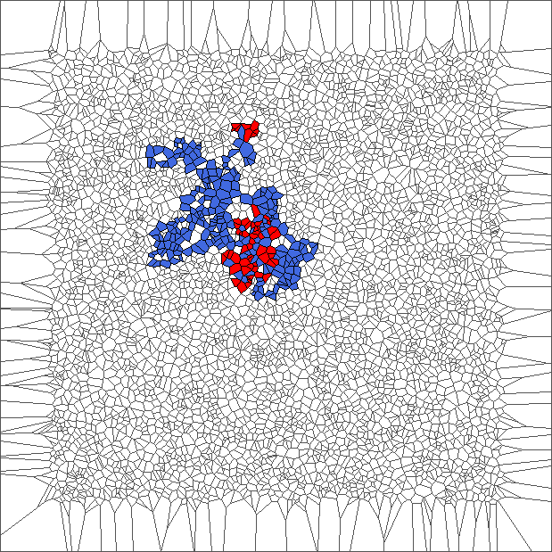
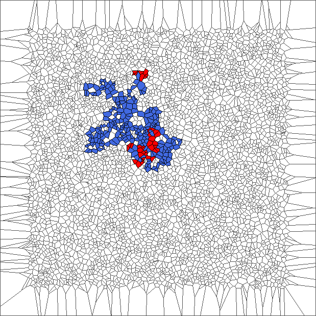
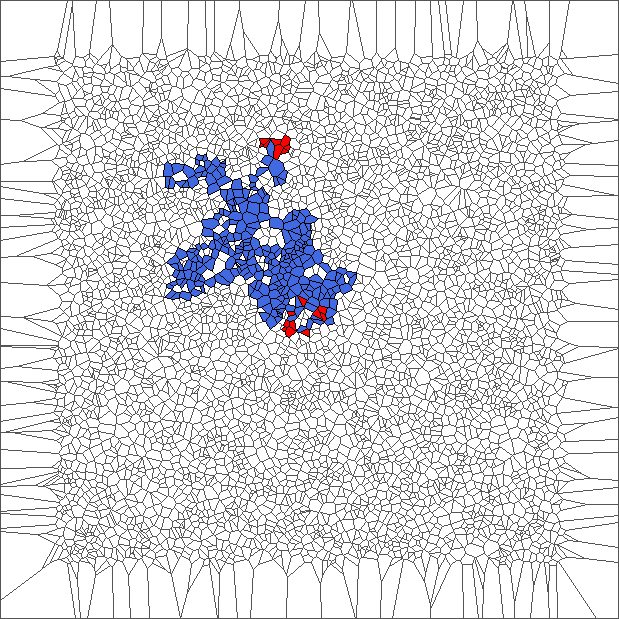
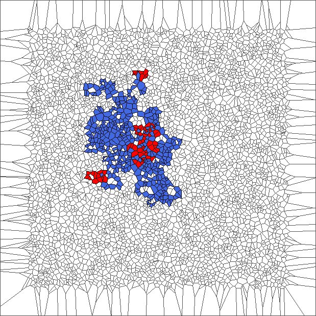

