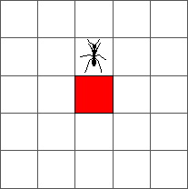
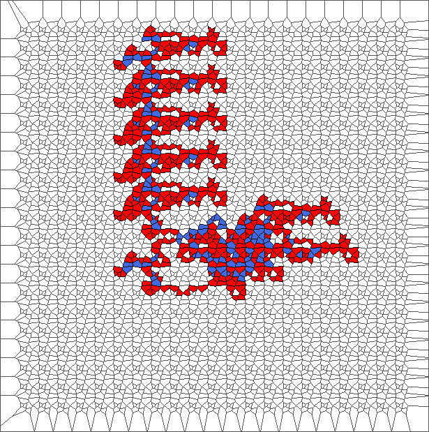
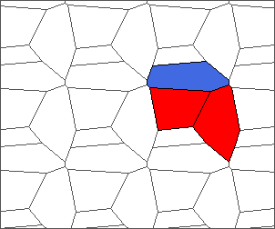
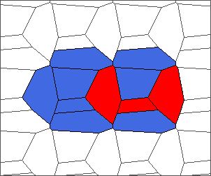
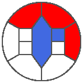
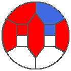
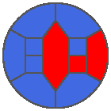

Langton's ant is a cellular automaton driven by a simple set of rules and running on a square lattice. It is one of the most simple system leading to an emergent behavior. In this post, the system is extended to run on any Voronoi tessellation of the plane. Simulations show interesting walks for some partitions of the plane, including chaotic structures, highway patterns and even bounded evolutions.

**Remind of classic Langton's ant**

Langton's ant runs on a square lattice. Initially, all cells are white and we place an ant on a square. At each step, the ant moves according to the following rules:

* If the cell is white or blue: Turn to the right, color current cell in red, and move forward;

* If the cell is red: Turn to the left, color current cell in blue, and move forward.

That's all! 
Here is the evolution of the ant from an initial configuration to step one:

And from step one to step two:

The ant goes round until reaching a red cell at step 4. At that step, the ant turns to the left:

During the ten first steps, the ant draws a simple pattern: 

The ant continues to draw symmetric or almost symmetric patterns during the first hundred steps. After step 500, the ant begins to adopt a chaotic behavior. The following pictures represent steps 10, 50, 100, 500 and 1000:

This chaotic behavior continues during ten thousand steps. After that, the ant starts building a regular pattern of 104 steps called "highway" and walking to infinity. The following pictures represent steps 1000, 5000, 10000 and 11565:

**Extension to Voronoi tesselations**

Given a finite set of points of the plane, we apply a <a href="https://en.wikipedia.org/wiki/Voronoi_diagram" target="_blank">Voronoi teselation</a> with Euclidian distance. We obtain a partition of this plane into convex polygonal cells.

Each cell can have a more than four edges, which means more possible directions. We define the following ones: backward (B), starboard (S), right (R), forward (F), left (L), and port (P). When the cell is a pentagon or an octagon, we obtain respectively:

&nbsp;&nbsp;&nbsp;&nbsp;&nbsp;&nbsp;&nbsp;&nbsp;&nbsp;&nbsp;&nbsp;

&nbsp;&nbsp;&nbsp;&nbsp;&nbsp;&nbsp;&nbsp;&nbsp;&nbsp;&nbsp;&nbsp;
&nbsp;&nbsp;&nbsp;&nbsp;&nbsp;&nbsp;

Here is the definition for a general polygon. Given previous cell and current cell, we obtain the direction of the ant (red arrow) and of the last edge crossed (bold edge). Relative to this direction, we number edges from 1 to E (where E is the number of edges of the current cell). B is edge 1; S is edge 2; R is the median edge minus one; F is only defined for even polygons and is the median edge; L is the median edge plus one; P is the last edge. 

For example, each cell of the classic Langton's ant is driven by alterning "going right" (R) and "going left" (L). We summarize this scheme using the word RL. Note that in this case, since each cell has four edges, the rules SP, RL, SR and SL are all identical.

**Nine trajectories for each rule**

For each simulation of a trajectory, we sample 5000 points in a unit square from uniform distribution; Obtain a Voronoi tessellation from them; Define an initial configuration of the ant; And compute evolution during 1000 steps (or until reaching a border of the area).

We plot 9 pictures for each rule SP, RL, SR and SL. Each picture represents the state after the evolution. Those pictures help to understand the different kind of behavior of the ant.

*Evolution with SP rule*

The ant circles forward and draws snake patterns. Cells where the ant has traveled are all in blue, except for the initial cell and for the last cells.

*Evolution with RL rule*

The ant initially makes circles and builds complex patterns (in red), before to backtrack a large part of the trajectory (in blue). This is caused by the symmetry between direction R and L, and can be shown through the large areas in red and blue.

*Evolution with SR rule*

The ant really wants to turn to starboard, but makes a lot of chaotic circles, generally in an increasing area.

*Evolution with SL rule*

The rule is asymmetric but keeps balance between moving to the left and to the right. Pictures show chaotic trajectories.

**Nine trajectories for each rule with translated tesselations**

To simulate regular tilings, we sample a limited number of points in a unit square, translate these points in all directions, and obtain a Voronoi tessellation from them. Then we proceed as in the last section. Trajectories exhibit three kinds of behavior: chaotic structures, highway patterns and bounded evolutions.

*Evolution with SP rule and a translated tesselation*

*Evolution with RL rule and a translated tesselation*

*Evolution with SR rule and a translated tesselation*

*Evolution with SL rule and a translated tesselation*

**A bounded trajectory with a period of 48 steps**

After computing trajectories for a lot of tilings, we observe that some evolutions are bounded. 

The following example is the smallest bounded trajectory obtained until now with the rule SP. It has a period of 48 steps, so it is called "SP48". It can be reduced to a graph with 20 vertices, 30 edges and 12 faces... Maybe a dodecahedron?
Here are the 50 first steps from 1 to 50 (there are some small edges):

I like the previous version of SP48 because some figures appear such as a turtle, a pelican and a dog (can you see them?). However, some edges are small to check. Here is a clear version of SP48.

Some questions arise from this example: Can we get a number of steps lower than 48 for this rule? Can we get a bounded trajectory for all rules?

**Front cover images**

Front set of pictures shows a bounded trajectory describing a ring, computed with rule SP and plotted at steps 1, 10, 20, ..., 90, 100, 200, ..., 500.

**References**
- I discovered Langton's ant from <a href="https://www.youtube.com/watch?v=qZRYGxF6D3w" target="_blank">this nice video of David Louapre (in French)</a>
- Experience hexagonal Langton's ant online in <a href="https://brtmr.de/2015/10/05/hexadecimal-langtons-ant-2.html" target="_blank">this post of Bastian Reitemeier</a>. I took the same notations to name the directions.
- Code and outputs are available <a href="https://github.com/ahstat/langton-voronoi" target="_blank">on my github</a>
- <a href="https://en.wikipedia.org/wiki/Langton%27s_ant" target="_blank">Wikipedia page</a> describing Langton's ant and some extensions.