Here blabla

And then:

And then:

So blablabla

About rules,

&nbsp;&nbsp;&nbsp;&nbsp;&nbsp;&nbsp;&nbsp;&nbsp;&nbsp;&nbsp;&nbsp;

&nbsp;&nbsp;&nbsp;&nbsp;&nbsp;&nbsp;&nbsp;&nbsp;&nbsp;&nbsp;&nbsp;
&nbsp;&nbsp;&nbsp;&nbsp;&nbsp;&nbsp;

Ok
and then can get results

Better rendering with Firefox over Chrome...

For SP

And for RL

And for SR

And for SL

And with translated SP

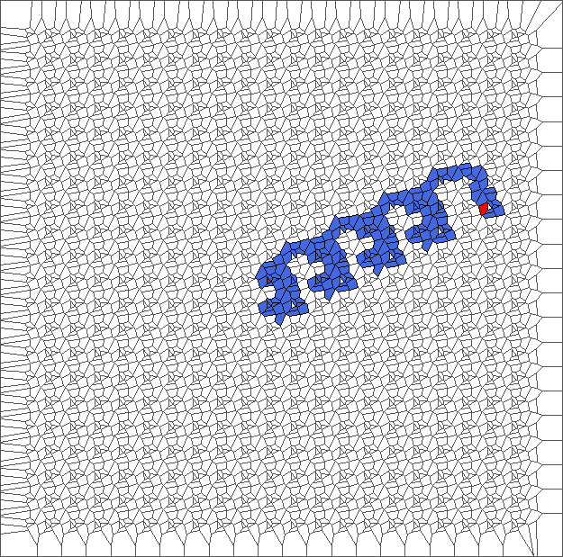

And with translated RL

And with translated SR

And with translated SL

And evolution for one SP

And evolution for one RL

And evolution for one SR

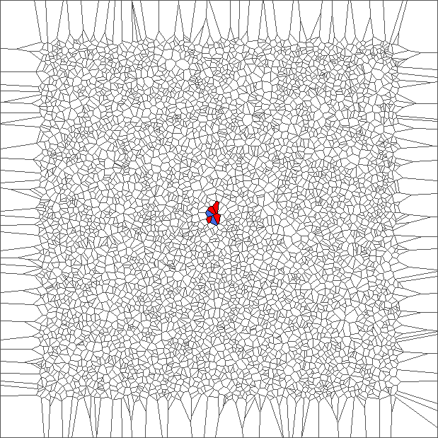
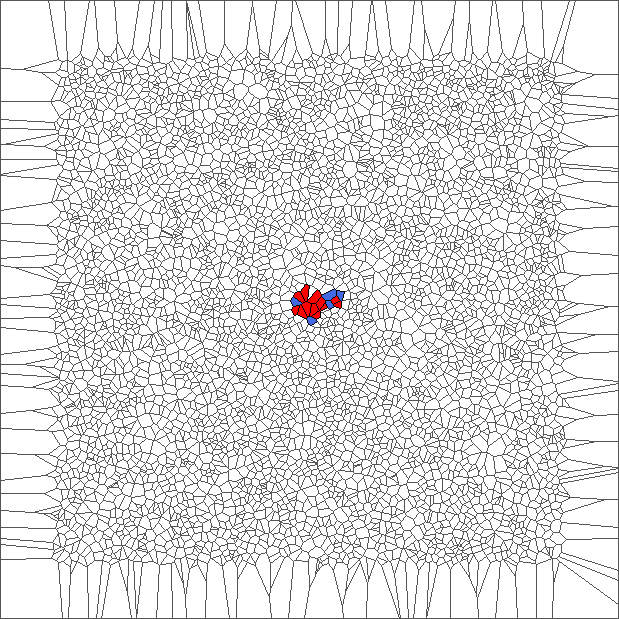
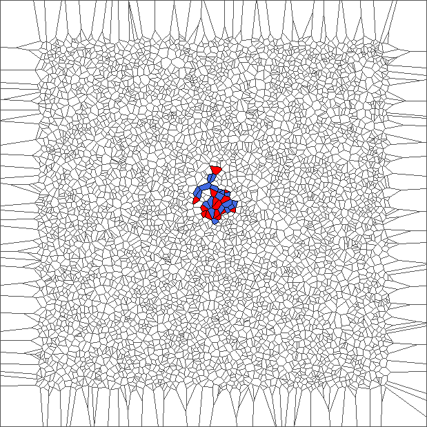
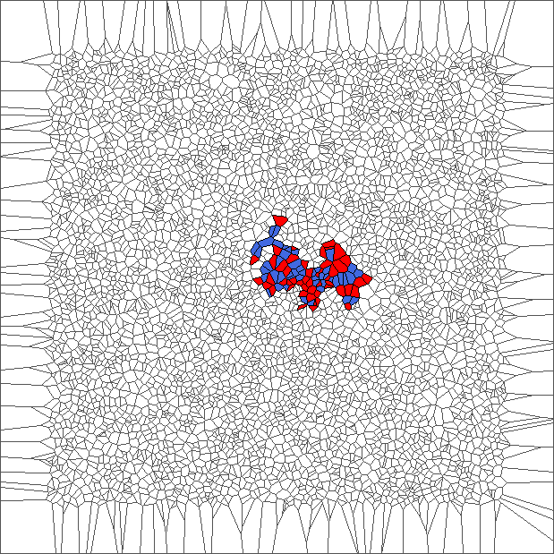
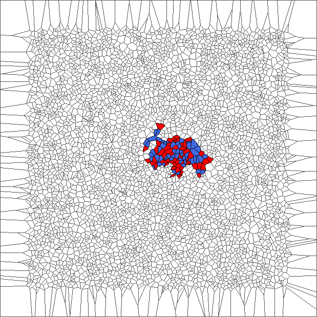

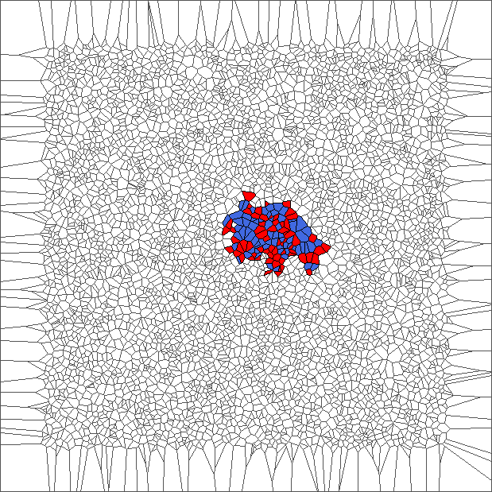
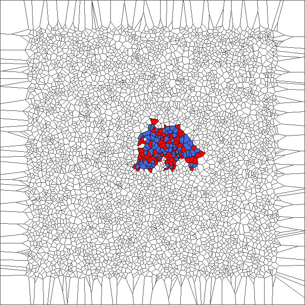
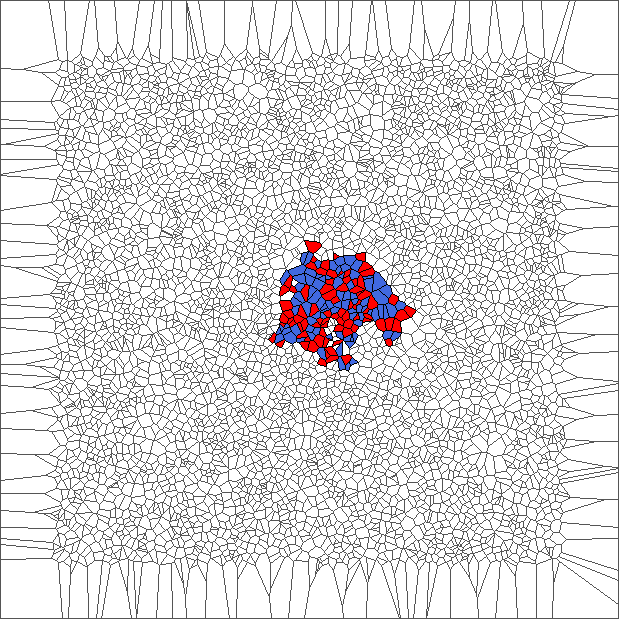

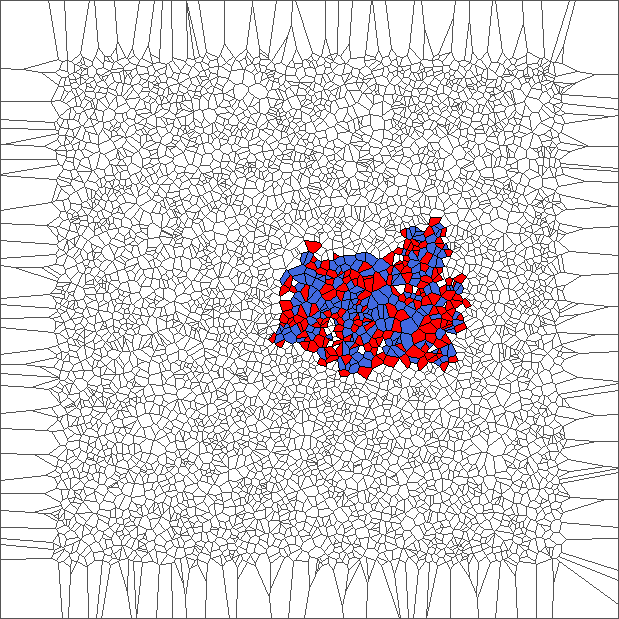

And evolution for one SL

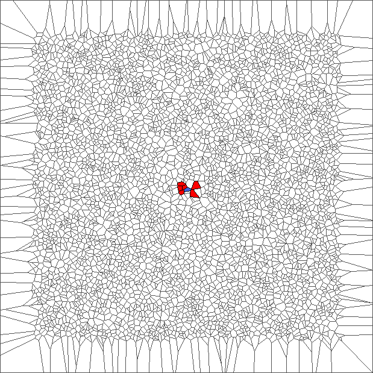
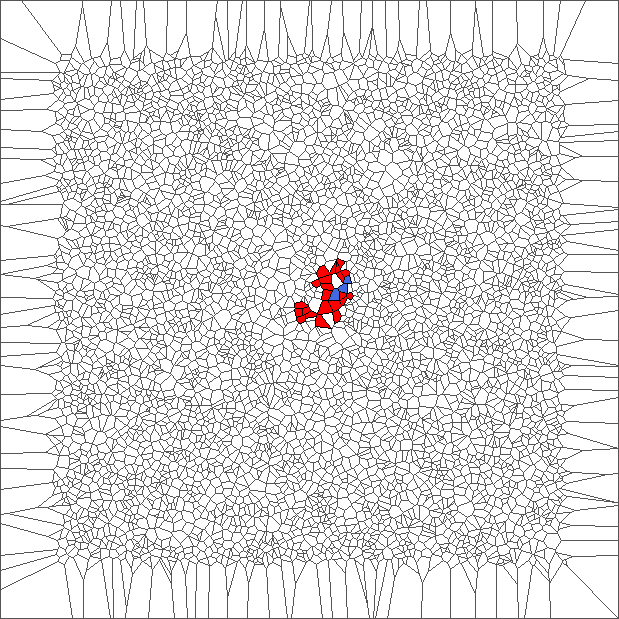
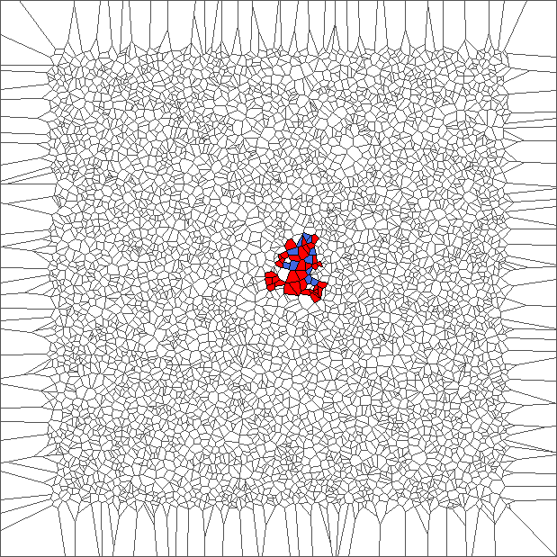

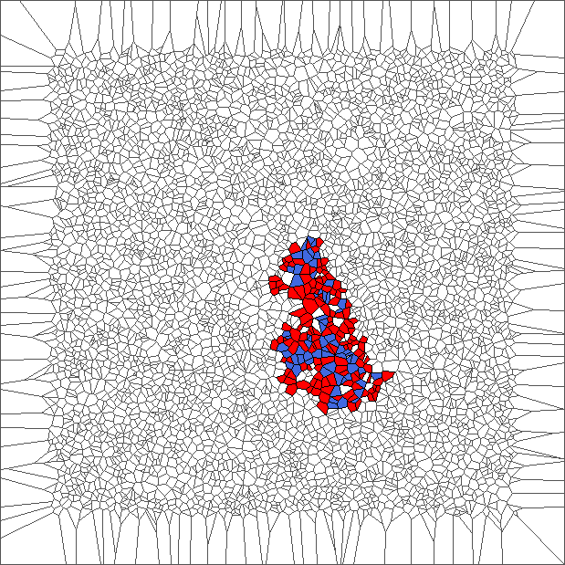

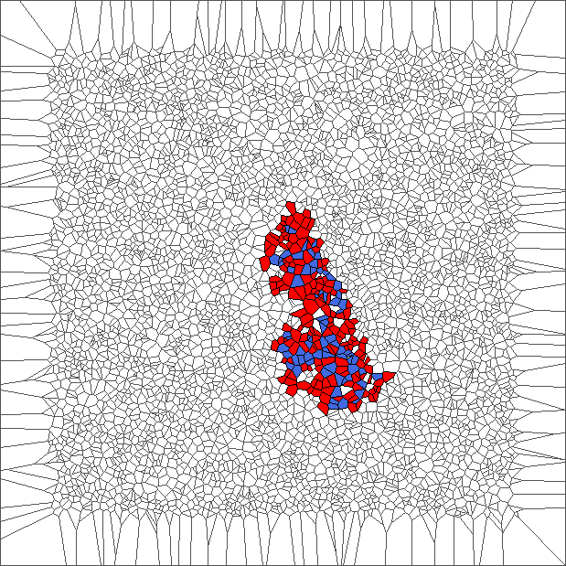

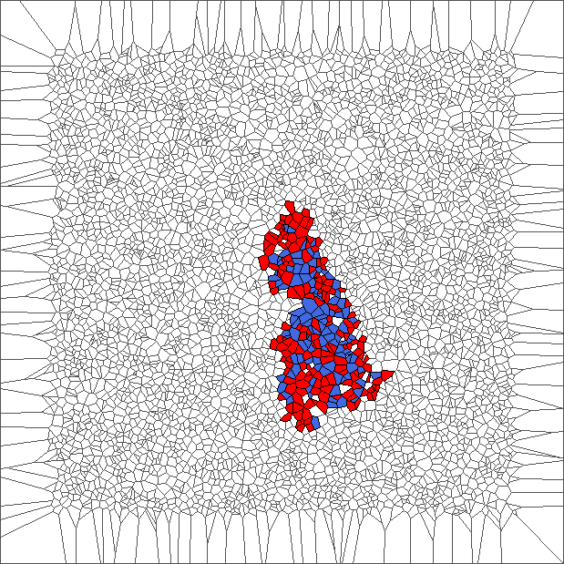
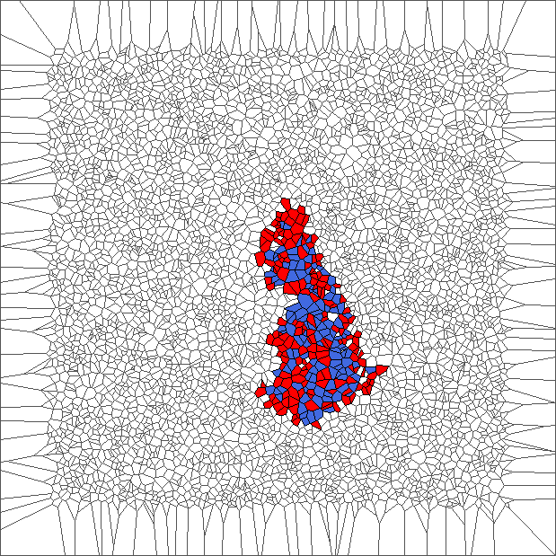
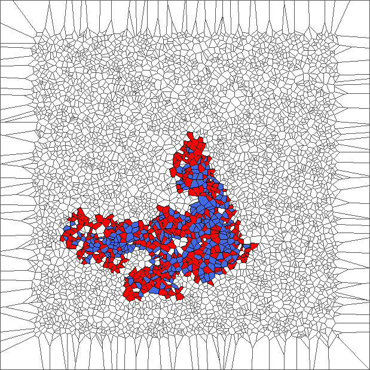

Bounded circle

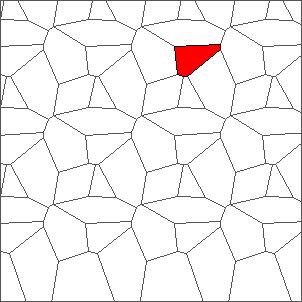
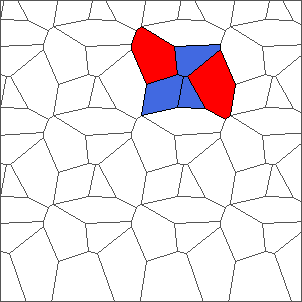
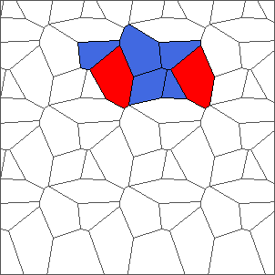
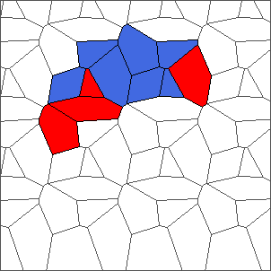
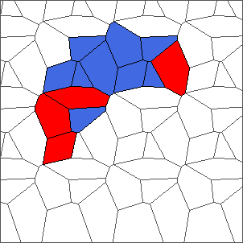

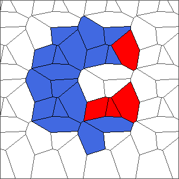
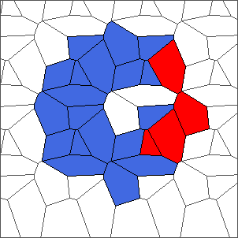
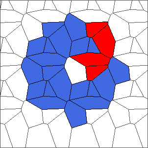

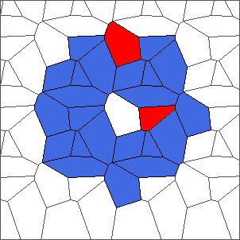
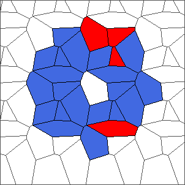
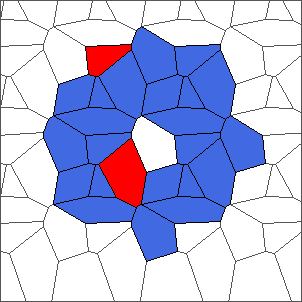
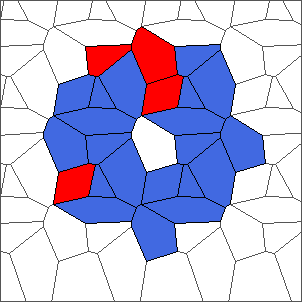
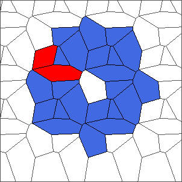

Smaller bounded

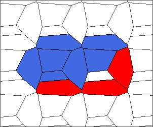

And voila.