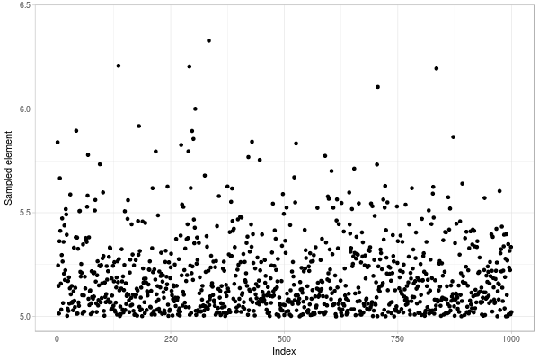
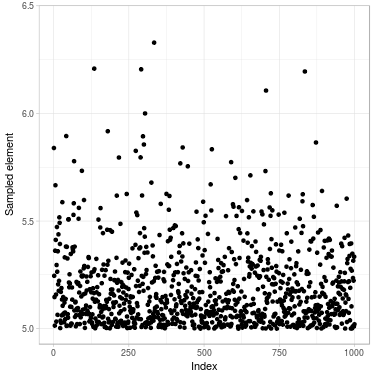
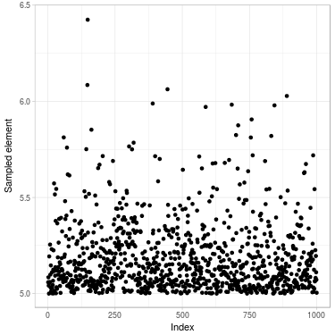

<script src="https://cdn.mathjax.org/mathjax/latest/MathJax.js?config=TeX-AMS-MML_HTMLorMML" type="text/javascript"></script>

*Metropolis–Hastings algorithm* is a method for sampling from a probability distribution. It is used when direct sampling is difficult.

This post illustrates the algorithm by sampling from $$\mathcal{N}(. \mid > 5)$$ -- the univariate normal distribution conditional on being greater than $$5$$.
This example has been chosen for its simplicity, for understanding how the algorithm actually works.

For real applications, other methods are preferred for sampling $$\mathcal{N}(. \mid > l)$$: It is direct for $$l = 5$$, and more tricky when $$l$$ is larger than $$10$$. You can read [this Wikipedia section for details](https://en.wikipedia.org/wiki/Truncated_normal_distribution#Simulating).

Simulation code has been written in R and is available [at that address](https://github.com/ahstat/warehouse/blob/master/Metropolis_Hastings_example.R).

<center>

</center>


*Fig. 1. Sample of size 1000 of a truncated normal distribution drawn with Metropolis–Hastings algorithm*

## Presentation

The aim of the algorithm is to simulate a sample following a distribution (**target 
distribution**).
We assume that this target distribution has a density, and that we know it up to a multiplicative constant.
This means that we do not need to know exactly the normalization constant,
which can be difficult to approximate for rare events or high-dimensional densities.

The idea is to perform simulations through another distribution (**instrumental
distribution**). This instrumental distribution is chosen to be easy to
sample.

The simulations computed through the instrumental distribution are "corrected".
To this end, we construct a Markov chain which admits a unique
stationary distribution which is the target distribution.
In practice, steps of the chain follows the instrumental distribution,
but step can be rejected with a certain probability.

## Illustrative example -- Preparation

In this example, we want to simulate a sample of the standard normal
distribution knowing that the values are greater than a limit $$5$$. If we
want to obtain this sample directly by reject algorithm, most of values
are rejected:

```R
set.seed(2713)
limit = 5
x_test = rnorm(10000)
max(x_test) # close to 3.5
which(x_test > limit) # no element, all are rejected 
```

**Target distribution.**
Therefore, we will use a Metropolis–Hastings algorithm to sample this
distribution. We first need the density of the target
distribution up to a constant. This is easily available, by cutting
the normal distribution:

```R
# Target density (this density is only known up to a constant)
pi_func0 = function(x, limit) {
  if(x < limit) {
    return(0)
  } else {
    return(dnorm(x, mean = 0, sd = 1))
  }
}
pi_func = function(x) {pi_func0(x, limit)}
```

**Instrumental distribution.** 
Then, we need an instrumental distribution $$q(. \mid x)$$ which can be easily simulated.
Here, the normal distribution centered in $$x$$ and with standard deviation 
of $$0.01$$ is selected. Sampling from this distribution is easy.

```R
# Simulation of the instrumental distribution
q_func_symm = function(x, sd = 0.01) {
  y = rnorm(1, x, sd)
  return(y)
}
```

Note that this instrumental distribution is symmetric.
This is not a requirement for Metropolis–Hastings algorithm, 
but simplifies computations a lot.
In particular, density of the instrumental distribution is not needed in this case
(we only need to know how to sample from it).
The algorithm is sometimes called *Metropolis algorithm* in this particular case.

In the previous instrumental distribution, 
parameter `sd` indicates range of each step. When `sd` is small, each
step is small and the probability to be accepted is large. However, the
Markov chain is moving slowly and many steps are necessary to reach
stationary distribution. When `sd` is large, larger steps are done, but are
accepted less often.

**Markov process**

We construct a Markov chain $$(x(t))_{t}$$.
It is designed to have a unique stationary distribution
which is the target distribution.
You can read Section 2.1 of [this course for formal derivation](https://www.math.wustl.edu/~sawyer/hmhandouts/MetropHastingsEtc.pdf).
As a consequence, given $$T$$ a large number, $$x(T)$$ can be regarded as a sample
element from target distribution
(and we hope that $$T$$ is not so large...).

Let's construct the Markov chain in our example.
Given $$x(t)$$ for any $$t \geq 1$$, we use the following function to compute $$x(t+1)$$.
Basicly, we simulate one element $$y$$ from $$q(. \mid x(t))$$, 
the instrumental distribution given $$x(t)$$; then accept it with a certain probability
$$\alpha(x(t),y)$$

```R
iterate_t_to_t_plus_1 = function(x_t, sd) {
  y_t_plus_1 = q_func_symm(x_t, sd)
  alpha_current = alpha(x_t, y_t_plus_1)
  x_t_plus_1 = NA
  if(runif(1) < alpha_current) { # move
    x_t_plus_1 = y_t_plus_1
  } else { # reject
    x_t_plus_1 = x_t
  }
  return(x_t_plus_1)
}
```

It remains to define the probability $$\alpha(x(t),y)$$ to accept the move.
It is simply the quotient of probability
of the target distribution
(it is a little more complex when instrumental distribution is not symmetric).

```R
alpha = function(x_t, y_t_plus_1) {
  alpha_out = min(pi_func(y_t_plus_1) / pi_func(x_t), 1)
  return(alpha_out)
}
```
## Illustrative example -- Computations

In this section, we sample $$\mathcal{N}(. \mid > 5)$$ using
Metropolis–Hastings algorithm.
We define length of the chain, 
the parameter of standard deviation in the instrumental distribution,
and the initial state.

```R
N = 1000000 # length of the chain
sd = 3 # standard deviation of the steps move
x_1 = limit # initialization of the chain
```

We compute a chain until step $$N$$ for a certain *alea* $$\omega$$.

```R
x_t_vect = rep(NA, N)
x_t_vect[1] = x_1
for(i in 2:N) {
  if(i %% 10000 == 0) {
    print(i)
  }
  x_t_vect[i] = iterate_t_to_t_plus_1(x_t_vect[i-1], sd)
}
```

Two consecutives elements of the chain are correlated.
This issue is inherent in MCMC methods.

We obtain an almost uncorrelated sample by selecting a subset of $$x(t)$$.
For example, if we know that the chain has almost reached stationarity after a certain number of steps `s`, then we can select $$x(s)$$, $$x(2s)$$, $$x(3s)$$.

In our case, the number of steps to wait depends on the `sd` parameter.
In the following, we took `step=1000`.

```R
step = 1000
simulated_distr = x_t_vect[seq(from = step, 
                               by = step, 
                               to = length(x_t_vect))]
```

The final sample has length $$N/step$$ and follows $$\mathcal{N}(. \mid > 5)$$
(almost).

The following figure compares sample obtained from Metropolis–Hastings algorithm
with sample obtained from direct formula using inverse transform method (see [Wikipedia page](https://en.wikipedia.org/wiki/Truncated_normal_distribution#Simulating)).




*Fig. 2. Sample of size 1000 drawn of a truncated normal distribution. (Left) Using Metropolis–Hastings algorithm (Right) Directly using inverse transform method*

Visually, it looks good.
Further checking are necessary, especially by checking autocorrelation of the sample.

## References

- [Wikipedia page about Metropolis–Hastings algorithm](https://en.wikipedia.org/wiki/Metropolis%E2%80%93Hastings_algorithm),

- [Wikipedia page about truncated Normal distributions](https://en.wikipedia.org/wiki/Truncated_normal_distribution),

- [A course introducing Metropolis–Hastings algorithm in details](https://www.math.wustl.edu/~sawyer/hmhandouts/MetropHastingsEtc.pdf).
