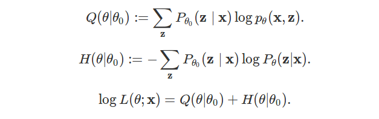

*Expectation-Maximization* algorithm (EM) is an algorithm used to estimate parameters of statistical models comprising latent variables.
It is applied in the case where direct calculation of *maximum likelihood estimation* (MLE) is impractical.
EM updates parameters of the model iteratively, in order to increase likelihood of the set.
It generally gives good estimation results, although there is no guarantee of convergence to MLE.

Many introductions of EM exist on the web. 
This one starts from the likelihood computation problem and uses inductive reasoning to bring out EM.
No implementation is provided.

We begin by describing a general model involving latent variables.
We then explain why direct computation of MLE is intractable.
After that, ideas are introduced one by one and lead us naturally towards EM.
Those ideas are formalized afterwards, making EM a practical algorithm to estimate parameters.

## Definition of the model

Let $$\mathbf{x} = (x_i)_{i \in \lbrace 1, \ldots n \rbrace}$$ the set of observed data points, where each $$x_i$$ stands in $$\mathbb{R}^d$$.

Let $$\mathbf{z}^{(\text{true})} = (z_i^{(\text{true})})_{i \in \lbrace 1, \ldots n \rbrace}$$ the set of unobserved latent data, where each $$z_i^{(\text{true})}$$ stands in $$\lbrace 1, \ldots, K \rbrace$$ with $$K$$ a fixed integer.

The couple $$(\mathbf{x}, \mathbf{z}^{(\text{true})})$$ is a realization of a random variable $$(\mathbf{X}, \mathbf{Z})$$.

The distribution of $$(\mathbf{X}, \mathbf{Z})$$ depends on a unknown but fixed parameter $$\theta^{(\text{true})}$$.

We use letter $$p$$ for densities and $$P$$ for probabilities. For the sake of conciseness, we discard notation of the random variable: For example, we write $$P(\mathbf{z})$$ for $$P(\mathbf{Z} = \mathbf{z})$$, and $$p(\mathbf{x})$$ for $$p(\mathbf{X} = \mathbf{x})$$.

EM algorithm can be always derived, but may be impractical.
A good rule of thumb to consider an EM algorithm is when it is "difficult to compute" $$p_{\theta}(\mathbf{x})$$ directly, but 
"easy to compute" both $$\log p_{\theta}(\mathbf{x} | \mathbf{z})$$ and $$P_{\theta}(\mathbf{z})$$ (for all $$\mathbf{x}$$, $$\mathbf{z}$$ and $$\theta$$).
In the following, we assume that we are in this configuration.

In GMM specifically, 3 hypotheses are set and allow practical use of EM algorithm:
The vector of marginal variables $$(X_i, Z_i)_i$$ of $$(\mathbf{X}, \mathbf{Z})$$ forms an independent vector over $$i$$; Each record belongs to a cluster $$Z_i = k$$ with a fixed probability; And each conditional variable $$(X_i \mid Z_i = k)$$ follows a Gaussian distribution with fixed parameters.
If you are only interested on understanding how to use and implement EM algorithm for GMM clustering, please check out [this specific post](../Optimizing-GMM-using-EM).

From now, we go back to the general setting.

## Direct calculation of MLE is intractable

The common strategy to estimate $$\theta^{(\text{true})}$$ is to maximize the log-likelihood of observed data $$\mathbf{x}$$, as defined by the density of probability to observe $$\mathbf{x}$$ given $$\theta$$:

$$\log L(\theta ; \mathbf{x}) := \log p_{\theta}(\mathbf{x}).$$

Direct maximization of the likelihood over $$\theta$$ is not possible because $$p_{\theta}(\mathbf{x})$$ "difficult to compute".
Using the law of total probability, we can reveal the latent variable by summing over all possible latent data (the sum in the following equation has $$K^n$$ terms):

$$\log L(\theta ; \mathbf{x}) = \log \left[ \sum_{\mathbf{z}}  p_{\theta}(\mathbf{x}, \mathbf{z}) \right] = \log \left[ \sum_{\mathbf{z}}  p_{\theta}(\mathbf{x} | \mathbf{z}) P_{\theta}(\mathbf{z}) \right].$$

We have retrieved $$P_{\theta}(\mathbf{z})$$, which is "easy to compute". 
However, the problem in this decomposition is the presence of the sum of $$p_{\theta}(\mathbf{x} | \mathbf{z})$$.
This makes the log-likelihood function being non-convex as a function of $$\theta$$, and direct optimization is intractable (see [this post for a discussion and the most simple example of non-convexity](https://stats.stackexchange.com/questions/94559/why-is-optimizing-a-mixture-of-gaussian-directly-computationally-hard)).

## Step by step from likelihood towards EM

We would like to let the $$\log$$ inside the sum to retrieve terms $$\log p_{\theta}(\mathbf{x} | \mathbf{z})$$ which are "easy to compute" 
(this is not possible directly because $$\log$$ is not linear!).
See for example:
$$\sum_{\mathbf{z}} \log p_{\theta}(\mathbf{x}, \mathbf{z}) = \sum_{\mathbf{z}} \log p_{\theta}(\mathbf{x} | \mathbf{z}) + \sum_{\mathbf{z}} \log P_{\theta}(\mathbf{z}).$$
This expression would be easier to maximize over $$\theta$$ ([at least for GMM, see explicit computations here](../Optimizing-GMM-using-EM)).

Basicly, EM will find a mean to include the $$\log$$ inside the sum.
To do this, we let $$\mathbf{z}$$ any element of $$\lbrace 1, \ldots, K \rbrace^n$$
and write:

$$p_{\theta}(\mathbf{x}, \mathbf{z}) = P_{\theta}(\mathbf{z} | \mathbf{x}) p_{\theta}(\mathbf{x}).$$

Taking the $$\log$$, we obtain:

$$\log L(\theta ; \mathbf{x}) = \log p_{\theta}(\mathbf{x}) = \log p_{\theta}(\mathbf{x}, \mathbf{z}) - \log P_{\theta}(\mathbf{z} | \mathbf{x}).$$

The previous formula is valid for all $$\mathbf{z}$$.
This is a great step, because the term of interest $$\log p_{\theta}(\mathbf{x}, \mathbf{z})$$ is here.
The first idea would be to sum over all $$\mathbf{z} \in \lbrace 1, \ldots, K \rbrace^n$$:

$$\sum_{\mathbf{z}} \log L(\theta ; \mathbf{x}) = \sum_{\mathbf{z}} \log p_{\theta}(\mathbf{x}, \mathbf{z}) - \sum_{\mathbf{z}} \log P_{\theta}(\mathbf{z} | \mathbf{x}).$$

On the left, there is no dependence in $$\mathbf{z}$$, so we end with:

$$\log L(\theta ; \mathbf{x}) = \frac{1}{K^n} \sum_{\mathbf{z}} \log p_{\theta}(\mathbf{x}, \mathbf{z}) - \frac{1}{K^n} \sum_{\mathbf{z}} \log P_{\theta}(\mathbf{z} | \mathbf{x}).$$

There is a new problem: The term containing $$P_{\theta}(\mathbf{z} | \mathbf{x})$$ on the right.
We don't have assumption on the conditional variable $$(\mathbf{Z} | \mathbf{X})$$, and Bayes' formula
does not help (using it, the denominator is $$p_{\theta}(\mathbf{x})$$ and we're stucked).

So how to do then? We come back to this formula, which is valid for all $$\mathbf{z}$$:

$$\log L(\theta ; \mathbf{x}) = \log p_{\theta}(\mathbf{x}, \mathbf{z}) - \log P_{\theta}(\mathbf{z} | \mathbf{x}).$$

We've seen that summing over all $$\mathbf{z}$$ and dividing by $$K^n$$ is not suitable to solve our problem (because of the term on the right).
There is another perspective: Summing over all $$\mathbf{z}$$ and dividing by $$K^n$$ corresponds to select each $$\mathbf{z}$$ with the uniform weight $$1 / K^n$$.
But we could also select any other distribution to weight each element $$\mathbf{z}$$.

Let $$(r_{\mathbf{z}})$$ be some distribution over $$\mathbf{z}$$.
Since $$\log L(\theta ; \mathbf{x})$$ does not depend on $$\mathbf{z}$$, and $$r_\mathbf{z}$$ sums to one over $$\mathbf{z}$$, we get:

$$\log L(\theta ; \mathbf{x}) = \sum_{\mathbf{z}} r_\mathbf{z} \log p_{\theta}(\mathbf{x}, \mathbf{z}) - \sum_{\mathbf{z}} r_\mathbf{z} \log P_{\theta}(\mathbf{z} | \mathbf{x}).$$

This is interpreted as the expectancy over a variable $$\hat{\mathbf{Z}}$$ following $$(r_\mathbf{z})_{\mathbf{z}}$$:

$$\log L(\theta ; \mathbf{x}) = E(\log p_{\theta}(\mathbf{x}, \hat{\mathbf{Z}})) - E(\log P_{\theta}(\hat{\mathbf{Z}} | \mathbf{x})).$$

We've said that second term on the right is the problem. We name it $$H$$:

$$H(\theta, r) := - \sum_{\mathbf{z}} r_\mathbf{z} \log P_{\theta}(\mathbf{z} | \mathbf{x}).$$

We assume that we have selected some current parameters $$\theta_0$$.
We would like to select $$r$$ such that for all choice of $$\theta$$,
$$H(\theta, r) \geq H(\theta_0, r).$$
If we can do this, $$H$$ would not be a problem anymore (try to see why now; Hint: we still cannot compute $$H$$, but we would know it cannot decrease; Answer in a subsequent section).

We define two distributions $$(p_{\mathbf{z}})$$ and $$(q_{\mathbf{z}})$$:

$$p_{\mathbf{z}} := P_{\theta_0}(\mathbf{z} \mid \mathbf{x}),$$

$$q_{\mathbf{z}} := P_{\theta}(\mathbf{z} \mid \mathbf{x}).$$

The inequality $$H(\theta, r) \geq H(\theta_0, r)$$ can be rewritten as follows:

$$ -\sum_{\mathbf{z}} r_\mathbf{z} \log q_\mathbf{z} \geq -\sum_{\mathbf{z}} r_\mathbf{z} \log p_\mathbf{z}.$$

We group terms to obtain:

$$ \sum_{\mathbf{z}} r_{\mathbf{z}} \times \left( -\log \frac{q_{\mathbf{z}}}{p_{\mathbf{z}}} \right) \geq 0.$$

The sum on the right is not easy to compute, but $$-\log$$ is convex, so we try the [Jensen's inequality](https://en.wikipedia.org/wiki/Jensen%27s_inequality). The following inequality in valid for any distribution $$r$$:

$$ \sum_{\mathbf{z}} r_{\mathbf{z}} \times \left( -\log \frac{q_{\mathbf{z}}}{p_{\mathbf{z}}} \right) \geq - \log \sum_{\mathbf{z}} r_{\mathbf{z}} \frac{q_{\mathbf{z}}}{p_{\mathbf{z}}}.$$

If we can select $$r$$ such that $$- \log \sum_{\mathbf{z}} r_{\mathbf{z}} \frac{q_{\mathbf{z}}}{p_{\mathbf{z}}} \geq 0$$, then we will end up with $$H(\theta, r) \geq H(\theta_0, r).$$

Now the inequality 
$$- \log \sum_{\mathbf{z}} r_{\mathbf{z}} \frac{q_{\mathbf{z}}}{p_{\mathbf{z}}} \geq 0$$ 
can be rewritten as: 
$$\sum_{\mathbf{z}} r_{\mathbf{z}} \frac{q_{\mathbf{z}}}{p_{\mathbf{z}}} \leq 1.$$

A natural choice is to select $$r_{\mathbf{z}} := p_{\mathbf{z}}$$ for all $$\mathbf{z}$$.

This choice has a nice interpretation in terms of entropy.
By rewriting the difference $$H(\theta, r) - H(\theta_0, r)$$ with $$r = p$$, we get (where $$\text{KL}$$ stands for the Kullback-Leibler divergence):

$$H(\theta, p) - H(\theta_0, p) = - \sum_{\mathbf{z}} p_{\mathbf{z}} \times \log \frac{q_{\mathbf{z}}}{p_{\mathbf{z}}} =: \text{KL}(p \mid \mid q) \geq 0.$$

[See post about KL for more details].

We put together our advances. For all $$\theta, \theta_0$$, the log-likelihood of $$\mathbf{x}$$ given parameters $$\theta$$ is expressed as:

$$\log L(\theta ; \mathbf{x}) = \sum_{\mathbf{z}} P_{\theta_0}(\mathbf{z} \mid \mathbf{x}) \log p_{\theta}(\mathbf{x}, \mathbf{z}) - \sum_{\mathbf{z}} P_{\theta_0}(\mathbf{z} \mid \mathbf{x}) \log P_{\theta}(\mathbf{z} | \mathbf{x}).$$

The first term of the sum is named $$Q$$:

$$Q(\theta | \theta_0) := \sum_{\mathbf{z}} P_{\theta_0}(\mathbf{z} \mid \mathbf{x}) \log p_{\theta}(\mathbf{x}, \mathbf{z}).$$

[Note that this can be seen as an expectancy. Let $$\hat{Z}_{\theta_0}$$ a random variable following distribution $$P_{\theta_0}(. \mid \mathbf{x})$$. Then:
$$Q(\theta | \theta_0) = E(\log p_{\theta}(\mathbf{x}, \hat{Z}_{\theta_0}))$$].

The second term is rewritten $$H$$:

$$H(\theta | \theta_0) := - \sum_{\mathbf{z}} P_{\theta_0}(\mathbf{z} \mid \mathbf{x}) \log P_{\theta}(\mathbf{z} | \mathbf{x}).$$

[Note that with previous notations, $$H(\theta, p) = H(\theta \mid \theta_0)$$
and $$H(\theta, q) = H(\theta \mid \theta)$$].

On the whole, for all $$\theta, \theta_0$$, the log-likelihood of $$\mathbf{x}$$ given parameters $$\theta$$ is:

$$\log L(\theta ; \mathbf{x}) = Q(\theta | \theta_0) + H(\theta | \theta_0),$$

and, for all $$\theta, \theta_0$$,

$$H(\theta | \theta_0) \geq H(\theta_0 | \theta_0).$$

This induces a method to increase log-likelihood of the dataset, described in the next section.

## The EM algorithm

EM algorithm computes parameters 
$$\theta^{(0)}, \theta^{(1)}, \theta^{(2)}, \ldots$$
such that the corresponding log-likelihoods nondecrease:

$$\log L(\theta^{(0)} ; \mathbf{x}) \leq \log L(\theta^{(1)} ; \mathbf{x}) \leq \log L(\theta^{(2)} ; \mathbf{x}), \ldots$$

We describe how to update parameters before showing that corresponding log-likelihoods nondecrease.

### Updating parameters

We begin with some initial parameters $$\theta^{(0)}$$.
This initialization step is important, and different $$\theta^{(0)}$$
can lead to different estimations.

Now assume that parameter $$\theta^{(t)}$$ has been defined (for a certain $$t \geq 0$$). We explain how to get $$\theta^{(t+1)}$$.

We define for all $$\theta$$:

$$Q(\theta | \theta^{(t)}) := E(\log p_{\theta}(\mathbf{x}, \hat{Z}_{\theta^{(t)}})) = \sum_{\mathbf{z}} \log p_{\theta}(\mathbf{x}, \mathbf{z}) P_{\theta^{(t)}}(\mathbf{z} \mid \mathbf{x}),$$

where $$\hat{Z}_{\theta^{(t)}}$$ is a random variable following distribution $$P_{\theta^{(t)}}(. \mid \mathbf{x}).$$

We let:

$$\theta^{(t+1)} := \text{argmax}_{\theta} Q(\theta | \theta^{(t)}).$$

The step of defining $$Q$$ is the *expectation step*, 
the step of maximizing $$Q$$ is the *maximization step*.

### Improvement of the likelihood using EM algorithm

We theoretically ensure that likelihood is nondecreasing when EM algorithm is used.
This paragraph formalizes the previous section.

At step $$t$$, we have for all $$\theta$$:

$$\log L(\theta ; \mathbf{x}) = Q(\theta | \theta^{(t)}) + H(\theta | \theta^{(t)}).$$

with:

$$H(\theta | \theta^{(t)}) = - \sum_{\mathbf{z}} P_{\theta^{(t)}}(\mathbf{z} \mid \mathbf{x}) \log P_{\theta}(\mathbf{z} | \mathbf{x}).$$

We compute:

$$
\begin{align}
\log L(\theta ; \mathbf{x}) - \log L(\theta^{(t)} ; \mathbf{x}) =& Q(\theta | \theta^{(t)}) - Q(\theta^{(t)} | \theta^{(t)}) + H(\theta | \theta^{(t)}) - H(\theta^{(t)} | \theta^{(t)}).
\end{align}
$$

Using [Jensen's inequality](https://en.wikipedia.org/wiki/Jensen%27s_inequality) or [Gibbs inequality](https://en.wikipedia.org/wiki/Gibbs%27_inequality), we obtain for all $$\theta$$:

$$H(\theta | \theta^{(t)}) \geq H(\theta^{(t)} | \theta^{(t)})$$

and so:

$$
\begin{align}
\log L(\theta ; \mathbf{x}) - \log L(\theta^{(t)} ; \mathbf{x}) \geq Q(\theta | \theta^{(t)}) - Q(\theta^{(t)} | \theta^{(t)}).
\end{align}
$$

By choosing $$\theta^{(t+1)} = \text{argmax}_{\theta} Q(\theta \mid \theta^{(t)})$$, we have:

$$Q(\theta^{(t+1)} | \theta^{(t)}) \geq Q(\theta^{(t)} | \theta^{(t)})$$

and finally:

$$
\begin{align}
\log L(\theta^{(t+1)} ; \mathbf{x}) - \log L(\theta^{(t)} ; \mathbf{x}) \geq 0.
\end{align}
$$

This ends the proof.

*Warning:* The previous proof ensures that likelihood is not decreasing. 
It does not say how parameters compare with $$\theta^{\text{(true)}}$$ (really unknown) or even $$\theta^{\text{(MLE)}}$$ (obtained using maximum likelihood estimate, but intractable).
Under mild conditions, EM converges to a local maximum though, see [this article for a review](../images/2017-1-11-Rediscover-EM-algorithm/A15n316.pdf).

### How to compute and maximize $$Q$$ in practice?

We make a full decomposition of $$Q$$:

$$
\begin{align}
Q(\theta | \theta^{(t)}) =& \sum_{\mathbf{z}} \log p_{\theta}(\mathbf{x}, \mathbf{z}) P_{\theta^{(t)}}(\mathbf{z} | \mathbf{x}) \\
=& \sum_{\mathbf{z}} \log \left[ p_{\theta}(\mathbf{x} | \mathbf{z}) p_{\theta}(\mathbf{z}) \right] \frac{p_{\theta^{(t)}}(\mathbf{z}, \mathbf{x})}{p_{\theta^{(t)}}(\mathbf{x})} \\
=& \sum_{\mathbf{z}} \left[ \log p_{\theta}(\mathbf{x} | \mathbf{z}) + \log p_{\theta}(\mathbf{z}) \right] \frac{p_{\theta^{(t)}}(\mathbf{z}, \mathbf{x})}{\sum_{\mathbf{z}'} p_{\theta^{(t)}}(\mathbf{z}', \mathbf{x})}.
\end{align}
$$

It should easier to maximize this function of $$\theta$$, compared to the initial log-likelihood function.

For explicit calculations for GMM, please follow [the next post](../Optimizing-GMM-using-EM).

## References

- [English wikipedia about EM](https://en.wikipedia.org/wiki/Expectation%E2%80%93maximization_algorithm). Wikipedia gives concise formulas, 

- [An introduction of EM following a similar perspective](http://cs229.stanford.edu/notes/cs229-notes8.pdf),

- [An article detailing parameter convergence results for EM](../images/2017-1-11-Rediscover-EM-algorithm/A15n316.pdf).
