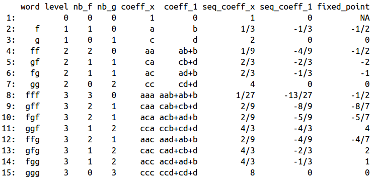

This code automatizes composition of linear functions.
For example, we can deduce slope, intercept and fixed point of *gfg* when
*f: x ↦ ax+b* and 
*g: x ↦ cx+d*.
Here, *a* and *b* can be formal letters, rational values or real values.
For rational values, gmp package is used to keep exact results.

More info and chaotic illustrations can be found on <a href="https://github.com/ahstat/coal">my github page</a>.
