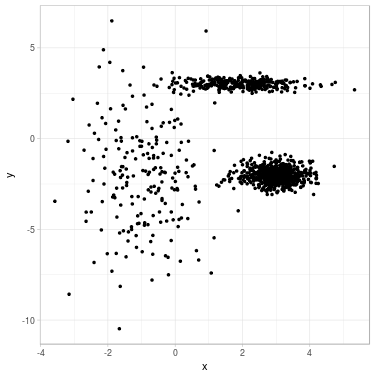
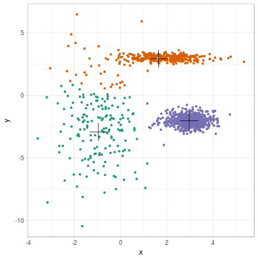
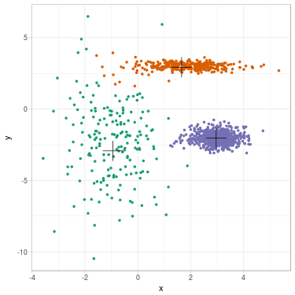
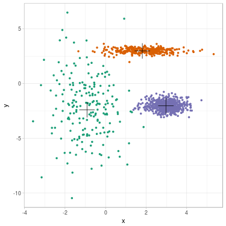
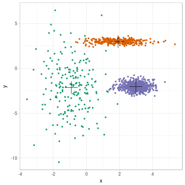

A *Gaussian Mixture Model* (GMM) models data as a finite mixture of Gaussians. It is often used to perform clustering. In this case, the number of Gaussians $$K$$ is the number of clusters and is initially selected.
Compared to $$K$$-means, GMM allows clusters with uneven variance and density.

Parameters are usually estimated using an *Expectation-Maximization* (EM) algorithm,
its aim being to iteratively increase likelihood of the dataset.
GMM is actually a perfect model to understand how EM is working.

*Fig. 1. Clustering a 2D dataset into 3 clusters using GMM. Left: Dataset before clustering. Right: Clustered data with position of fitted mean for each Gaussian.*

We begin by describing GMM and list parameters of the model.
We continue by applying EM to GMM and derive update formulas.
Then, the algorithm to cluster data is given.
We finally illustrate the clustering process on a simple example.
This post does not detail how EM is working. 
[If you are interested about theoretical considerations, please read this post](../Rediscover-EM-algorithm).

## What is GMM?

Let $$\mathbf{x} = (x_i)_{i \in \lbrace 1, \ldots n \rbrace}$$ a dataset of $$\mathbb{R}^d$$.

Let $$i$$ any element of $$\lbrace 1, \ldots n \rbrace$$.
We assume that $$x_i \in \mathbb{R}^d$$ has been sampled from a random variable $$X_i$$.
We assume that $$X_i$$ follows a probability distribution with a certain density.
The density of $$X_i$$ in any $$x \in \mathbb{R}^d$$ is written as follows:

$$p(X_i = x).$$

In addition, we assume that $$x_i$$ is labeled with a certain $$z_i^{(\text{true})} \in \lbrace 1, \ldots, K \rbrace$$,
where $$K$$ is a fixed integer.
Those labels exist (and are fixed), but we only observe $$x_i$$, *without explicit knowledge of the corresponding label* $$z_i^{(\text{true})}$$.
The underlying random variable to model the label is noted $$Z_i$$, and the probability
to be labeled $$k \in \lbrace 1, \ldots, K \rbrace$$ is written as follows:

$$P(Z_i = k).$$

We say that $$Z_i$$ is a latent variable.
Using the law of total probability, we can reveal the latent variable (in the formula, $$x \in \mathbb{R}^d$$):

$$p(X_i = x) = \sum_{k = 1}^K p(X_i = x | Z_i = k) \times P(Z_i = k).$$

GMM assumes that three hypotheses are verified:
1. The vector of couples $$(X_i, Z_i)_i$$ forms an independent vector over $$i$$,
2. Each record belongs to a cluster $$Z_i = k$$ with probability $$\pi_k$$ (with $$\pi_k > 0$$),
3. Each conditional variable $$(X_i \mid Z_i = k)$$ follows a Gaussian distribution with mean $$m_k$$ and covariance matrix $$\Sigma_k$$.

We let $$f_{(m, \Sigma)}$$ the density function of a Gaussian with parameters $$m$$ and $$\Sigma$$ on $$\mathbb{R}^d$$.
Using hypotheses 2 and 3, the last equation is rewritten as follows (for all $$i, x$$):

$$p(X_i = x) = \sum_{k = 1}^K f_{(m_k, \Sigma_k)}(x_i) \times \pi_k.$$

Unknown (fixed) parameters of the model are grouped together into:

$$\theta^{(\text{true})} := (\pi_k^{(\text{true})}, m_k^{(\text{true})}, \Sigma_k^{(\text{true})})_{k \in \lbrace 1, \ldots, K \rbrace}.$$

The chosen strategy to estimate $$\theta^{(\text{true})}$$ is to maximize the log-likelihood of observed data $$\mathbf{x} := (x_1, \ldots, x_n)$$, as defined by the density of probability to observe $$\mathbf{x}$$ given $$\theta$$:

$$\log L(\theta ; \mathbf{x}) := \log p_{\theta}((X_1, \ldots, X_n) = (x_1, \ldots, x_n)).$$

Using the three hypotheses of GMM, we obtain:

$$
\begin{align}
\log L(\theta ; \mathbf{x}) =& \log \prod_{i=1}^n p_{\theta}(X_i = x_i) \\
=& \sum_{i=1}^n \log p_{\theta}(X_i = x_i) \\
=& \sum_{i=1}^n \log \left[ \sum_{k = 1}^K p_{\theta}(X_i = x_i | Z_i = k) P_{\theta}(Z_i = k) \right] \\
=& \sum_{i=1}^n \log \left[ \sum_{k = 1}^K f_{(m_k, \Sigma_k)}(x_i) \times \pi_k \right] \\
\end{align}
$$

However, this log-likelihood function is non-convex (as a function of $$\theta$$) and direct optimization is intractable (see [this post for a discussion](https://stats.stackexchange.com/questions/94559/why-is-optimizing-a-mixture-of-gaussian-directly-computationally-hard)). We introduce EM to circumvent this problem (other methods could work, see [this post for a discussion](https://stats.stackexchange.com/questions/158859/why-should-one-use-em-vs-say-gradient-descent-with-mle)).

## Applying EM to GMM

We assume that some parameters $$\theta^{(t)}$$ have been selected (for a certain $$t \geq 0$$).
We would like to update parameters and find out $$\theta^{(t+1)}$$ using
EM algorithm.

We define for all $$\theta$$:

$$Q(\theta | \theta^{(t)}) := \sum_{\mathbf{z}} \log p_{\theta}(\mathbf{x}, \mathbf{z}) P_{\theta^{(t)}}(\mathbf{z} \mid \mathbf{x}).$$

The aim of EM is to maximize the function $$Q$$ in $$\theta$$.
Please read section "The EM algorithm" of [the EM post](../Rediscover-EM-algorithm)
to understand why we have selected this function.
From the last paragraph of [the EM post](../Rediscover-EM-algorithm), we also have:

$$Q(\theta | \theta^{(t)}) = \sum_{\mathbf{z}} \left[ \log p_{\theta}(\mathbf{x} | \mathbf{z}) + \log p_{\theta}(\mathbf{z}) \right] \frac{p_{\theta^{(t)}}(\mathbf{z}, \mathbf{x})}{\sum_{\mathbf{z}'} p_{\theta^{(t)}}(\mathbf{z}', \mathbf{x})}.$$

We recall how parameters decompose into 3 terms for GMM:

$$\theta := (\pi_k, m_k, \Sigma_k)_{k \in \lbrace 1, \ldots, K \rbrace},$$

$$\theta^{(t)} := (\pi_k^{(t)}, m_k^{(t)}, \Sigma_k^{(t)})_{k \in \lbrace 1, \ldots, K \rbrace}.$$

In the following equalities, we use hypothesis 1 and then hypotheses 2 and 3 of GMM:

$$
\begin{align}
Q(\theta | \theta^{(t)}) =& \sum_{\mathbf{z}} \left[ \log p_{\theta}(\mathbf{x} | \mathbf{z}) + \log p_{\theta}(\mathbf{z}) \right] \frac{p_{\theta^{(t)}}(\mathbf{z}, \mathbf{x})}{\sum_{\mathbf{z}'} p_{\theta^{(t)}}(\mathbf{z}', \mathbf{x})} \\
=& \sum_{i = 1}^{N} \sum_{z_i = 1}^{K} \left[\log p_{\theta}(x_i |z_i) + \log p_{\theta}(z_i) \right] \frac{p_{\theta^{(t)}}(z_i, x_i)}{\sum_{z_i'} p_{\theta^{(t)}}(z_i', x_i)} \\
=& \sum_{i = 1}^{N} \sum_{k = 1}^{K} \left[\log p_{\theta}(x_i | k) + \log p_{\theta}(k) \right] \frac{p_{\theta^{(t)}}(k, x_i)}{\sum_{k' = 1}^{K} p_{\theta^{(t)}}(k', x_i)} \\
=& \sum_{i = 1}^{N} \sum_{k = 1}^{K} \left[\log f_{\left( m_k, \Sigma_k \right)}(x_i) + \log \pi_k \right] \frac{f_{(m_k^{(t)}, \Sigma_k^{(t)})}(x_i) \pi_k^{(t)}}{\sum_{k' = 1}^{K} f_{\left( m_{k'}^{(t)}, \Sigma_{k'}^{(t)} \right)}(x_i) \pi_{k'}^{(t)}}.
\end{align}
$$

We define:

$$T_{k, i}^{(t)} := P_{\theta^{(t)}}(Z_i = k | X_i = x_i) = \frac{f_{(m_k^{(t)}, \Sigma_k^{(t)})}(x_i) \pi_k^{(t)}}{\sum_{k' = 1}^{K} f_{\left( m_{k'}^{(t)}, \Sigma_{k'}^{(t)} \right)}(x_i) \pi_{k'}^{(t)}}.$$

We use explicit formula for the Gaussian distribution (for all $$x \in \mathbb{R}^{d}$$)

$$f_{\left( m, \Sigma \right)}(x) = \frac{1}{(2 \pi)^{K/2} \sqrt{\text{det} \Sigma}} \exp \left( -\frac{1}{2} (x - m)^{T} \Sigma^{-1} (x - m) \right)$$

and obtain:

$$
\begin{align}
Q(\theta | \theta^{(t)}) =& \sum_{i = 1}^{N} \sum_{k = 1}^{K} \left[ \log f_{\left( m_k, \Sigma_k \right)}(x_i) + \log \pi_k \right] T_{k, i}^{(t)} \\
=& \sum_{i = 1}^{N} \sum_{k = 1}^{K} \left[ - \frac{K}{2} \log 2 \pi - \frac{1}{2} \log \text{det} \Sigma_k -\frac{1}{2} (x_i - m_k)^{T} \Sigma_k^{-1} (x_i - m_k) + \log \pi_k \right] T_{k, i}^{(t)}
\end{align}
$$

From this shape, we can separate maximization of each couple $$(m_k, \Sigma_k)$$ (for $$k \in \lbrace 1, \ldots, K \rbrace$$) and maximization of the set $$(\pi_k)_k$$.

### For the mean $$m_k$$

From previous expression, we can perform maximization for each fixed $$k$$. Some terms have no dependence on $$m_k \in \mathbb{R}^{d}$$, so we need to maximize:

$$
\begin{align}
A(m_k) := - \frac{1}{2} \sum_{i = 1}^{N} \left[ (x_i - m_k)^{T} \Sigma_k^{-1} (x_i - m_k) \right] T_{k, i}^{(t)}
\end{align}
$$

We take the gradient with respect to $$m_k$$ (see formula (86) of [the matrix cookbook](https://www.math.uwaterloo.ca/~hwolkowi/matrixcookbook.pdf) and [this post](https://stats.stackexchange.com/questions/27436/how-to-take-derivative-of-multivariate-normal-density) to remember how gradient is calculated in this case):

$$\nabla_{m_k} A(m_k) = - \frac{1}{2} \sum_{i = 1}^{N} \left[ - 2 \Sigma_k^{-1} (x_i - m_k) \right] T_{k, i}^{(t)} =  \sum_{i = 1}^{N} \Sigma_k^{-1} (x_i - m_k) T_{k, i}^{(t)}.$$

We have $$\nabla_{m_k} A(m_k) = 0$$ if and only if:
$$\sum_{i = 1}^{N} (x_i - m_k) T_{k, i}^{(t)} = 0$$
from which we deduce:

$$m_k  = \frac{\sum_{i = 1}^{N} x_i T_{k, i}^{(t)}}{\sum_{i = 1}^{N} m_k T_{k, i}^{(t)}}.$$

Furthermore, Hessian matrix of $$A(m_k)$$ is given by:

$$- \left( \sum_{i = 1}^{N} T_{k, i}^{(t)} \right) \Sigma_k^{-1}$$

which is negative-definite.

*Conclusion:* We select $$m_k^{(t+1)} := \frac{\sum_{i = 1}^{N} x_i T_{k, i}^{(t)}}{\sum_{i = 1}^{N} m_k T_{k, i}^{(t)}}$$ and $$A(.)$$ is maximized in $$m_k^{(t+1)}$$.

### For the matrix of variance-covariance $$\Sigma_k$$

From previous expression, we can also perform maximization of $$\Sigma_k$$ for each fixed $$k$$.

First, it is easier to differentiate with respect to $$\Sigma_k^{-1}$$, so we let $$\Lambda_k := \Sigma_k^{-1}$$ and maximize:

$$
\begin{align}
B(\Lambda_k) := - \frac{1}{2} \sum_{i = 1}^{N} T_{k, i}^{(t)} \log \text{det} \Lambda_k^{-1} - \frac{1}{2} \sum_{i = 1}^{N} \left[ (x_i - m_k^{(t+1)})^{T} \Lambda_k (x_i - m_k^{(t+1)}) \right] T_{k, i}^{(t)}
\end{align}
$$

Then, we want to differentiate with respect to the matrix $$\Lambda_k$$ of shape $$d \times d$$. This is quite ambiguous: We can either decide to see the matrix as a vector of length $$d^2$$, or to see it as a vector of length $$d(d+1)/2$$ (because $$\Lambda_k$$ is symmetric and many coefficients are identical). Choosing one or another way to differentiate will change the formula for $$\nabla_{\Lambda_k} B(\Lambda_k)$$, which are both valid and give the same maximized variance-covariance matrix $$\Lambda_k^{(t+1)}.$$

Let's do the most simple computations (seeing $$\Lambda_k$$ as a vector of length $$d^2$$).

Using formula (57) of [the matrix cookbook](https://www.math.uwaterloo.ca/~hwolkowi/matrixcookbook.pdf) and that $$\Lambda_k$$ is symmetric and positive-definite:

$$\nabla_{\Lambda_k} \log \text{det} \Lambda_k^{-1} = - \nabla_{\Lambda_k} \log \text{det} | \Lambda_k | = - \Lambda_k^{-1}.$$

Using formula (70) of [the matrix cookbook](https://www.math.uwaterloo.ca/~hwolkowi/matrixcookbook.pdf):

$$\nabla_{\Lambda_k} z^{T} \Lambda_k z = z z^{T}.$$

We select $$z:= x_i - m_k^{(t+1)}$$ and obtain:

$$
\begin{align}
\nabla_{\Lambda_k} B(\Lambda_k) = - \frac{1}{2} \sum_{i = 1}^{N} T_{k, i}^{(t)} \left( - \Lambda_k^{-1} \right) - \frac{1}{2} \sum_{i = 1}^{N} \left[ (x_i - m_k^{(t+1)})(x_i - m_k^{(t+1)})^{T} \right] T_{k, i}^{(t)}.
\end{align}
$$

We have $$\nabla_{\Sigma_k} B(\Sigma_k) = 0$$ if and only if:

$$
\begin{align}
\Lambda_k^{-1} \left( \sum_{i = 1}^{N} T_{k, i}^{(t)} \right) = \sum_{i = 1}^{N} (x_i - m_k^{(t+1)})(x_i - m_k^{(t+1)})^{T} T_{k, i}^{(t)}.
\end{align}
$$

And so:

$$
\begin{align}
\Sigma_k = \frac{\sum_{i = 1}^{N} (x_i - m_k^{(t+1)})(x_i - m_k^{(t+1)})^{T} T_{k, i}^{(t)}}{\sum_{i = 1}^{N} T_{k, i}^{(t)} }.
\end{align}
$$

This matrix is positive-definite.

Furthermore, Hessian matrix of $$B(\Lambda_k)$$ is given by:

$$
\begin{align}
\nabla_{\Lambda_k} B(\Lambda_k) = -\frac{1}{2} \sum_{i = 1}^{N} T_{k, i}^{(t)} \Lambda_k^{-2}.
\end{align}
$$

which is negative-definite.

*Conclusion:* We select $$\Sigma_k^{(t+1)} := \frac{\sum_{i = 1}^{N} (x_i - m_k^{(t+1)})(x_i - m_k^{(t+1)})^{T} T_{k, i}^{(t)}}{ \sum_{i = 1}^{N} T_{k, i}^{(t)}}.$$ and $$B(.)$$ is maximized in $$\Sigma_k^{(t+1)}$$.

### For the probabilities $$(\pi_k)_k$$

Probabilities $$(\pi_k)_k$$ are considered all together since there is a constraint: The sum of $$\pi_k$$ over $$k$$ must be $$1$$. We remove this constraint using: $$\pi_K = 1 - (\pi_1 + \ldots + \pi_{K-1})$$.
From previous expression, we only need to maximize:

$$
\begin{align}
C((\pi_k)_{k \in \lbrace 1, \ldots, K-1 \rbrace}) :=& \sum_{i = 1}^{N} \sum_{k = 1}^{K} T_{k, i}^{(t)} \log \pi_k.
\end{align}
$$

We let $$S_k := \sum_{i = 1}^{N} T_{k, i}^{(t)}$$ and rewrite:

$$
\begin{align}
C((\pi_k)_{k \in \lbrace 1, \ldots, K-1 \rbrace}) =& \sum_{k = 1}^{K-1}   S_k \log \pi_k +   S_K \log \left( 1 - (\pi_1 + \ldots + \pi_{K-1}) \right).
\end{align}
$$

For all $$k \in \lbrace 1, \ldots, K-1 \rbrace$$:

$$
\begin{align}
\nabla_{\pi_k} C((\pi_k)_{k \in \lbrace 1, \ldots, K-1 \rbrace}) = \frac{S_k}{\pi_k} - \frac{S_K}{\pi_K}
\end{align}
$$

And $$\nabla_{\pi_k} C((\pi_k)_{k \in \lbrace 1, \ldots, K-1 \rbrace}) = 0$$ if and only if $$\pi_k = \frac{S_k}{S_K} \pi_K$$.

Summing on all $$k \in \lbrace 1, \ldots, K-1 \rbrace$$, we obtain:

$$1 - \pi_K = \frac{\sum_{k=1}^{K-1} S_k}{S_K} \pi_K$$ and so: $$\pi_K = \frac{S_K}{\sum_{k=1}^{K} S_k}.$$

It follows for all $$k \in \lbrace 1, \ldots, K \rbrace$$:

$$\pi_k = \frac{S_k}{\sum_{k=1}^{K} S_k} = \frac{\sum_{i = 1}^{N} T_{k, i}^{(t)}}{\sum_{k'=1}^{K} \sum_{i = 1}^{N} T_{k', i}^{(t)}}.$$

Furthermore, Hessian matrix of $$C((\pi_k)_{k \in \lbrace 1, \ldots, K-1 \rbrace})$$ is a diagonal matrix with diagonal coefficients given by:

$$
-\frac{S_k}{\pi_k^2},
$$

which is a negative-definite matrix.

*Conclusion:* We select $$\pi_k^{(t+1)} := \frac{\sum_{i = 1}^{N} T_{k, i}^{(t)}}{\sum_{k'=1}^{K} \sum_{i = 1}^{N} T_{k', i}^{(t)}}$$ for all $$k$$ and $$C(.)$$ is maximized in $$(\pi_k^{(t+1)})_{k}$$.

## Algorithm to cluster data 

Let $$\mathbf{x} = (x_i)_{i \in \lbrace 1, \ldots n \rbrace}$$ a dataset of $$\mathbb{R}^d$$ and $$K$$ an integer.

### Step $$0$$

We define initial parameters. For $$k \in \lbrace 1, \ldots, K \rbrace$$:

- $$\pi_k^{(0)} = 1 / K$$, 
- $$\Sigma_k^{(0)}$$ the identity matrix of size
$$K \times K$$, and 
- $$(m_k^{(0)})_{k \in \lbrace 1, \ldots, K \rbrace}$$ some initial positions obtained with $$K$$-means.

### Step $$t$$ to $$t+1$$

Let $$f_{(m, \Sigma)}$$ the density function of a Gaussian with parameters $$m$$ and $$\Sigma$$ on $$\mathbb{R}^d$$.

Let for all $$k, i$$:

$$T_{k, i}^{(t)} := \frac{f_{(m_k^{(t)}, \Sigma_k^{(t)})}(x_i) \pi_k^{(t)}}{\sum_{k' = 1}^{K} f_{\left( m_{k'}^{(t)}, \Sigma_{k'}^{(t)} \right)}(x_i) \pi_{k'}^{(t)}}.$$

Let for all $$k$$:

$$m_k^{(t+1)} := \frac{\sum_{i = 1}^{N} x_i T_{k, i}^{(t)}}{\sum_{i = 1}^{N} m_k T_{k, i}^{(t)}},$$

$$\Sigma_k^{(t+1)} := \frac{\sum_{i = 1}^{N} (x_i - m_k^{(t+1)})(x_i - m_k^{(t+1)})^{T} T_{k, i}^{(t)}}{ \sum_{i = 1}^{N} T_{k, i}^{(t)}},$$

$$\pi_k^{(t+1)} := \frac{\sum_{i = 1}^{N} T_{k, i}^{(t)}}{\sum_{k'=1}^{K} \sum_{i = 1}^{N} T_{k', i}^{(t)}}.$$

We repeat this step until convergence (see [this article for theoretical results of convergence](http://www3.stat.sinica.edu.tw/statistica/oldpdf/A15n316.pdf)). In general there is no problem for convergence to a local maxima, however it is possible to build some pathological cases.

### Clustering

Given estimated parameters 
$$\theta^{(\infty)} = \left( m_k^{(\infty)}, \Sigma_k^{(\infty)}, \pi_k^{(\infty)} \right)_k$$,

we compute the density for $$x_i$$ to be labeled $$k$$ (for all $$x_i, k$$):

$$p_{\theta^{(\infty)}}(X_i = x_i, Z_i = k) = f_{(m_k^{(\infty)}, \Sigma_k^{(\infty)})}(x_i) \times \pi_k^{(\infty)}.$$

Hard label for $$x_i$$ is estimated by taking 
$$\text{argmax}_k p_{\theta^{(\infty)}}(X_i = x_i, Z_i = k).$$

## Illustration of the clustering process

We propose to cluster a 2D dataset into 3 clusters using GMM. 
The dataset is plotted in Fig. 2 (a).
We initialize parameters $$\theta^{(0)}$$ with $$K$$-means (related clustering shown in Fig. 2 (b)).
We update parameters $$\theta^{(1)}$$, $$\theta^{(2)}$$, $$\theta^{(3)}$$ (see Fig. 2 (c,d,e))
until convergence $$\theta^{(\infty)}$$ (see Fig. 2 (f)).

*Fig. 2. Clustering a 2D dataset into 3 clusters using GMM. From left to right: (a) Dataset before clustering; (b) Initialization with K-means; (c) Step 1; (d) Step 2; (e) Step 3; (f) GMM clustering after convergence. On each figure from (b) to (f), one color represents one cluster, and mean positions of each cluster is represented with a cross.*

We summarize evolution of the parameters along steps.
Cluster $$1$$ is the green one on the left, 
cluster $$2$$ is the orange one on the top,
cluster $$3$$ is the purple one on the right.

<table border="0" cellspacing="0" cellpadding="0">
<tbody>
<tr>
<td align="right">$$t$$</td>
<td>$$m_1^{(t)}$$</td>
<td>$$m_2^{(t)}$$</td>
<td>$$m_3^{(t)}$$</td>
<td>$$\Sigma_1^{(t)}$$</td>
<td>$$\Sigma_2^{(t)}$$</td>
<td>$$\Sigma_3^{(t)}$$</td>
</tr>
<tr>
<td align="right">$$0$$</td>
<td>$$(-0.95, -2.94)$$</td>
<td>$$(1.65, 2.93)$$</td>
<td>$$(2.97, -2.03)$$</td>
<td>$$
\begin{bmatrix}
    1 & 0 \\
    0 & 1
\end{bmatrix}
$$</td>
<td>$$
\begin{bmatrix}
    1 & 0 \\
    0 & 1
\end{bmatrix}
$$</td>
<td>$$
\begin{bmatrix}
    1 & 0 \\
    0 & 1
\end{bmatrix}
$$</td>
</tr>
<tr>
<td align="right">$$1$$</td>
<td>$$(-0.94, -2.93)$$</td>
<td>$$(1.66, 2.93)$$</td>
<td>$$(2.96, -2.03)$$</td>
<td>0</td>
<td>0</td>
<td>0</td>
</tr>
<tr>
<td align="right">$$2$$</td>
<td>$$(-0.92, -2.40)$$</td>
<td>$$(1.81, 2.98)$$</td>
<td>$$(2.98, -2.03)$$</td>
<td>0</td>
<td>0</td>
<td>0</td>
</tr>
<tr>
<td align="right">$$3$$</td>
<td>$$(-0.91, -2.14)$$</td>
<td>$$(1.90, 3.00)$$</td>
<td>$$(2.98, -2.03)$$</td>
<td>0</td>
<td>0</td>
<td>0</td>
</tr>
<tr>
<td align="right">$$\infty$$</td>
<td>$$(-0.88, -2.01)$$</td>
<td>$$(1.94, 3.00)$$</td>
<td>$$(2.98, -2.03)$$</td>
<td>0</td>
<td>0</td>
<td>0</td>
</tr>
</tbody>
</table>

$`0`
$`0`[[1]]
     [,1] [,2]
[1,]    1    0
[2,]    0    1

$`0`[[2]]
     [,1] [,2]
[1,]    1    0
[2,]    0    1

$`0`[[3]]
     [,1] [,2]
[1,]    1    0
[2,]    0    1

[[1]]
      x     y
x  0.91 -0.14
y -0.14  4.90

[[2]]
     x    y
x 1.64 0.13
y 0.13 0.32

[[3]]
      x     y
x  0.30 -0.01
y -0.01  0.18

[[1]]
      x     y
x  0.94 -0.18
y -0.18  7.03

[[2]]
     x    y
x 1.24 0.02
y 0.02 0.08

[[3]]
     x    y
x 0.27 0.00
y 0.00 0.16

[[1]]
      x     y
x  0.96 -0.20
y -0.20  7.87

[[2]]
      x     y
x  0.99 -0.01
y -0.01  0.05

[[3]]
     x    y
x 0.26 0.00
y 0.00 0.16

[[1]]
      x     y
x  0.97 -0.09
y -0.09  8.28

[[2]]
      x     y
x  0.93 -0.02
y -0.02  0.04

[[3]]
      x     y
x  0.26 -0.01
y -0.01  0.16

todo

Likelihood for K-means (t is 0): -4144.924

Likelihood after numerical convergence (t is 7)
-2966.941

Compare with likelihood for theta MLE and theta true.

## References

- [The Matrix Cookbook](https://www.math.uwaterloo.ca/~hwolkowi/matrixcookbook.pdf). I've just discovered it, and it is really useful for reference,

- [English wikipedia about EM](https://en.wikipedia.org/wiki/Expectation%E2%80%93maximization_algorithm). Wikipedia gives concise formulas,

- [An introduction of EM following a similar perspective](http://cs229.stanford.edu/notes/cs229-notes8.pdf),

- [An article detailing parameter convergence results for EM](../images/2017-1-11-Rediscover-EM-algorithm/A15n316.pdf).
