
Let $$x_1, x_2, x_3$$ be three points in a plane.
We define $$x_4$$ the point on the ray $$[x_3 x_1)$$ located at a distance $$1$$ of $$x_3$$.
It is as $$x_1$$ has been attracted to $$x_3$$ for a distance $$1$$.
We continue by defining $$x_5$$ the point on the ray $$[x_4 x_2)$$ located at a distance $$1$$ of $$x_4$$.

On the whole, we define from $$(x_1, x_2, x_3)$$ a recurrent sequence taking values in $$\mathbb{R}^2$$
and such that, for $$n \geq 4$$ (with $$N: x \mapsto \frac{x}{\| x \|}$$ where $$ \|.\|$$ is a norm):

$$x_{n} = x_{n-1} - N(x_{n-1} - x_{n-3}).$$

We would like to study how behaves this sequence for large $$n$$.

Except for the last part of this post, 
we select the Euclidian norm and identify the plane with the complex plane.

**Understanding the recurrence on an example**

We illustrate the first steps of the sequence when $$x_1=(0,0)$$, $$x_2=(1,0)$$, and $$x_3=(1,1)$$.
The construction of $$x_4$$ is shown in Fig. 2.
This can be computed from the formula:

$$x_{4} = x_{3} - N(x_{3} - x_{1}) = (1,1) - N((1,1)) = (1 - 1/\sqrt{2}, 1 - 1/\sqrt{2}).$$

*Fig. 2. Construction of $$x_4$$ from $$x_1$$ and $$x_3$$*

Next points $$x_5$$ and $$x_6$$ are more difficult to calculate from the formula, and we only provide the construction (Fig. 3 and 4).

*Fig. 3. Construction of $$x_5$$ from $$x_2$$ and $$x_4$$*

*Fig. 4. Construction of $$x_6$$ from $$x_3$$ and $$x_5$$*

After some steps, we obtain $$3$$ adherent points forming an equilateral triangle.
Initial and final steps are shown in Fig. 5.

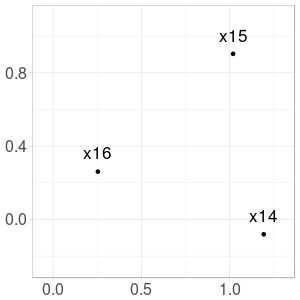

*Fig. 5. Initial and final steps*

Note that the sequence may be undefined for some initial triplets (for example when $$x_1 = x_2 = x_3$$).

**Reducing dimension of the problem**
 
Each triplet contains $$6$$ real parameters. We will show that we can reduce the *triangle pursuit* problem to $$1$$ parameter without loss of generality. Explicitly, our final parameter will be $$t \in (0, 2 \pi) \setminus \lbrace \pi \rbrace$$, related with triplet $$(x_1, x_2, x_3) = (0, 1, e^{it})$$.

***Applying rotation and translation***

Suppose that $$(x_n)_n$$ is well-defined from triplet $$(x_1, x_2, x_3)$$.
Let $$\theta \in [0, 2 \pi)$$ and $$b \in \mathbb{C}$$.
Let for $$k \in \lbrace 1, 2, 3 \rbrace$$:
$$x'_k := e^{-i \theta} (x_k - b).$$

Then, for $$k \in \lbrace 1, 2, 3 \rbrace$$, $$x_k = e^{i  \theta} x'_k + b.$$
We rewrite $$x_4$$ as follows:

$$x_4 = x_3 - N(x_3 - x_1) = e^{i  \theta} x'_3 + b - N(e^{i  \theta} x'_3 - e^{i  \theta} x'_1).$$

Because $$N(.)$$ is defined with the Euclidian norm, we obtain:

$$x_4 = e^{i  \theta} x'_3 + b - e^{i  \theta} N( x'_3 - x'_1)
= e^{i  \theta} \left(x'_3 - N( x'_3 - x'_1) \right) + b.$$

Since $$x_4$$ exists, $$x'_3 - N( x'_3 - x'_1)$$ exists and we define:
$$x'_4 := x'_3 - N( x'_3 - x'_1).$$

We can continue and define $$(x'_n)$$ such that for all $$n$$:
$$x'_n := e^{i \theta} x'_n + b.$$

***From 6 to 3 parameters***

Suppose as before that $$(x_n)_n$$ is well-defined from triplet $$(x_1, x_2, x_3)$$.

Rotation and translation have released $$3$$ degree of freedom. 
In this paragraph, we select $$\theta$$ and $$b$$ to obtain a triplet $$(x'_1, x'_2, x'_3)$$
verifying those $$3$$ conditions:

$$x'_1 \text{ on the ray } ]x'_3 0)~~~;~~~x'_2 \in \mathbb{R}^{+}~~~;~~~\| x'_3 \| = 1.$$

Positions of $$x'_1, x'_2, x'_3$$ are illustrated in Fig. 6.

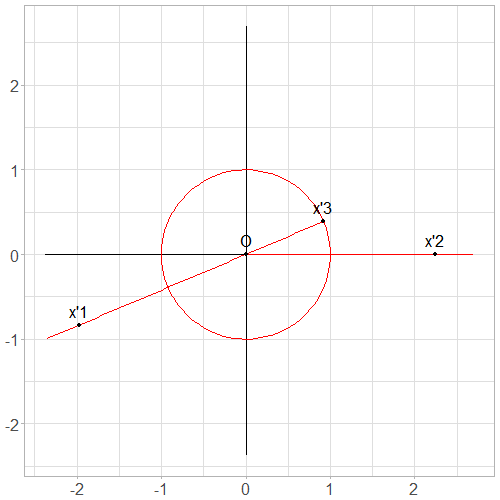

*Fig. 6. Typical positions of $$x'_1, x'_2$$ and $$x'_3$$ after transformation*

Calculations are tedious, so you can skip them at first reading.

First, we have $$x_3 \neq x_1$$, otherwise $$x_4$$ cannot be defined.
Then, we let:

$$s:= \text{Arg}(x_3 - x_1) \in [0, 2 \pi),$$

$$r:= 1 - \| x_3 - x_1 \| \in (-\infty, 1),$$

$$A \geq 0 \text{ and } t \in [0, 2 \pi) \text{ such that } A e^{-it} := 1 + (x_2 - x_3)e^{-is}.$$

We select:

$$\theta := s - t,$$

$$b:= x_3 - e^{is}.$$

We compute $$x'_1, x'_2, x'_3$$:

$$x'_1 = e^{-i \theta}(x_1 - b) = e^{-i s}e^{i t}(x_1 - x_3 + e^{is}) = e^{-i s}e^{i t}(-(1-r) e^{is} + e^{is}) = r e^{it}.$$

$$x'_2 = e^{-i \theta}(x_2 - b) = e^{-is}e^{it}(x_2 - x_3) + e^{it} = e^{it} (1 + (x_2 - x_3) e^{-is}) =  A.$$

$$x'_3 = e^{-i \theta}(x_3 - b) = e^{-is}e^{it}e^{is} = e^{it}.$$
 
$$x'_1, x'_2, x'_3$$ verify the $$3$$ conditions, so the conclusion.

**From 3 to 1 parameters**

We consider $$(x'_1, x'_2, x'_3)$$ as is the last paragraph.

From the recurrence relation, we obtain: $$x'_4 = 0$$ regardless of $$r$$.
The term $$x'_1$$ is not used for subsequent terms, so we can let $$r = 0$$
and consider $$(x''_1, x''_2, x''_3) = (0, x'_2, x'_3).$$

Then, we observe that $$A \neq 0$$, otherwise $$x''_5$$ cannot be defined.
From the recurrence relation, we obtain: $$x''_5 = 0$$ regardless of remaining $$A$$.
The term $$x''_2$$ is not used for subsequent terms, so we can let $$A = 1$$
and consider $$(x'''_1, x'''_2, x'''_3) = (0, 1, e^{it}).$$

This construction is illustrated in Fig. 7.
 
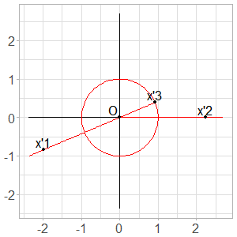
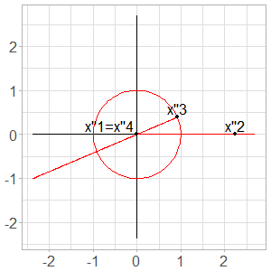
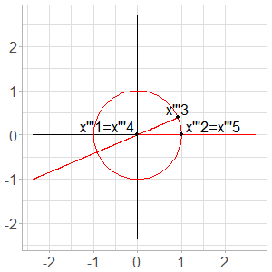

*Fig. 7. From $$3$$ parameters to $$1$$ parameter*
 
We have reduced the problem to $$1$$ dimension without loss of generality.
We observe that parameters $$t = 0 \text{ mod } \pi$$ are impossible. 
We are now interested to understand the behavior of the sequence as a function of $$t$$.

**First terms of the sequence**

Let $$t \in (0, 2 \pi) \setminus \lbrace \pi \rbrace$$ and $$(x_1, x_2, x_3) := (0, 1, e^{it})$$.

We separate the recurrence relation into 2 steps, for $$n \geq 4$$:

$$w_n := \frac{1}{\| x_{n-1} - x_{n-3} \|}, \text{ and}$$

$$x_n = (1- w_n) x_{n-1} + w_n x_{n-3}.$$

First terms are easy:

$$w_4 = 1,~~~x_4 = 0,~~~w_5 = 1,~~~x_5 = 1,~~~ $$

After that, it is more and more complex. The following formulas are true with $$t \in (0, \pi)$$ (additional care is needed outside).

We let $$a := \sin(t/2)$$, $$a' := \cos(t/2)$$, 
$$b := \cos(\frac{t+\pi}{4})$$, $$b' := \sin(\frac{t+\pi}{4})$$,
$$c := \sin(\frac{t+\pi}{8})$$, and get:

$$w_6 = 1/(2a),~~~ \text{Re}(x_6) = 1 - a,~~~ \text{Im}(x_6) = a',$$

$$w_7 = 1/(2b),~~~ \text{Re}(x_7) = (2b - 1)b,~~~ \text{Im}(x_7) = (2b - 1)b',$$

$$w_8 = 1/(2c).$$

Functions with long periods are appearing, all shaped with absolute values everywhere. Maybe some Fourier wizard can help to get a closed form for $$w_n$$ and $$x_n$$.

Construction of the first terms of the sequence for $$t = 0.6$$ is illustrated in Fig. 8.

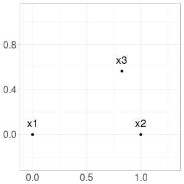
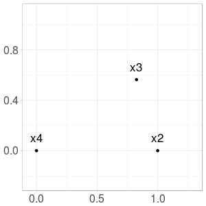

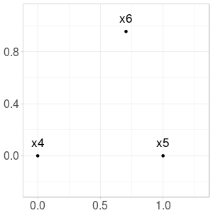
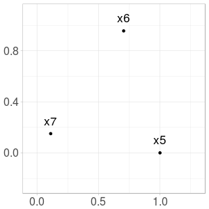

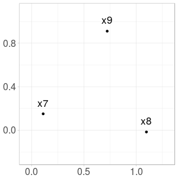
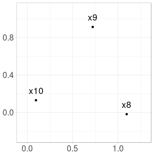
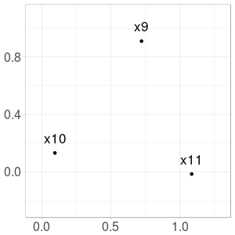

*Fig. 8. Construction of the first steps with initial triplet $$(0, 1, e^{0.6i})$$*

**Adherent points**

For each $$t \in (0, 2 \pi) \setminus \lbrace \pi \rbrace$$ and $$(x_1, x_2, x_3) := (0, 1, e^{it})$$,
we observe that $$(x_n)_n$$ has $$3$$ adherent points forming an equilateral triangle.

We map each initial triplet to the corresponding adherent points.

We show in Fig. 9 the mapping from $$(0, 2 \pi) \setminus \lbrace \pi$$ to the corresponding adherent points.
Images of components $$(0, \pi)$$ and $$(\pi, 2 \pi)$$ are symmetric with respect to the x-axis.

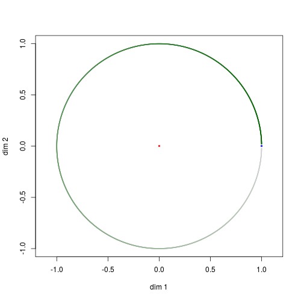
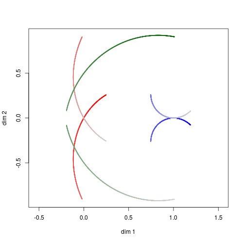

*Fig. 9. Mapping from $$(0, 2 \pi) \setminus \lbrace \pi$$ (left) to the corresponding adherent points (right). Bright colors correspond to small values of $$t$$, and faded colors to larger values.*

We restrict the mapping on the interval $$(0, \pi)$$ and show a more detailed plot in Fig. 10. Notice the mapping of $$\pi / 3 \approx 1.05$$ by the mapping.

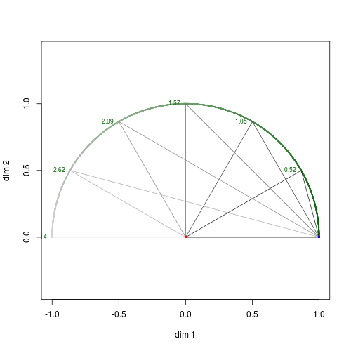
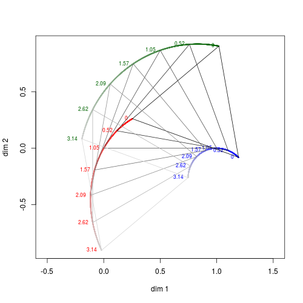

*Fig. 10. Mapping from $$(0, \pi)$$ (left) to the corresponding adherent points (right).*

**Illustration with other norms**
 
TODO: Illustrations
Continue here

Remember to add illustration like that

**Example with more adherent points**

*Fig. 1. Illustration explained later in this post*
TODO: add introduction pictures.

**References**

TODO.
