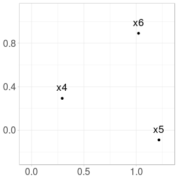
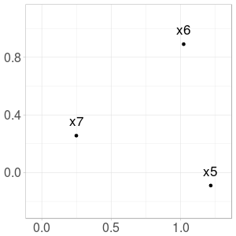
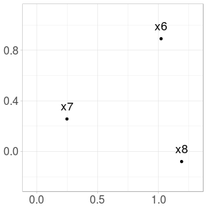
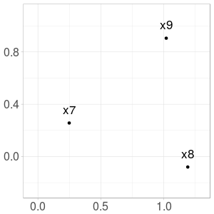
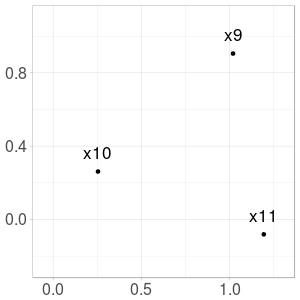

Let $$x_1, x_2, x_3$$ be three points in a plane.
We define $$x_4$$ the point on the ray $$[x_3 x_1)$$ located at a distance $$1$$ of $$x_3$$.
It is as $$x_1$$ has been attracted to $$x_3$$ but kept at distance.
We continue by defining $$x_5$$ the point on the ray $$[x_4 x_2)$$ located at a distance $$1$$ of $$x_4$$.

On the whole, we define from $$(x_1, x_2, x_3)$$ a recurrent sequence taking values in $$\mathbb{R}^2$$
and such that, for $$n \geq 4$$,

$$x_{n} = x_{n-1} - N(x_{n-1} - x_{n-3})$$

with $$N: x \mapsto \frac{x}{\left| \left| x \right| \right| }$$

and $$ \left| \left| . \right| \right|$$ the Euclidian norm.

For example, with $$x_1=(0,0), x_2=(1,0), x_3=(1,1)$$, first steps are illustrated on the following figure.

Note that sequence may be undefined for some initial triplets (for example when $$x_1 = x_2 = x_3$$).

Continue here