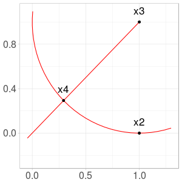
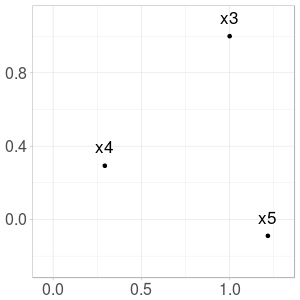
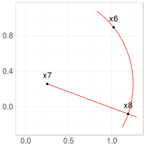

Let $$x_1, x_2, x_3$$ be three points in a plane.
We define $$x_4$$ the point on the ray $$[x_3 x_1)$$ located at a distance $$1$$ of $$x_3$$.
It is as $$x_1$$ has been attracted to $$x_3$$ but kept at distance.
We continue by defining $$x_5$$ the point on the ray $$[x_4 x_2)$$ located at a distance $$1$$ of $$x_4$$.

On the whole, we define from $$(x_1, x_2, x_3)$$ a recurrent sequence taking values in $$\mathbb{R}^2$$
and such that, for $$n \geq 4$$ (with $$N: x \mapsto \frac{x}{\| x \|}$$ and $$ \|.\|$$ the Euclidian norm):

$$x_{n} = x_{n-1} - N(x_{n-1} - x_{n-3}).$$

Note that sequence may be undefined for some initial triplets (for example when $$x_1 = x_2 = x_3$$).

With $$x_1=(0,0)$$, $$x_2=(1,0)$$, $$x_3=(1,1)$$, construction of the first steps are illustrated on the following figures.

*Computing $$x_4$$ from $$x_1$$ and $$x_3$$*

*Computing $$x_5$$ from $$x_2$$ and $$x_4$$*

*Computing $$x_6$$ from $$x_3$$ and $$x_5$$*

*Computing $$x_7$$ from $$x_4$$ and $$x_6$$*

*Computing $$x_8$$ from $$x_5$$ and $$x_7$$*

Continue here