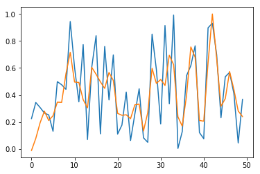

<script src="https://cdn.mathjax.org/mathjax/latest/MathJax.js?config=TeX-AMS-MML_HTMLorMML" type="text/javascript"></script>
This tutorial provides a complete introduction of time series prediction with RNN.

In part A, we predict *short* time series using stateless LSTM. Computations give good results for this kind of series.

In part B, we try to predict *long* time series using stateless LSTM. In that case, model leads to poor results. 

In part C, we circumvent this issue by training **stateful LSTM**. Stateful models are tricky with Keras, because you need to be careful on how to cut time series, select batch size, and reset states. I wrote a wrapper function working in all cases for that purpose.

In part D, stateful LSTM is used to predict multiple outputs from multiple inputs.

<center></center>


*Fig. 1. Framework with input time series on the left, RNN model in the middle, and output time series on the right*

Companion source code for this post is available [here](https://github.com/ahstat/deep-learning/blob/master/rnn/4_lagging_and_stateful.py).

### Description of the problem

We focus on the following problem.
Let $$x_1, x_2, x_3, x_4$$ four time series following the uniform distribution on $$[0, 1]$$. Each time series is indexed by $$\lbrace 0, 1, \ldots, T-1 \rbrace$$.

Let $$y_1, y_2, y_3$$ three time series defined as:

* $$y_1(t) = x_1(t-2)$$ for $$t \geq 2$$,
* $$y_2(t) = x_2(t-1) \times x_3(t-2)$$ for $$t \geq 2$$,
* $$y_3(t) = x_4(t-3)$$ for $$t \geq 3$$.

Each time series is also indexed by $$\lbrace 0, 1, \ldots, T-1 \rbrace$$ (first undefined elements of $$y_1, y_2, y_3$$ are sampled randomly).

Our task is to predict the three time series $$y = (y_1, y_2, y_3)$$ based on inputs $$x = (x_1, x_2, x_3, x_4)$$. To this end, we will train different RNN models.
Fig. 1 represents the framework when $$T=10$$.

### Training and test sets

Two parameters are used to define training and test sets: $$N$$ the number of sample elements and $$T$$ the length of each time series. Each sample element consists of inputs $$x = (x_1, x_2, x_3, x_4)$$ (four time series of length $$T$$) and outputs $$y = (y_1, y_2, y_3)$$ (three time series of length $$T$$).

We take the same number of elements $$N$$ in the training and the test set.

On the whole, for $$i \in \lbrace 0, ..., N-1 \rbrace$$, the $$i$$-th element of the training set is:
$$(x^{i,\text{train}}, y^{i,\text{train}}),$$
and the $$i$$-th element of the test set is:
$$(x^{i,\text{test}}, y^{i,\text{test}}).$$

For example, $$x^{i,\text{train}}_2(t) \in [0, 1]$$ is the value at date $$t$$ of the time series $$x^{i,\text{train}}_2$$, which is the second input of 
$$(x^{i,\text{train}}, y^{i,\text{train}})$$, which is the $$i$$-th element of the training set.

This is implemented in function `sample_time_series_roll`.

## Part A: Short time series with stateless LSTM

We consider short time series of length $$T = 37$$ and sample size $$N = 663$$.

In this part, the most difficult task is to reshape inputs and outputs correctly using numpy tools. We obtain inputs with shape $$(N, T, 4)$$ and outputs with shape $$(N, T, 3)$$.

Then, an classic LSTM model is defined and trained with $$10$$ units.

```
##
# Model
##
model=Sequential()
dim_in = 4
dim_out = 3
nb_units = 10
model.add(LSTM(input_shape=(None, dim_in),
               return_sequences=True, 
               units=nb_units))
model.add(TimeDistributed(Dense(activation='linear', 
                                units=dim_out)))
model.compile(loss = 'mse', optimizer = 'rmsprop')

##
# Training
##
# 2 seconds for each epoch
np.random.seed(1337)
history = model.fit(inputs, outputs, 
                    epochs = 500, batch_size = 32,
                    validation_data=(inputs_test, 
                                     outputs_test))
plotting(history)
```

Training performs well (see Fig. 2), and after $$500$$ epochs, training and test losses have reached $$0.0061$$.

<center></center>

*Fig. 2. MSE loss as a function of epochs for short time series with stateless LSTM*

Results are also checked visually, here for sample $$i=0$$ (blue for true output; orange for predicted outputs):

<center></center>

*Fig. 3.a. Prediction of $$y_1$$ for short time series with stateless LSTM*

<center></center>

*Fig. 3.b. Prediction of $$y_2$$ for short time series with stateless LSTM*

<center></center>

*Fig. 3.c. Prediction of $$y_3$$ for short time series with stateless LSTM*

**Conclusion of this part:** Our LSTM model works well to learn short sequences.

## Part B: Problem to predict long time series with stateless LSTM

We consider long time series of length $$T = 1443$$ and sample size $$N = 17$$.
Note that product $$N \times T$$ is the same in parts A and B (so computation of $$500$$ epochs takes a similar amount of time).

We repeat the methodology described in part A in a simplified setting: We only predict $$y_1$$ (the first time series output) as a function of $$x_1$$ (the first time series input).
Even in this case, predictions are not satisfactory after $$500$$ epochs.
Training and test losses have decreased to $$0.036$$ (see Fig. 4), but it is not enough to give accurate predictions (see Fig. 5). 

<center></center>
*Fig. 4. MSE loss as a function of epochs for long time series with stateless LSTM*

In Fig. 5, we check output time series for sample $$i=0$$ and for the $$50$$ first elements (blue for true output; orange for predicted outputs).

<center></center>

*Fig. 5. Prediction for $$y_1$$ for long time series with stateless LSTM, restricted to the $$50$$ first dates*


**Conclusion of this part:** Stateless LSTM models work poorly in practice for learning long time series, even for $$y_t = x_{t-2}$$.
The network is able to learn such dependence, but convergence is too slow. In this case, we need to switch to stateful LSTM as seen in part C.

## Part C: Wrapper function to use stateful LSTM with time series

We have seen in part B that learning with LSTM can be very slow for long time series.

A natural idea is to cut the series into smaller pieces and to treat each one separately.

An issue arises by applying this method directly: 
Between two pieces, the network will reset hidden states, 
preventing share of information.
For example, with $$y_1(t) = x_1(t-2)$$ and a series cuts into $$2$$ pieces, the first element of piece $$2$$ cannot access to any information kept in memory from piece $$1$$, and will be unable to produce a correct output.

Here is coming stateful LSTM. 
Using it, we cut the series into smaller pieces, and also keep state of hidden cells from one piece to the next. This idea is illustrated in Fig. 6 with a series of length $$T = 14$$ divided into $$2$$ pieces of length $$T_{\text{after_cut}} = 7$$.

<center></center>

*Fig. 6. a. Series before cut. Simplified workflow: Compute gradient of the series; Update parameters; Reset hidden states*

*Fig. 6. b. Series cut into $$2$$ pieces of length $$7$$. Simplified workflow: Compute gradient of piece $$1$$; Update parameters; Keep hidden states; Compute gradient of piece $$2$$; Update parameters; Reset hidden states*

In practice, we also need to paid attention of the batch size during cut.

The easiest case is when batch size is $$N$$ the number of elements in the sample.
In that case, we only reset states after each epoch.

Another simple case is when batch size is $$1$$.
In that case, we present each series in a lineup, and reset states after each series.
This case is illustrated in Fig. 7.

The tricky case is when $$\text{batch_size} | N$$ and $$\text{batch_size} \not \in \lbrace 1, N \rbrace$$.
In that case, we present a batch series in a lineup, and reset states after batch series.
This is illustrated in Fig. 8.
In the companion source code, 
cut is done with `stateful_cut` function,
designed to manage number of cuts, batch size, as well as multiple inputs and outputs.


<center></center>
*Fig. 7. a. Aaa*

<center></center>
*Fig. 7. b. Aaa*

<center></center>
*Fig. 8. a. Aaa*

<center></center>
*Fig. 8. b. Aaa*


## Part D: Long time series with stateful LSTM

we apply those predictions with multiple inputs and outputs
Do not forget to reset states.
A technical problem with validation, as noted by Philippe Remy.

TODO before 31th March 2018.

## References
To deal with part C in companion code, we consider a 0/1 time series described by Philippe
Remy in http://philipperemy.github.io/keras-stateful-lstm/ and we follow
stateful implementation in Keras according to 
https://stackoverflow.com/questions/43882796/

Model defined in https://stackoverflow.com/questions/41947039

Based on question https://stackoverflow.com/questions/41947039 called
"Keras RNN with LSTM cells for predicting multiple output time series based 
on multiple input time series"
