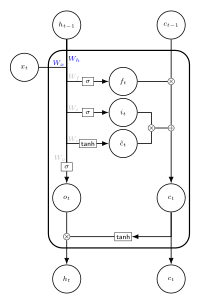
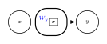
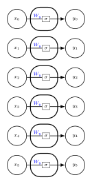
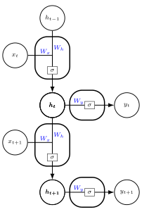
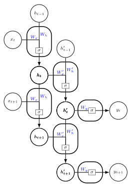
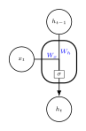
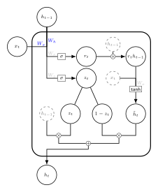

<script src="https://cdn.mathjax.org/mathjax/latest/MathJax.js?config=TeX-AMS-MML_HTMLorMML" type="text/javascript"></script>

This tutorial highlights structure of common RNN algorithms by following and understanding computations carried out by each model.
It is intended for anyone knowing the general deep learning workflow, but without prior understanding of RNN.
If you really never heard about RNN, you can [read this post of Christopher Olah](http://colah.github.io/posts/2015-08-Understanding-LSTMs/) first.

The present post focuses on understanding computations in each model step by step, without paying attention to train something useful.
It is illustrated with [Keras](https://keras.io/) codes
and divided into five parts:

- TimeDistributed component,
- Simple RNN,
- Simple RNN with two hidden layers,
- LSTM,
- GRU.

<center><a href="https://ahstat.github.io/RNN-Keras-understanding-computations/"></a></center>


*This diagram is an illustration of an LSTM cell. Check out part D for details.*

Companion source code for this post is available [here](https://github.com/ahstat/deep-learning/blob/master/rnn/1_math_structure_of_rnn.py).

The core idea of RNN over feedforward neural networks is to read input in a sequential way. In RNN, input $$x$$ is indexed with $$t$$ and processed sequentially. The index $$t$$ can represent time for time-series, or sentence's position for NLP tasks.
Information is stored, updated and transmitted over time using a hidden variable. 

Simple RNN is a simple way to keep and update information along time. It is progressively described in Part A, B and C. This kind of model is effective but difficult to train for long-dependence series. The main issue is caused by the [vanishing gradient problem](https://en.wikipedia.org/wiki/Vanishing_gradient_problem). This problem is detailed in [Section 10.7 of the Deep Learning book](http://www.deeplearningbook.org/contents/rnn.html).

Gated RNNs have been introduced to circumvent the vanishing gradient problem. Two popular gated RNNs are described in Part D (LSTM) and Part E (GRU). 
The main idea is to control information flow by introducing gates.
Insight into why it is working can be found [here](https://stats.stackexchange.com/questions/185639/how-does-lstm-prevent-the-vanishing-gradient-problem) (please share if you know a better reference).

Note that even gated RNNs have computational and interpretability issues, and are not explicit memory. 
A promising way to circumvent those issues is attention mechanisms.
An overview is available [here](https://distill.pub/2016/augmented-rnns/) (see also [this](https://towardsdatascience.com/the-fall-of-rnn-lstm-2d1594c74ce0) and [this](https://syncedreview.com/2017/09/25/a-brief-overview-of-attention-mechanism/) short posts).

## Part A: Explanation of the TimeDistributed component

**A very simple network.**
Let's begin with one-dimensional input and output.
In Keras, the command line:

```python
Dense(activation='sigmoid', units=1)
```

corresponds to the mathematical equation:

$$y = \sigma(W_y x + b_y).$$

Input $$x$$ and output $$y$$ are one-dimensional, so the weights are such that $$W_y \in \mathbb{R}$$ and $$b_y \in \mathbb{R}$$. The output layer is indeed one-dimensional because we let `units = 1` in the previous command line.
This equation can be represented by the following diagram (bias term $$b_y$$ has been masked to improve lisibility):

<center></center>

**TimeDistributed wrapper in dimension 1.** 
The TimeDistributed wrapper applies the same layer at each time step. 
For example, with one-dimensional input and output along $$T = 6$$ dates, input is represented with $$(x_0, \ldots, x_5) \in \mathbb{R}^6$$ and output with $$(y_0, \ldots, y_5) \in \mathbb{R}^6$$. Then, the model:

```python
TimeDistributed(Dense(activation='sigmoid', units=1),
                input_shape=(None, 1))
```

corresponds to the equation:

$$y_t = \sigma(W_y x_t + b_y)$$

applied at each $$t \in \lbrace 0, \ldots 5 \rbrace$$. Note that $$W_y \in \mathbb{R}$$ and $$b_y \in \mathbb{R}$$ are identical for each $$t$$. In the previous command line, `input_shape=(None, 1)` means that input layer is an array of shape $$T \times 1$$, and `units = 1` means that output layer contains $$1$$ unit for each $$t$$. This model can be represented by the diagram:

<center></center>

**Input and output shapes in practice.**
Input has usually the shape $$(N, T, m)$$, where $$N$$ is sample size, $$T$$ is temporal size, and $$m$$ is the dimension of each input vector.
Output has the shape $$(N, T, m')$$, where $$m'$$ is the dimension of each output vector.
In the previous example, we have selected $$T = 6$$, $$m = 1$$, and $$m' = 1$$. 

**Prediction of new inputs.**
Given a model trained on inputs of shape $$(N, T, m)$$,
we can feed the model with new inputs of shape $$(k, l, m)$$.

In the previous example, we can select for example:

```python
new_input = np.array([[[1],[0.8],[0.6],[0.2],
                      [1],[0],[1],[1]]])
new_input.shape # (1, 8, 1)
print(model.predict(new_input))
```

**Complete example of TimeDistributed with higher dimensions.**
Let $$N = 256$$, $$T = 6$$, $$m = 2$$, $$m' = 3$$. Training inputs have shape $$(256, 6, 2)$$ and training outputs have shape $$(256, 6, 3)$$.

The model is built and trained as follows:

```python
dim_in = 2
dim_out = 3
model=Sequential()
model.add(TimeDistributed(Dense(activation='sigmoid', units=dim_out), # target is dim_out-dimensional
                          input_shape=(None, dim_in))) # input is dim_in-dimensional
model.compile(loss = 'mse', optimizer = 'rmsprop')
model.fit(x_train, y_train, epochs = 100, batch_size = 32)
```

Output for a new input of shape $$(k, l, m)$$ can be predicted as follows:

```python
new_input = model.predict(np.array([[[1,1]]]))
new_input.shape # (1, 1, 2), which is a valid shape for this model
print(model.predict(new_input))
# [[[ 0.70669621  0.70633912  0.65635538]]]
# output is (1, 1, 3) as expected.
# Note that each column has been trained differently
```

This computation can be understood in details,
by taking $$x_t$$ a two-dimensional vector,
computing $$W_y x_t + b_y$$,
and then applying the sigmoid function $$\sigma$$ to each component.

```python
W_y = model.get_weights()[0] # this is a (2,3) matrix
b_y = model.get_weights()[1] # this is a (3,1) vector
# At each time, we have a dense neural network 
# (without hidden layer) from 2+1 inputs to 3 outputs.
# On the whole, there are 9 parameters 
# (the same parameters are used at each time).

[[sigmoid(y)
  for y in np.dot(x,W_y) + b_y] # like doing X * beta
  for x in [[1,1]]]
# We obtain the same results as with 'model.predict'
```

We have:
$$
W_y = \begin{bmatrix}
0.76 & 0.68 & 0.66 \\
0.92 & 0.99 & 0.52
\end{bmatrix}
$$,
$$
b_y = \begin{bmatrix}
-0.80 \\
-0.79 \\
-0.54
\end{bmatrix}
$$,
and we take
$$x_t = \begin{bmatrix}
1 \\
1
\end{bmatrix}$$.
The formula $$W_y^\intercal x_t + b_y$$ (note the transpose for dimensional correctness) gives
$$W_y^\intercal x_t + b_y = \begin{bmatrix}
0.88 \\
0.88 \\
0.65
\end{bmatrix},$$
and after applying the sigmoid on each component, we obtain:
$$y_t = \begin{bmatrix}
0.71 \\
0.71 \\
0.66
\end{bmatrix}$$.

## Part B: Explanation of simple RNN

*Simple RNN* is the simplest way for a neural network to keep information along time.
Information is stored in the hidden variable $$h$$ and updated at each time based on new inputs.
Simple RNN can be connected to a time distributed component to form the *Elman's network*, introduced in 1990. The time distributed component allows computing output from the hidden variable.
We describe this complete network in this part.

**Description of the network.**
In Keras, the command lines:

```python
dim_in=3; dim_out=2; nb_units=5;
model=Sequential()
model.add(SimpleRNN(input_shape=(None, dim_in), 
                    return_sequences=True, 
                    units=nb_units))
model.add(TimeDistributed(Dense(activation='sigmoid',
                                units=dim_out)))
```

corresponds to the mathematical equations (for all time $$t$$):

$$
\begin{align}
h_t =& \sigma(W_x x_t + W_h h_{t-1} + b_h), \\
y_t =& \sigma(W_y h_t + b_y).
\end{align}
$$

As before, training inputs have shape $$(N, T, m)$$ and training outputs have shape $$(N, T, m')$$. In this example, we have taken $$m = 3$$ and $$m' = 2$$, then $$x_t$$ is a two-dimensional vector and $$y_t$$ is a three-dimensional vector.
We have selected `units=5`, so $$h_t$$ is a five-dimensional vector.
In details, the `SimpleRNN` line computes the full sequence $$(h_0, \ldots h_T)$$ from $$(x_0, \ldots, x_T)$$ (and initial $$h_{-1}$$); the `TimeDistributed` line computes the sequence $$(y_0, \ldots y_T)$$ from $$(h_0, \ldots h_T)$$.

Those equations can be represented by the following diagram:

<center></center>

This diagram shows one temporal step of the network, explaining how to compute $$h_t$$ and $$y_t$$ from $$x_t$$ and $$h_{t-1}$$.

It remains to select the initial value $$h_{-1}$$ of the hidden variable, and we take the null vector: $$h_{-1} = \left( 0,0,0,0,0 \right)^\intercal$$.


**Complete example of simple RNN.**
Let $$N = 256$$, $$T = 6$$, $$m = 2$$, $$m' = 3$$. Training inputs have shape $$(256, 6, 2)$$ and training outputs have shape $$(256, 6, 3)$$.

The model is built and trained as follows:

```python
dim_in = 2; dim_out = 3; nb_units = 5
model=Sequential()
model.add(SimpleRNN(input_shape=(None, dim_in), 
                    return_sequences=True, 
                    units=nb_units))
model.add(TimeDistributed(Dense(activation='sigmoid', units=dim_out)))
model.compile(loss = 'mse', optimizer = 'rmsprop')
model.fit(x_train, y_train, epochs = 100, batch_size = 32)
```

The weights of the trained network are:

```python
W_x = model.get_weights()[0] # W_x a (3,5) matrix
W_h = model.get_weights()[1] # W_h a (5,5) matrix
b_h = model.get_weights()[2] # b_h a (5,1) vector
W_y = model.get_weights()[3] # W_y a (5,2) matrix
b_y = model.get_weights()[4] # b_y a (2,1) vector
```

We want to predict output for a new input of shape $$(k,l,m)$$. We take a shape $$(1, 3, 3)$$ and let:
$$x_0 = (4,2,1)^\intercal$$, $$x_1 = (1,1,1)^\intercal$$, and $$x_2 = (1,1,1)^\intercal$$. The model predicts output for this series:

```python
new_input = [[4,2,1], [1,1,1], [1,1,1]]
print(model.predict(np.array([new_input])))
# [[[ 0.79032147  0.42571515]
#   [ 0.59781438  0.55316663]
#   [ 0.87601596  0.86248338]]]
```

It is possible to retrive this result manually by computing $$h_0$$ from $$x_0$$ and $$h_{-1}$$; then $$y_0$$ from $$h_0$$; then $$h_1$$ from $$x_1$$ and $$h_{0}$$; then $$y_1$$ from $$h_1$$; then $$h_2$$ from $$x_2$$ and $$h_{1}$$; then $$y_2$$ from $$h_2$$. This is detailed in Part B of the [companion code](https://github.com/ahstat/deep-learning/blob/master/rnn/1_math_structure_of_rnn.py).

## Part C: Explanation of simple RNN with two hidden layers

In Part B, we have connected a `SimpleRNN` layer and a `TimeDistributed` layer to form an Elman's network with one hidden layer. It is easy to stack another `SimpleRNN` layer.

This Keras code:

```python
dim_in = 3; dim_out = 2
model=Sequential()
model.add(SimpleRNN(input_shape=(None, dim_in), 
                    return_sequences=True, 
                    units=5))
model.add(SimpleRNN(input_shape=(None,4), 
                    return_sequences=True, 
                    units=7))
model.add(TimeDistributed(Dense(activation='sigmoid',
                                units=dim_out)))
```

corresponds to the mathematical equations (for all time $$t$$):

$$
\begin{align}
h_t =& \sigma(W_x x_t + W_h h_{t-1} + b_h), \\
h'_t =& \sigma(W'_x h_t + W'_h h'_{t-1} + b'_h), \\
y_t =& \sigma(W_y h'_t + b_y).
\end{align}
$$

and is represented by the following diagram (two temporal steps are shown to help understanding how all is connecting together):

<center></center>

In this example, at each time $$t$$, $$x_t$$, $$h_t$$, $$h'_t$$, $$y_t$$ are vectors of size $$2$$, $$5$$, $$7$$, $$3$$ respectively.

Shape of weight matrices and manual computations are detailed in Part C of the [companion code](https://github.com/ahstat/deep-learning/blob/master/rnn/1_math_structure_of_rnn.py).

## Part D: Explanation of LSTM

**From SimpleRNN layer to LSTM layer.**
In Part B, we used a `SimpleRNN` layer to update the hidden variable $$h$$, i.e. to compute $$h_t$$ from $$(x_t, h_{t-1})$$. This layer in isolation at time $$t$$ is represented as follows: 

<center></center>

Long short-term memory (LSTM) networks replace the `SimpleRNN` layer with an `LSTM` layer. An LSTM layer takes 3 inputs $$(x_t, h_{t-1}, c_{t-1})$$ and outputs a couple $$(h_t, c_t)$$ at each step $$t$$. $$h$$ is the hidden variable and $$c$$ is called the cell variable. This kind of networks has been introduced in 1997.

In Keras, the command line:
```python
LSTM(input_shape=(None, dim_in), 
                    return_sequences=True, 
                    units=nb_units,
                    recurrent_activation='sigmoid',
                    activation='tanh')
```

corresponds to the equations:

$$
\begin{align}
i_t =& \sigma(W_{ix} x_t + W_{ih} h_{t-1} + b_i) \\
f_t =& \sigma(W_{fx} x_t + W_{fh} h_{t-1} + b_f) \\
\tilde{c}_t =& \tanh(W_{cx} x_t + W_{ch} h_{t-1} + b_c) \\
o_t =& \sigma(W_{ox} x_t + W_{oh} h_{t-1} + b_o) \\
 \\
c_t =& f_t c_{t-1} + i_t \tilde{c}_t \\
h_t =& o_t \tanh(c_t)
\end{align}
$$

(with null vectors for $$c_{-1}$$ and $$h_{-1}$$) and is represented by the following diagram:

<center></center>

In this setting, $$f_t$$ represents the *forget variable* (controlling how much information of $$c_{t-1}$$ is transmitted), $$\tilde{c}_t$$ represents *new information* to save, weighted by an *input variable* $$i_t$$ (controlling how much information of $$\tilde{c}_t$$ is transmitted). The combination of those variables forms $$c_t$$ the cell variable. Finally, $$o_t$$ represents the *output variable* (controlling how much information of $$\tanh c_{t}$$ is transmitted to $$h_t$$).

**Explanation of matrices.**
It can be confusing to understand how all the matrices are organized.
Let us suppose that `dim_in=7` and `nb_units = 13`.
The input vector $$x_t$$ has length 7, and hidden and cell vectors $$h_t$$ and $$c_t$$ have both length 13.

- Matrices $$W_{ix}$$, $$W_{fx}$$, $$W_{cx}$$, $$W_{ox}$$ have shape $$7 \times 13$$ each, because they are multiplied with $$x_t$$,
- Matrices $$W_{ih}$$, $$W_{fh}$$, $$W_{ch}$$, $$W_{oh}$$ have shape $$13 \times 13$$ each, because they are multiplied with $$h_t$$,
- Bias vectors $$b_{i}$$, $$b_{f}$$, $$b_{c}$$, $$b_{o}$$ have length $$13$$ each.

Consequently, vectors $$i_t$$, $$f_t$$, $$\tilde{c}_t$$ and $$o_t$$ have length $$13$$ each.

In the Keras implementation of LSTM, <span style="color:blue;">$$W_x$$</span> and <span style="color:blue;">$$W_h$$</span> are defined as follows:

- <span style="color:blue;">$$W_{x}$$</span> is the concatenation of $$W_{ix}$$, $$W_{fx}$$, $$W_{cx}$$, $$W_{ox}$$, resulting in a $$7 \times 52$$ matrix,
- <span style="color:blue;">$$W_{h}$$</span> is the concatenation of $$W_{ih}$$, $$W_{fh}$$, $$W_{ch}$$, $$W_{oh}$$, resulting in a $$13 \times 52$$ matrix,
- <span style="color:blue;">$$b_h$$</span> is the concatenation of $$b_{i}$$, $$b_{f}$$, $$b_{c}$$, $$b_{o}$$, resulting in a vector of length $$52$$.

With those notations, we can first compute a raw vector <span style="color:blue;">$$W_{x}$$</span> $$\!x_t +$$ <span style="color:blue;">$$\!W_{h}$$</span> $$\!h_{t-1} +$$ <span style="color:blue;">$$\!b_h$$</span> of length $$52$$, before cutting it and applying activation functions to obtain 
$$i_t$$, $$f_t$$, $$\tilde{c}_t$$ and $$o_t$$.

Note that in 
[the post of Christopher Olah](http://colah.github.io/posts/2015-08-Understanding-LSTMs/), <span style="color:lightgray;">$$W_{i}$$</span>, <span style="color:lightgray;">$$W_{f}$$</span>, <span style="color:lightgray;">$$W_{c}$$</span> and <span style="color:lightgray;">$$W_{o}$$</span> are defined as follows:

- <span style="color:lightgray;">$$W_{i}$$</span>  is the concatenation of $$W_{ih}$$ and $$W_{ix}$$,
- <span style="color:lightgray;">$$W_{f}$$</span>  is the concatenation of $$W_{fh}$$ and $$W_{fx}$$,
- <span style="color:lightgray;">$$W_{c}$$</span>  is the concatenation of $$W_{ch}$$ and $$W_{cx}$$,
- <span style="color:lightgray;">$$W_{o}$$</span>  is the concatenation of $$W_{oh}$$ and $$W_{ox}$$.

**Connecting LSTM layer with subsequent layers.**
The rest of the network works as before. In Keras, we let:

```python
model=Sequential()
model.add(LSTM(input_shape=(None, dim_in), 
                    return_sequences=True, 
                    units=nb_units,
                    recurrent_activation='sigmoid',
                    activation='tanh'))
model.add(TimeDistributed(Dense(activation='sigmoid',
                                units=dim_out)))
```

In details, `LSTM` line computes the full sequence $$(h_0, \ldots h_T)$$ and $$(c_0, \ldots c_T)$$ from $$(x_0, \ldots, x_T)$$ (and initials $$h_{-1}$$ and $$c_{-1}$$); the `TimeDistributed` line computes the sequence $$(y_0, \ldots y_T)$$ from $$(h_0, \ldots h_T)$$ (note that the cell variable $$c$$ is used internally in `LSTM` but not in subsequent layers, contrary to the hidden variable $$h$$).

Shape of weight matrices and manual computations are detailed in Part D of the [companion code](https://github.com/ahstat/deep-learning/blob/master/rnn/1_math_structure_of_rnn.py).

## Part E: Explanation of GRU

Gated Recurrent Units (GRU) are a popular alternative to LSTM introduced in 2014. They apparently give similar results to LSTM with fewer parameters to train (3 sets of weights for GRU instead of 4 for LSTM).

A GRU layer takes inputs $$(x_t, h_{t-1})$$ and outputs $$h_t$$ at each step $$t$$.
In Keras, the command line:

```python
GRU(input_shape=(None, dim_in), 
    return_sequences=True, 
    units=nb_units,
    recurrent_activation='sigmoid',
    activation='tanh')
```

corresponds to the equations:

$$
\begin{align}
z_t =& \sigma(W_{zx} x_t + W_{zh} h_{t-1} + b_z) \\
r_t =& \sigma(W_{rx} x_t + W_{rh} h_{t-1} + b_r) \\
\tilde{h}_t =& \tanh(W_{ox} x_t + W_{oh} r_t h_{t-1} + b_o) \\
 \\
h_t =& z_t h_{t-1} + (1 - z_t) \tilde{h}_t
\end{align}
$$

(with null vector for $$h_{-1}$$) and is represented by the following diagram:

<center></center>

In this setting, $$z_t$$ has a role similar to the *forget variable* (controlling how much information of $$h_{t-1}$$ and $$\tilde{h}_t$$ is transmitted), $$r_t$$ is a *recurrent variable* (controlling how $$h_{t-1}$$ is weighted), and $$\tilde{h}_t$$ represents *new information* to save (subsequently weighted by $$z_t$$).

**Explanation of matrices.**
As before, we suppose that `dim_in=7` and `nb_units = 13`, so $$x_t$$ has length 7 and  $$h_t$$ has length 13.

- Matrices $$W_{zx}$$, $$W_{rx}$$, $$W_{ox}$$ have shape $$7 \times 13$$ each, because they are multiplied with $$x_t$$,
- Matrices $$W_{zh}$$, $$W_{rh}$$, $$W_{oh}$$ have shape $$13 \times 13$$ each, because they are multiplied with $$h_t$$,
- Bias vectors $$b_{z}$$, $$b_{r}$$, $$b_{o}$$ have length $$13$$ each.

Consequently, vectors $$z_t$$, $$r_t$$ and $$\tilde{h}_t$$ have length $$13$$ each.

In the Keras implementation of LSTM, <span style="color:blue;">$$W_x$$</span> and <span style="color:blue;">$$W_h$$</span> are defined as follows:

- <span style="color:blue;">$$W_{x}$$</span> is the concatenation of $$W_{zx}$$, $$W_{rx}$$, $$W_{ox}$$, resulting in a $$7 \times 39$$ matrix,
- <span style="color:blue;">$$W_{h}$$</span> is the concatenation of $$W_{zh}$$, $$W_{rh}$$, $$W_{oh}$$, resulting in a $$13 \times 39$$ matrix,
- <span style="color:blue;">$$b_h$$</span> is the concatenation of $$b_{z}$$, $$b_{r}$$, $$b_{o}$$, resulting in a vector of length $$39$$.

Manual computations are detailed in Part E of the [companion code](https://github.com/ahstat/deep-learning/blob/master/rnn/1_math_structure_of_rnn.py), and are relatively less straightforward compared to LSTM.

### References

- [Companion code for this post](https://github.com/ahstat/deep-learning/blob/master/rnn/1_math_structure_of_rnn.py)
- [Understanding LSTM Networks](http://colah.github.io/posts/2015-08-Understanding-LSTMs/) by Christopher Olah,
- [Keras documentation for TimeDistributed](https://keras.io/layers/wrappers/),
- [Keras documentation for RNN](https://keras.io/layers/recurrent/),
- [Wikipedia page on RNN describing the Elman networks](https://en.wikipedia.org/wiki/Recurrent_neural_network).
- Thanks to J. Leon for this [Tikz figure](https://tex.stackexchange.com/questions/432312/how-do-i-draw-an-lstm-cell-in-tikz), on which I made figures ([full sources are here](https://github.com/ahstat/ahstat.github.io/tree/master/images/2018-04-11-RNN-Keras-understanding-computations/tex_archives))
