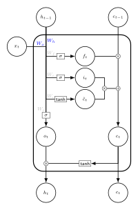

<script src="https://cdn.mathjax.org/mathjax/latest/MathJax.js?config=TeX-AMS-MML_HTMLorMML" type="text/javascript"></script>


Given a univariate random variable $$Z$$ with density $$f_Z$$, and a polynomial $$Q[X_1, \ldots, X_n]$$, we are interested in finding a random variable $$X$$ such that, given independent copies of it $$X_1, \ldots, X_n$$ (where $$\stackrel{\text{D}}{=}$$ stands for the equality in distribution):

$$Z \stackrel{\text{D}}{=} Q[X_1, \ldots, X_n].$$

This is a different problem from studying the root of a random polynomial, where the coefficients are random but not the variables. This is also different from computing $$Z$$ given $$X$$ (which is the inverse problem).

We only consider the case of multivariate monomials ($$X_1^3, X_1 X_2 X_3, X_1^2 X_2, \ldots$$) and of some common distributions on $$\mathbb{R}$$ (normal, exponential, gamma distributions).

We consider at first the cases $$X_1^k$$ and $$X_1 \ldots X_k$$ before moving to the monomials up to degree five (the number of monomials of degree $$k$$ is given by [the partition numbers](http://oeis.org/A000041)):

- $$X_1$$,
- $$X_1^2$$, $$X_1 X_2$$,
- $$X_1^3$$, $$X_1^2 X_2$$, $$X_1 X_2 X_3$$,
- $$X_1^4$$, $$X_1^3 X_2$$, $$X_1^2 X_2^2$$, $$X_1^2 X_2 X_3$$, $$X_1 X_2 X_3 X_4$$,
- $$X_1^5$$, $$X_1^4 X_2$$, $$X_1^3 X_2^2$$, $$X_1^3 X_2 X_3$$, $$X_1^2 X_2 X_3 X_4$$, $$X_1^2 X_2^2 X_3$$, $$X_1 X_2 X_3 X_4 X_5.$$

## Recall of some distributions

$$\text{Gamma}(k, \theta)$$, with shape $$k > 0$$ and scale $$\theta > 0$$ is given by the density (for $$x > 0$$):

$$\frac{1}{\Gamma{\left( k \right)} \theta^k} x^{k-1} e^{-x/ \theta}.$$


$$\text{GGamma}(k, \theta, p)$$, with shape $$k > 0$$, scale $$\theta > 0$$, power $$p > 0$$ is given by the density (for $$x > 0$$):

$$\frac{p}{\Gamma{\left( k/p \right)} \theta^k} x^{k-1} e^{-\left( x/\theta \right)^p}.$$

## Root of $$X^k = Z$$

### Case of positive variables

For $$Z$$ distributed on $$\mathbb{R}^{+}$$, and $$X$$ searched as nonnegative too, 
a change of variable gives the following density function, for $$x \geq 0$$:

$$f_X(x) = k x^{k-1} f_Z(x^k).$$

A way of generating $$X$$ from $$Z$$ is given by: 

$$X = Z^{1/k}.$$

### Other cases

#### Case $$Z \geq 0$$ and $$X \in \mathbb{R}$$

For $$k = 2$$, if $$Z$$ is nonnegative but $$X$$ is possibly real, then $$X = -\sqrt{Z}$$ also works. 
But $$X = (-1)^{\mathbf{1}_{Z \leq 1}} \sqrt{Z}$$ also. 

{::options parse_block_html="true" /}

<details><summary markdown="span">Example of three random variables $$X$$ such that $$X^2$$ follows $$\text{Exp}(1)$$.</summary>
<center></center>
```r
png("1_three_variables_such_that_square_is_exp.png", 827, 400, pointsize=24)
N = 1e7
lambda = 1
k = 2
Z = rexp(N, lambda)

par(mfrow=c(1,3))

## Positive square-root
X = Z^(1/k)
hist(X, probability = TRUE, breaks = 300, 
     main = "Positive X")
x = seq(from = -10, to = 10, length.out = 1000)
lines(x, k * x^(k-1) * dexp(x^k, lambda) * (x > 0), col = "red")

## Negative square-root (only for k = 2)
X = -Z^(1/k)
hist(X, probability = TRUE, breaks = 300, 
     main = "Negative X")
x = seq(from = -10, to = 10, length.out = 1000)
lines(x, k * abs(x)^(k-1) * dexp(x^k, lambda) * (x < 0), col = "red")

## Another alternative square-root (only for k = 2)
X = ifelse(Z <= 1, Z^(1/k), -Z^(1/k))
hist(X, probability = TRUE, breaks = 300, 
     main = "Alternative X")
x = seq(from = -10, to = 10, length.out = 1000)
lines(x, k * abs(x)^(k-1) * dexp(x^k, lambda) * (x < -1 | (x < 1 & x > 0)), col = "red")

# # Check that Z is here after taking the power value
# hist(X^k, probability = TRUE, breaks = 300)
# lines(x, dexp(x, lambda), col = "red")
dev.off()
```
</details>
<br/>

{::options parse_block_html="false" /}

#### Case $$Z \in \mathbb{R}$$

If $$Z$$ has a positive probability to be negative, the variable $$X$$ may need to live on $$\mathbb{C}$$ to exist. For example for $$k=2$$ and $$Z$$ a random variable following the normal distribution, defining $$X := \sqrt{\mid Z \mid}$$ if $$\text{sign}(Z) \geq 0$$ and $$X := i \sqrt{\mid Z \mid}$$ otherwise will work.

## Root $$\sqrt[k]{Z}$$ given by $$X_1 \ldots X_k = Z$$


### Case normal

We provide a way of generating $$X_1$$ as follows.
We define independent variables $$\varepsilon$$ following  $$\frac{1}{2} \mathbf{1}_{\lbrace -1, 1 \rbrace}$$, and $$G_{1/k, 0}, G_{1/k, 1}, \ldots $$ each following $$\text{Gamma}(1/k, 1)$$.

$$X_1 := \varepsilon \exp \left\lbrace \frac{\log 2}{2k} - G_{1/k, 0} - \sum_{j=1}^{+\infty} \left[ \frac{G_{1/k, j}}{2j+1} - \frac{1}{2k} \log \left( 1 + \frac{1}{j} \right) \right] \right\rbrace.$$

Other $$X_i$$ are independent copies of $$X_1$$, and we have $$X_1 \ldots X_k$$ following the normal distribution.

This is exactly the results obtained by Iosif Pinelis in: [The exp-normal distribution is infinitely divisible](https://arxiv.org/abs/1803.09838).

{::options parse_block_html="true" /}

<details><summary markdown="span">Proof.</summary>
Let $$Z$$ be a standard normal random variable. The distribution $$U := \log |Z|$$ is referred to as the *exp-normal distribution*, and its characteristic function is, for $$t \in \mathbb{R}$$:

$$
\begin{align*}
\mathbb{E} e^{it\log |Z|} =& \int_{-\infty}^{+\infty} e^{it \log |z|} \frac{1}{\sqrt{2\pi}} e^{-z^2/2} dz \\
\text{(Symm. in z)}=& 2 \int_{0}^{+\infty} e^{it \log z} \frac{1}{\sqrt{2\pi}} e^{-z^2/2} dz \\
=& \frac{2}{\sqrt{2\pi}} \int_{0}^{+\infty} e^{it \log z -z^2/2} dz \\
=& \frac{2}{\sqrt{2\pi}} \left[ 2^{i(i+t)/2} \Gamma \left(\frac{1+it}{2} \right) \right] \\
=& \frac{2^{1/2}}{\sqrt{\pi}}  2^{\frac{it -1}{2}} \Gamma \left(\frac{1+it}{2} \right)  \\
=& \frac{2^{it/2}}{\sqrt{\pi}}  \Gamma \left(\frac{1+it}{2} \right)  \\
=& 2^{it/2}  \frac{\Gamma \left(\frac{1+it}{2} \right)}{\Gamma \left( \frac{1}{2} \right)} \\
=& \exp \left( it \frac{\log 2}{2} \right)  \Gamma \left(\frac{1+it}{2} \right) \frac{1}{\Gamma \left( \frac{1}{2} \right)}
\end{align*}
$$

We use the formula (valid for $$z \in \mathbb{C} \setminus \left\{0, -1, -2, \ldots \right\}$$): 
$$\Gamma(z) = \frac{1}{z} \prod_{j=1}^{+\infty} \frac{\left( 1 + \frac{1}{j} \right)^z}{1 + \frac{z}{j}}$$

to get:

$$
\begin{align*}
\mathbb{E} e^{it\log |Z|} =& \exp \left( it \frac{\log 2}{2} \right) \left[ \frac{2}{1+it} \prod_{j=1}^{+\infty} \frac{\left( 1 + \frac{1}{j} \right)^{\frac{1+it}{2}}}{1 + \frac{1+it}{2j}} \right] \frac{1}{2 \prod_{j=1}^{+\infty} \frac{\left( 1 + \frac{1}{j} \right)^{1/2}}{1 + \frac{1}{2j}}} \\
=& \exp \left( it \frac{\log 2}{2} \right) \left[ \frac{2}{1+it} \prod_{j=1}^{+\infty} \frac{\left( 1 + \frac{1}{j} \right)^{\frac{1+it}{2}}}{1 + \frac{1+it}{2j}} \right] \frac{1}{2} \prod_{j=1}^{+\infty} \frac{1 + \frac{1}{2j}}{\left( 1 + \frac{1}{j} \right)^{1/2}} \\
=& \exp \left( it \frac{\log 2}{2} \right) \frac{1}{1+it} \left[  \prod_{j=1}^{+\infty} \frac{\left( 1 + \frac{1}{j} \right)^{\frac{1+it}{2}}}{1 + \frac{1+it}{2j}} \right]  \prod_{j=1}^{+\infty} \left[ \left(1 + \frac{1}{2j} \right) \left( 1 + \frac{1}{j} \right)^{-1/2} \right] \\
=& \exp \left( it \frac{\log 2}{2} \right) \frac{1}{1+it} \left[  \prod_{j=1}^{+\infty} \left( 1 + \frac{1}{j} \right)^{\frac{it}{2}} \right]  \prod_{j=1}^{+\infty}  \frac{1 + \frac{1}{2j}}{1 + \frac{1+it}{2j}} \\
=& \exp \left( it \frac{\log 2}{2} \right) \frac{1}{1+it} \left[  \prod_{j=1}^{+\infty} \left( 1 + \frac{1}{j} \right)^{\frac{it}{2}} \right]  \prod_{j=1}^{+\infty}  \frac{1}{1 + \frac{it}{2j+1}} \\
=& \exp \left( it \frac{\log 2}{2} \right) \frac{1}{1+it} \prod_{j=1}^{+\infty} \exp \left[ \frac{it}{2} \log \left( 1 + \frac{1}{j} \right) \right] \prod_{j=1}^{+\infty}  \frac{1}{1 + \frac{it}{2j+1}} \\
=& \exp \left( it \frac{\log 2}{2} \right) \frac{1}{1+it} \prod_{j=1}^{+\infty}    \frac{\exp \left[ \frac{it}{2} \log \left( 1 + \frac{1}{j} \right) \right]}{1 + \frac{it}{2j+1}}.
\end{align*}
$$

In addition, the characteristic function of an exponential variable $$X$$ with mean $$a > 0$$ (so with parameter $$1/a$$) is:

$$\mathbb{E} e^{itX} = \frac{1}{a} \int_0^{+\infty} e^{itx} e^{-x/a} dx = \frac{1}{a} \frac{1}{\frac{1}{a}-it} = \frac{1}{1-ita}.$$

With $$a=1$$, the characteristic function of the variable $$-X$$ is:

$$\mathbb{E} e^{-itX} = \frac{1}{1+ita} = \frac{1}{1+it}.$$

and for the variable $$-X/(2j+1)$$ (still with $$a=1$$), it is:

$$\mathbb{E} e^{-it\frac{X}{2j+1}} = \frac{1}{1+\frac{ita}{2j+1}} = \frac{1}{1+\frac{it}{2j+1}}.$$

In addition, the characteristic function of the constant $$\frac{\log 2}{2}$$ is $$\exp \left( it \frac{\log 2}{2} \right)$$; and for the constant $$\frac{\log \left(1 + \frac{1}{j} \right)}{2}$$ it is $$\exp \left( it \frac{\log \left( 1 + \frac{1}{j} \right)}{2} \right)$$.

We have a product of characteristic distribution, so given $$E_0, E_1, \ldots$$ independent exponential random variable with parameter $$1$$, so have this equality in distribution:

$$\log |Z| = \frac{\log 2}{2} - E_0 - \sum_{j=1}^{\infty} \left[ \frac{E_j}{2j+1} - \frac{1}{2} \log \left( 1 + \frac{1}{j} \right) \right].$$

Since the sum of $$k$$ independent $$\text{Gamma}(1/k, 1)$$ distributed variables follows an exponential distribution $$\text{Exp}(1)$$, the result follows.
</details>
<br/>

{::options parse_block_html="false" /}


### Case generalized gamma

TODO

{::options parse_block_html="true" /}

<details><summary markdown="span">Proof.</summary>
Let $$Z$$ be a generalized gamma random variable with shape $$k > 0$$, scale $$\theta > 0$$, and power $$p > 0$$, that is for $$x > 0$$ the density function is:

$$f(x) = \frac{p}{\Gamma{\left( k/p \right)} \theta^k} x^{k-1} e^{-\left( x/\theta \right)^p}.$$

We have:

$$\Gamma \left( \frac{it + k}{p} \right) = \frac{p}{it + k} \prod_{j=1}^{+\infty} \frac{\left( 1 + \frac{1}{j} \right)^{\frac{it + k}{p}}}{1 + \frac{it + k}{jp}}$$

$$\Gamma \left( \frac{k}{p} \right) = \frac{p}{k} \prod_{j=1}^{+\infty} \frac{\left( 1 + \frac{1}{j} \right)^{\frac{k}{p}}}{1 + \frac{k}{jp}}$$

$$\frac{\Gamma \left( \frac{it + k}{p} \right)}{\Gamma \left( \frac{k}{p} \right)} = \frac{k}{it + k} \prod_{j=1}^{+\infty} \frac{\left( 1 + \frac{1}{j} \right)^{\frac{it + k}{p}}}{\left( 1 + \frac{1}{j} \right)^{\frac{k}{p}}} \frac{1 + \frac{k}{jp}}{1 + \frac{it + k}{jp}}$$


The distribution $$U := \log Z$$ is referred to as the *exp-ggamma distribution*, and its characteristic function is, for $$t \in \mathbb{R}$$:

$$
\begin{align*}
\mathbb{E} e^{it\log Z} =& \int_{0}^{+\infty} e^{it \log z} \frac{p}{\Gamma{\left( k/p \right)} \theta^k} z^{k-1} e^{-\left( z/\theta \right)^p} dz \\
=& \frac{p}{\Gamma{\left( k/p \right)} \theta^k} \int_{0}^{+\infty} e^{it \log z} z^{k-1} e^{-\left( z/\theta \right)^p} dz \\
=& \frac{p}{\Gamma{\left( k/p \right)} \theta^k} \left[ \frac{1}{p} \theta^{k + it} \Gamma \left( \frac{it + k}{p} \right) \right] \\
=& \theta^{it} \frac{\Gamma \left( \frac{it + k}{p} \right)}{\Gamma{\left( \frac{k}{p} \right)}} \\
=& \theta^{it} \left[ \frac{k}{it + k} \prod_{j=1}^{+\infty} \frac{\left( 1 + \frac{1}{j} \right)^{\frac{it + k}{p}}}{\left( 1 + \frac{1}{j} \right)^{\frac{k}{p}}} \frac{1 + \frac{k}{jp}}{1 + \frac{it + k}{jp}} \right] \\
=& \theta^{it} \left[ \frac{1}{1 + \frac{it}{k}} \prod_{j=1}^{+\infty} \left( 1 + \frac{1}{j} \right)^{\frac{it}{p}} \frac{1}{1 + \frac{it}{jp + k}} \right] \\
=& \exp \left( it \log \theta \right) \frac{1}{1 + \frac{it}{k}} \prod_{j=1}^{+\infty} \frac{1}{1 + \frac{it}{jp + k}} \exp \left( it \frac{\log \left( 1 + \frac{1}{j} \right)}{p} \right)
\end{align*}
$$

In addition, the characteristic function of an exponential variable $$X$$ with mean $$a > 0$$ (so with parameter $$1/a$$) is:

$$\mathbb{E} e^{itX} = \frac{1}{a} \int_0^{+\infty} e^{itx} e^{-x/a} dx = \frac{1}{a} \frac{1}{\frac{1}{a}-it} = \frac{1}{1-ita}.$$

With $$a=1$$, the characteristic function of the variable $$-X/k$$ is:

$$\mathbb{E} e^{-itX/k} = \frac{1}{1+\frac{it}{k}}.$$

and for the variable $$-X/(jp+k)$$ (still with $$a=1$$), it is:

$$\mathbb{E} e^{-it\frac{X}{jp+k}} = \frac{1}{1+\frac{ita}{jp+k}} = \frac{1}{1+\frac{it}{jp+k}}.$$

In addition, the characteristic function of the constant $$\log \theta$$ is $$\exp \left( it \log \theta \right)$$; and for the constant $$\frac{\log \left( 1 + \frac{1}{j} \right)}{p}$$ it is $$\exp \left( it \frac{\log \left( 1 + \frac{1}{j} \right)}{p} \right)$$.

We have a product of characteristic distribution, so given $$E_0, E_1, \ldots$$ independent exponential random variable with parameter $$1$$, so have this equality in distribution:

$$\log Z = \log \theta - \frac{E_0}{k} - \sum_{j=1}^{\infty} \left[ \frac{E_j}{jp+k} - \frac{1}{p} \log \left( 1 + \frac{1}{j} \right) \right].$$

Then todo, we can cut it.
</details>
<br/>

{::options parse_block_html="false" /}


## Summary

### For the exponential distribution

#### Square

Variable | Way of generating | Density
$$Z$$ | $$\text{Exp}(\lambda)$$ | $$\lambda e^{-\lambda x}$$
--- | --- | ---
$$X^{(2)}$$ | $$\sqrt{Z}$$ | $$2 \lambda x \exp{-\lambda x^2} \sim \text{Rayleigh} \left( 1 / \sqrt{2 \lambda} \right) = \chi \left( 2, 1 / \sqrt{2 \lambda} \right)$$
$$X^{(1,1)}$$ | ... | ... 
--- | --- | ---
$$\left( X_1^{(2)} \right)^2$$ | $$\text{Exp}(\lambda)$$ | $$\lambda e^{-\lambda x}$$ |
$$X_1^{(2)} X_2^{(2)}$$ | todo |  todo
$$\left( X_1^{(1,1)} \right)^2$$ | todo | todo
$$X_1^{(1,1)} X_2^{(1,1)}$$ | $$\text{Exp}(\lambda)$$ | $$\lambda e^{-\lambda x}$$

#### Cubic

$$Z$$ | $$X^{(2)}$$ | $$X^{(1,1)}$$ | $$X^{(2)}$$
--- | --- | ---
$$\text{Exp}(\lambda)$$ | $$k x^{k-1} \lambda \exp{-\lambda x^k}$$ | nicely
1 | 2 | 3

$$Z$$ | $$Z^{1/k}$$ | After
--- | --- | ---
$$\text{Exp}(\lambda)$$ | $$k x^{k-1} \lambda \exp{-\lambda x^k}$$ | nicely
1 | 2 | 3

$$\Gamma(k, \theta) = \chi^2 \left( 2k, \sqrt{\theta / 2} \right)$$

y never heard about RNN, you can [name to give](https://address/) first.

The present post focuses on understanding computations in each model step by step, without paying attention to train something useful.
It is illustrated with [Keras](https://keras.io/) codes
and divided into five parts:

- TimeDistributed component,
- Simple RNN,
- Simple RNN with two hidden layers,
- LSTM,
- GRU.

<center><a href="https://ahstat.github.io/RNN-Keras-understanding-computations/"></a></center>


*This diagram is an illustration of an LSTM cell. Check out part D for details.*

Companion source code for this post is available [here](https://github.com/ahstat/deep-learning/blob/master/rnn/1_math_structure_of_rnn.py).

long-dependence series. The main issue is caused by the [vanishing gradient problem](https://en.wikipedia.org/wiki/Vanishing_gradient_problem). This problem is detailed in [Section 10.7 of the Deep Learning book](https://www.deeplearningbook.org/contents/rnn.html).

## Part A: Explanation of the TimeDistributed component

**A very simple network.**
Let's begin with one-dimensional input and output.


### References

- [Companion code for this post](https://github.com/ahstat/deep-learning/blob/master/rnn/1_math_structure_of_rnn.py)
- [Understanding LSTM Networks](https://colah.github.io/posts/2015-08-Understanding-LSTMs/) by Christopher Olah,
- [Keras documentation for TimeDistributed](https://keras.io/layers/wrappers/),
- [Keras documentation for RNN](https://keras.io/layers/recurrent/),
- [Wikipedia page on RNN describing the Elman networks](https://en.wikipedia.org/wiki/Recurrent_neural_network).
- Thanks to J. Leon for this [Tikz figure](https://tex.stackexchange.com/questions/432312/how-do-i-draw-an-lstm-cell-in-tikz), on which I made figures ([full sources are here](https://github.com/ahstat/ahstat.github.io/tree/master/images/2018-04-11-RNN-Keras-understanding-computations/tex_archives))
