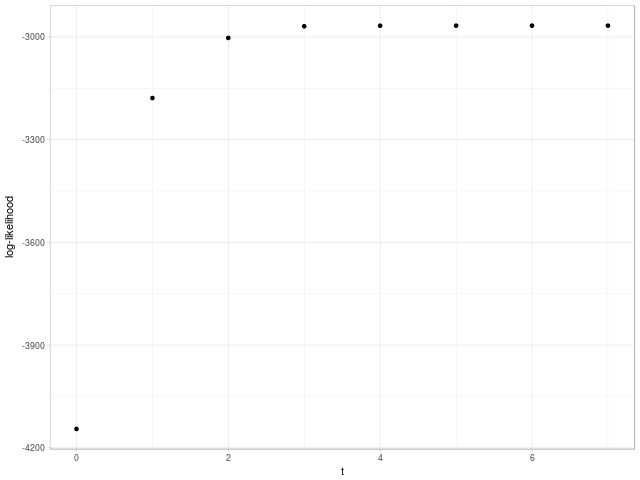

Period mixtures (draft)

f

<table border="0" cellspacing="0" cellpadding="0">
<tbody>
<tr>
<td align="right">type</td>
<td>$$~~~~~~~~~~~f_{\sigma}(x)~~~~~~~~~~~$$</td>
<td>$$~~~~~~~~~~~g_{\sigma}(x)~~~~~~~~~~~$$</td>
<td>$$~~~~~~~~~~~\mathcal{F}f_{\sigma}(\xi)~~~~~~~~~~~$$</td>
<td>$$~~~~~~~~~~~\mathcal{F}g_{\sigma}(\xi)~~~~~~~~~~~$$</td>
</tr>
<tr>
<td align="right">Linear</td>
<td>$$\sigma^{-1} \left( 1- \frac{|x|}{\sigma} \right) \mathbf{1}_{|x| \leq \sigma}$$</td>
<td>$$- \text{sign}(x) \frac{1}{\sigma^2} \mathbf{1}_{|x| \leq \sigma}$$</td>
<td>$$\text{sinc}^2(\sigma \xi)$$</td>
<td>$$2\pi i \xi \text{sinc}^2(\sigma \xi)$$</td>
</tr>
<tr>
<td align="right">Exponential</td>
<td>$$\frac{1}{2\sigma} e^{-\frac{|x|}{\sigma}}$$</td>
<td>$$- \text{sign}(x) \frac{1}{2 \sigma^2} e^{-\frac{|x|}{\sigma}}$$</td>
<td>$$\frac{1}{1 + \left( 2 \pi \sigma \xi \right)^2}$$</td>
<td>$$2\pi i \xi \frac{1}{1 + \left( 2 \pi \sigma \xi \right)^2}$$</td>
</tr>
<tr>
<td align="right">Polynomial</td>
<td>$$\sigma^{-1} \pi^{-1} \frac{1}{1 + \left( x/\sigma \right) ^2}$$</td>
<td>$$-2 \sigma^{-3} \pi^{-1} \frac{1}{\left( 1 + \left( x/\sigma \right)^2 \right)^2} x$$</td>
<td>$$e^{-2\pi \sigma |\xi|}$$</td>
<td>$$2\pi i \xi e^{-2\pi \sigma |\xi|}$$</td>
</tr>
<tr>
<td align="right">Gaussian</td>
<td>$$\left( 2 \pi \right)^{-1/2} \sigma^{-1} e^{-\frac{x^2}{2\sigma^2}}$$</td>
<td>$$- \left( 2 \pi \right)^{-1/2} \sigma^{-3} e^{-\frac{x^2}{2\sigma^2}} x$$</td>
<td>$$e^{-\frac{(2 \pi \sigma \xi)^2}{2}}$$</td>
<td>$$2\pi i \xi e^{-\frac{(2 \pi \sigma \xi)^2}{2}}$$</td>
</tr>
<tr>
<td align="right">Sinc</td>
<td>$$\pi^{-1} x^{-1} \sin (x / \sigma)$$</td>
<td>$$\frac{x \cos \left(  x / \sigma \right) - \sigma \sin \left( x / \sigma \right)}{\sigma \pi x^{2} }$$</td>
<td>$$\mathbf{1}_{\xi \in \left[ -\frac{1}{2 \pi \sigma}, \frac{1}{2 \pi \sigma} \right]}$$</td>
<td>$$2 \pi i \xi \mathbf{1}_{\xi \in \left[ -\frac{1}{2 \pi \sigma}, \frac{1}{2 \pi \sigma} \right]}$$</td>
</tr>
</tbody>
</table>

