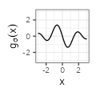
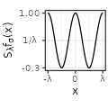

Let $$f$$ be a real function. For $$\lambda > 0$$, we are interested in the equally-spaced summation $$\sum_{k=-\infty}^{+\infty} f(.+k\lambda)$$, that can be interpreted depending on the context as a periodic mixture or as a wrapped distribution.
For some specific functions such as the Gaussian density, we derive expressions, evaluations, and approximations of the sum, further accompanied with visualization of the different shapes for various values of $$\lambda$$.

In the following, we consider limitedly five types of functions $$f_{\sigma}$$, each type being parametrized by $$\sigma>0$$ representing a kind of deviation. The types are named Linear, Exponential, Polynomial, Gaussian, and Sinc in the following, and correspond to family of densities, expect for Sinc that however still sums to one. The definition of the functions is provided in the table below. As you can see, the shape of each type is adjusted to peak at $$x=0$$ and then symmetrically fade to zero.

For each case, we consider the derivative of the functions $$g(x) := f'(x)$$ and their Fourier transforms, where we use below the conventions $$\mathcal{F}f(\xi) := \int_{-\infty}^{+\infty} f(x) e^{-2i\pi x \xi} dx$$ and $$\text{sinc}(x) := \frac{\sin(\pi x)}{\pi x}.$$

In the visual representations of the table, the value of $$\sigma$$ is set as indicated in the first column, and corresponds to the case where the Fourier transform is also a density function (or equivalently where $$f(0) = 1$$).

<table border="0" cellspacing="0" cellpadding="0">
<tbody>
<tr>
<td align="center">$$\text{type}$$</td>
<td>$$f_{\sigma}(x)$$</td>
<td>$$g_{\sigma}(x)$$</td>
<td>$$\mathcal{F}f_{\sigma}(\xi)$$</td>
<td>$$\mathcal{F}g_{\sigma}(\xi)$$</td>
</tr>
<tr>
<td align="center" style="vertical-align:middle">Linear$$(\sigma=1)$$</td>
<td align="center">$${\scriptstyle \sigma^{-1} \left( 1- \frac{|x|}{\sigma} \right) \mathbf{1}_{|x| \leq \sigma}}$$</td>
<td align="center">$${\scriptstyle - \text{sign}(x) \frac{1}{\sigma^2} \mathbf{1}_{|x| \leq \sigma}}$$</td>
<td align="center">$${\scriptstyle \text{sinc}^2(\sigma \xi)}$$</td>
<td align="center">$${\scriptstyle 2\pi i \xi \text{sinc}^2(\sigma \xi)}$$</td>
</tr>
<tr>
<td align="center" style="vertical-align:middle">Exponential$$(\sigma=1/2)$$</td>
<td align="center">$${\scriptstyle \frac{1}{2\sigma} e^{-\frac{|x|}{\sigma}}}$$</td>
<td align="center">$${\scriptstyle - \text{sign}(x) \frac{1}{2 \sigma^2} e^{-\frac{|x|}{\sigma}}}$$</td>
<td align="center">$${\scriptstyle \frac{1}{1 + \left( 2 \pi \sigma \xi \right)^2}}$$</td>
<td align="center">$${\scriptstyle 2\pi i \xi \frac{1}{1 + \left( 2 \pi \sigma \xi \right)^2}}$$</td>
</tr>
<tr>
<td align="center" style="vertical-align:middle">Polynomial$$(\sigma=1/\pi)$$</td>
<td align="center">$${\scriptstyle \sigma^{-1} \pi^{-1} \frac{1}{1 + \left( x/\sigma \right) ^2}}$$</td>
<td align="center">$${\scriptstyle -2 \sigma^{-3} \pi^{-1} \frac{1}{\left( 1 + \left( x/\sigma \right)^2 \right)^2} x}$$</td>
<td align="center">$${\scriptstyle e^{-2\pi \sigma |\xi|}}$$</td>
<td align="center">$${\scriptstyle 2\pi i \xi e^{-2\pi \sigma |\xi|}}$$</td>
</tr>
<tr>
<td align="center" style="vertical-align:middle">Gaussian$$(\sigma=1/\sqrt{2\pi})$$</td>
<td align="center">$${\scriptstyle \left( 2 \pi \right)^{-1/2} \sigma^{-1} e^{-\frac{x^2}{2\sigma^2}}}$$</td>
<td align="center">$${\scriptstyle - \left( 2 \pi \right)^{-1/2} \sigma^{-3} e^{-\frac{x^2}{2\sigma^2}} x}$$</td>
<td align="center">$${\scriptstyle e^{-\frac{(2 \pi \sigma \xi)^2}{2}}}$$</td>
<td align="center">$${\scriptstyle 2\pi i \xi e^{-\frac{(2 \pi \sigma \xi)^2}{2}}}$$</td>
</tr>
<tr>
<td align="center" style="vertical-align:middle">Sinc$$(\sigma=1/\pi)$$</td>
<td align="center">$${\scriptstyle \pi^{-1} x^{-1} \sin (x / \sigma)}$$</td>
<td align="center">$${\scriptstyle \frac{x \cos \left(  x / \sigma \right) - \sigma \sin \left( x / \sigma \right)}{\sigma \pi x^{2} }}$$</td>
<td align="center">$${\scriptstyle \mathbf{1}_{\xi \in \left[ -\frac{1}{2 \pi \sigma}, \frac{1}{2 \pi \sigma} \right]}}$$</td>
<td align="center">$${\scriptstyle 2 \pi i \xi \mathbf{1}_{\xi \in \left[ -\frac{1}{2 \pi \sigma}, \frac{1}{2 \pi \sigma} \right]}}$$</td>
</tr>
</tbody>
</table>

In each case, we are interested in wrapping the function around a circle of circumference $$\lambda > 0$$, that is to let, for $$x \in [0,\lambda)$$, $$S_{\lambda}f(x) := \sum_{k=-\infty}^{+\infty} f(x+k\lambda)$$. This function is extended by shifts of $$\lambda$$ on the whole real line.
The purpose in computing the Fourier transforms lies in the Poisson summation formula, which states under some assumptions that: $$S_{\lambda}f(x) = \frac{1}{\lambda} \sum_{k=-\infty}^{+\infty} \mathcal{F}f \left( \frac{k}{\lambda} \right) e^{2i\pi \frac{k}{\lambda} x}$$. 
Since each $$f_{\sigma}$$ is an even and real function, we deduce that $$\mathcal{F}{f_{\sigma}}$$ is even and real too, while the transform of the derivative $$\mathcal{F}{g_{\sigma}}$$ is odd and purely imaginary, so that:

$$S_{\lambda}f_{\sigma}(x) = \frac{1}{\lambda} \mathcal{F}{f_{\sigma}} \left( 0 \right) + \frac{2}{\lambda} \sum_{k=1}^{+\infty}  \mathcal{F}{f_{\sigma}} \left( \frac{k}{\lambda} \right) \cos \left( 2\pi \frac{k}{\lambda} x \right) \text{~and}$$ 

$$S_{\lambda}g_{\sigma}(x) =  -\frac{4\pi}{\lambda^2} \sum_{k=1}^{+\infty} k \mathcal{F}{f_{\sigma}} \left( \frac{k}{\lambda} \right) \sin \left( 2\pi \frac{k}{\lambda} x \right).$$

todo

<table border="0" cellspacing="0" cellpadding="0">
<tbody>
<tr>
<td align="center">$$S_{\lambda}f_{\sigma}(x)$$</td>
<td>$$\lambda=30$$</td>
<td>$$\lambda=3$$</td>
<td>$$\lambda=1/3$$</td>
<td>video</td>
</tr>
<tr>
<td align="center" style="vertical-align:middle">Linear$$(\sigma=1)$$</td>
<td align="center">$${\scriptstyle \text{todo}}$$</td>
<td align="center">$${\scriptstyle \text{todo}}$$</td>
<td align="center">$${\scriptstyle \text{todo}}$$</td>
<td align="center">$${\scriptstyle \text{todo}}$$</td>
</tr>
<tr>
<td align="center" style="vertical-align:middle">Exponential$$(\sigma=1/2)$$</td>
<td align="center">$${\scriptstyle \text{todo}}$$</td>
<td align="center">$${\scriptstyle \text{todo}}$$</td>
<td align="center">$${\scriptstyle \text{todo}}$$</td>
<td align="center">$${\scriptstyle \text{todo}}$$</td>
</tr>
<tr>
<td align="center" style="vertical-align:middle">Polynomial$$(\sigma=1/\pi)$$</td>
<td align="center">$${\scriptstyle \text{todo}}$$</td>
<td align="center">$${\scriptstyle \text{todo}}$$</td>
<td align="center">$${\scriptstyle \text{todo}}$$</td>
<td align="center">$${\scriptstyle \text{todo}}$$</td>
</tr>
<tr>
<td align="center" style="vertical-align:middle">Gaussian$$(\sigma=1/\sqrt{2\pi})$$</td>
<td align="center">$${\scriptstyle \text{todo}}$$</td>
<td align="center">$${\scriptstyle \text{todo}}$$</td>
<td align="center">$${\scriptstyle \text{todo}}$$</td>
<td align="center">$${\scriptstyle \text{todo}}$$</td>
</tr>
<tr>
<td align="center" style="vertical-align:middle">Sinc$$(\sigma=1/\pi)$$</td>
<td align="center">$${\scriptstyle \text{todo}}$$</td>
<td align="center">$${\scriptstyle \text{todo}}$$</td>
<td align="center">$${\scriptstyle \text{todo}}$$</td>
<td align="center">$${\scriptstyle \text{todo}}$$</td>
</tr>
</tbody>
</table>

### References

- [Wikipedia page on classic Fourier transforms](https://en.wikipedia.org/wiki/Fourier_transform#Square-integrable_functions,_one-dimensional),
- [Wikipedia page on the Poisson summation formula](https://en.wikipedia.org/wiki/Poisson_summation_formula).

