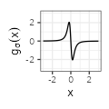
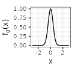

Let $$f$$ be a real function. For $$\lambda > 0$$, we are interested in the equally-spaced summation $$\sum_{k=-\infty}^{+\infty} f(.+k\lambda)$$, that can be interpreted depending on the context as a periodic mixture or as a wrapped distribution.
For some specific functions such as the Gaussian density, we derive expressions, evaluations, and approximations of the sum, further accompanied with visualization of the different shapes for various values of $$\lambda$$.

## Base functions $$f_{\sigma}$$

In the following, we consider limitedly five types of functions $$f_{\sigma}$$, each type being parametrized by $$\sigma>0$$ representing a kind of deviation. The types are named Linear, Exponential, Polynomial, Gaussian, and Sinc, and correspond to family of densities, except for Sinc that however still sums to one. The definition of the functions is provided in the table below. As you can see, each function is adjusted to peak at $$x=0$$ and then symmetrically fade to zero.

For each type, we complement the table with additional columns derived from the function $$f_{\sigma}$$, by considering the derivative of the functions $$g(x) := f'(x)$$ and their Fourier transforms, where we use below the conventions $$\mathcal{F}f(\xi) := \int_{-\infty}^{+\infty} f(x) e^{-2i\pi x \xi} dx$$ and $$\text{sinc}(x) := \frac{\sin(\pi x)}{\pi x}.$$

In the visual representations of the table, the value of $$\sigma$$ is set as indicated in the first column, and corresponds to the case where the Fourier transform is also a density function (or equivalently where $$f(0) = 1$$).

<table border="0" cellspacing="0" cellpadding="0">
<tbody>
<tr>
<td align="center">$$\text{type}$$</td>
<td>$$f_{\sigma}(x)$$</td>
<td>$$g_{\sigma}(x)$$</td>
<td>$$\mathcal{F}f_{\sigma}(\xi)$$</td>
<td>$$\mathcal{F}g_{\sigma}(\xi)$$</td>
</tr>
<tr>
<td align="center" style="vertical-align:middle">Linear$$(\sigma=1)$$</td>
<td align="center">$${\scriptstyle \sigma^{-1} \left( 1- \frac{|x|}{\sigma} \right) \mathbf{1}_{|x| \leq \sigma}}$$</td>
<td align="center">$${\scriptstyle - \text{sign}(x) \frac{1}{\sigma^2} \mathbf{1}_{|x| \leq \sigma}}$$</td>
<td align="center">$${\scriptstyle \text{sinc}^2(\sigma \xi)}$$</td>
<td align="center">$${\scriptstyle 2\pi i \xi \text{sinc}^2(\sigma \xi)}$$</td>
</tr>
<tr>
<td align="center" style="vertical-align:middle">Exponential$$(\sigma=1/2)$$</td>
<td align="center">$${\scriptstyle \frac{1}{2\sigma} e^{-\frac{|x|}{\sigma}}}$$</td>
<td align="center">$${\scriptstyle - \text{sign}(x) \frac{1}{2 \sigma^2} e^{-\frac{|x|}{\sigma}}}$$</td>
<td align="center">$${\scriptstyle \frac{1}{1 + \left( 2 \pi \sigma \xi \right)^2}}$$</td>
<td align="center">$${\scriptstyle 2\pi i \xi \frac{1}{1 + \left( 2 \pi \sigma \xi \right)^2}}$$</td>
</tr>
<tr>
<td align="center" style="vertical-align:middle">Polynomial$$(\sigma=1/\pi)$$</td>
<td align="center">$${\scriptstyle \sigma^{-1} \pi^{-1} \frac{1}{1 + \left( x/\sigma \right) ^2}}$$</td>
<td align="center">$${\scriptstyle -2 \sigma^{-3} \pi^{-1} \frac{1}{\left( 1 + \left( x/\sigma \right)^2 \right)^2} x}$$</td>
<td align="center">$${\scriptstyle e^{-2\pi \sigma |\xi|}}$$</td>
<td align="center">$${\scriptstyle 2\pi i \xi e^{-2\pi \sigma |\xi|}}$$</td>
</tr>
<tr>
<td align="center" style="vertical-align:middle">Gaussian$$(\sigma=1/\sqrt{2\pi})$$</td>
<td align="center">$${\scriptstyle \left( 2 \pi \right)^{-1/2} \sigma^{-1} e^{-\frac{x^2}{2\sigma^2}}}$$</td>
<td align="center">$${\scriptstyle - \left( 2 \pi \right)^{-1/2} \sigma^{-3} e^{-\frac{x^2}{2\sigma^2}} x}$$</td>
<td align="center">$${\scriptstyle e^{-\frac{(2 \pi \sigma \xi)^2}{2}}}$$</td>
<td align="center">$${\scriptstyle 2\pi i \xi e^{-\frac{(2 \pi \sigma \xi)^2}{2}}}$$</td>
</tr>
<tr>
<td align="center" style="vertical-align:middle">Sinc$$(\sigma=1/\pi)$$</td>
<td align="center">$${\scriptstyle \pi^{-1} x^{-1} \sin (x / \sigma)}$$</td>
<td align="center">$${\scriptstyle \frac{x \cos \left(  x / \sigma \right) - \sigma \sin \left( x / \sigma \right)}{\sigma \pi x^{2} }}$$</td>
<td align="center">$${\scriptstyle \mathbf{1}_{\xi \in \left[ -\frac{1}{2 \pi \sigma}, \frac{1}{2 \pi \sigma} \right]}}$$</td>
<td align="center">$${\scriptstyle 2 \pi i \xi \mathbf{1}_{\xi \in \left[ -\frac{1}{2 \pi \sigma}, \frac{1}{2 \pi \sigma} \right]}}$$</td>
</tr>
</tbody>
</table>

## Sum of the base functions $$S_{\lambda}f_{\sigma}$$

In each case, we are interested in wrapping the function around a circle of circumference $$\lambda > 0$$, that is to let, for $$x \in [0,\lambda)$$, $$S_{\lambda}f(x) := \sum_{k=-\infty}^{+\infty} f(x+k\lambda)$$. This function is extended by shifts of $$\lambda$$ on the whole real line (which, by periodicity, is also equal to $$S_{\lambda}f(x)$$ for $$x \in \mathbb{R}$$).

There are three ways to compute $$S_{\lambda}f(x)$$:
1. by *direct* approximation of the sum, 
2. by using the *Fourier* transform,
3. by determining, when available, a *closed*-form expression.

Regarding the second way, the purpose in using the Fourier transforms lies in the Poisson summation formula, which states under some assumptions that: $$S_{\lambda}f(x) = \frac{1}{\lambda} \sum_{k=-\infty}^{+\infty} \mathcal{F}f \left( \frac{k}{\lambda} \right) e^{2i\pi \frac{k}{\lambda} x}$$. 
Since each $$f_{\sigma}$$ is an even and real function, we deduce that $$\mathcal{F}{f_{\sigma}}$$ is even and real too, while the transform of the derivative $$\mathcal{F}{g_{\sigma}}$$ is odd and purely imaginary, so that:

$$S_{\lambda}f_{\sigma}(x) = \frac{1}{\lambda} \mathcal{F}{f_{\sigma}} \left( 0 \right) + \frac{2}{\lambda} \sum_{k=1}^{+\infty}  \mathcal{F}{f_{\sigma}} \left( \frac{k}{\lambda} \right) \cos \left( 2\pi \frac{k}{\lambda} x \right) \text{ and}$$ 

$$S_{\lambda}g_{\sigma}(x) =  -\frac{4\pi}{\lambda^2} \sum_{k=1}^{+\infty} k \mathcal{F}{f_{\sigma}} \left( \frac{k}{\lambda} \right) \sin \left( 2\pi \frac{k}{\lambda} x \right).$$

The following table shows the shape of the summation for a fixed $$\sigma$$ as a function of $$\lambda$$. The $$x$$-axis is always set on $$[-\lambda, \lambda]$$ (i.e., two periods), while the $$y$$-axis is adapted to the figure. The last column shows the video for decreasing $$\lambda$$. 
The sum is either approximated using the Fourier transform (for the Polynomial and the Gaussian types) or computed with the closed-form expression (for Linear, Exponential, and Sinc types; see also proofs after the table).

<table border="0" cellspacing="0" cellpadding="0">
<tbody>
<tr>
<td align="center">$$S_{\lambda}f_{\sigma}(x)$$</td>
<td>$$\lambda=30$$</td>
<td>$$\lambda=3$$</td>
<td>$$\lambda=1/3$$</td>
<td>$$\text{video}$$</td>
</tr>
<tr>
<td align="center" style="vertical-align:middle">Linear$$(\sigma=1)$$</td>
<td align="center"></td>
<td align="center"></td>
<td align="center"></td>
<td align="center"><video controls autoplay=1 loop=1 src="../images/2023-6-11-Periodic-mixtures/plot2/Sf/linear.mp4"></video></td>
</tr>
<tr>
<td align="center" style="vertical-align:middle">Exponential$$(\sigma=1/2)$$</td>
<td align="center"></td>
<td align="center"></td>
<td align="center"></td>
<td align="center"><video controls autoplay=1 loop=1 src="../images/2023-6-11-Periodic-mixtures/plot2/Sf/exponential.mp4"></video></td>
</tr>
<tr>
<td align="center" style="vertical-align:middle">Polynomial$$(\sigma=1/\pi)$$</td>
<td align="center"></td>
<td align="center"></td>
<td align="center"></td>
<td align="center"><video controls autoplay=1 loop=1 src="../images/2023-6-11-Periodic-mixtures/plot2/Sf/polynomial.mp4"></video></td>
</tr>
<tr>
<td align="center" style="vertical-align:middle">Gaussian$$(\sigma=1/\sqrt{2\pi})$$</td>
<td align="center"></td>
<td align="center"></td>
<td align="center"></td>
<td align="center"><video controls autoplay=1 loop=1 src="../images/2023-6-11-Periodic-mixtures/plot2/Sf/gaussian.mp4"></video></td>
</tr>
<tr>
<td align="center" style="vertical-align:middle">Sinc$$(\sigma=1/\pi)$$</td>
<td align="center"></td>
<td align="center"></td>
<td align="center"></td>
<td align="center"><video controls autoplay=1 loop=1 src="../images/2023-6-11-Periodic-mixtures/plot2/Sf/sinc.mp4"></video></td>
</tr>
</tbody>
</table>

For all types, several observations can be made on the function restricted on the interval $$[-\lambda/2, \lambda/2]$$:
- its integral sums to one by construction, for any positive values of $$\sigma$$ and $$\lambda$$,
- for $$\lambda$$ large, its distribution is almost the same as the original function (cf the column with $$\lambda=30$$, viewed at a distance on the x-axis),
- for $$\lambda$$ tiny, its distribution is almost the same as the uniform distribution (cf the column with $$\lambda=1/3$$, viewed at a close range on the y-axis; observe that the whole range is always close to $$1/\lambda$$).

We next briefly comment each type separatly, before deriving closed-form expressions for the Linear, Exponential, and Sinc types, along with a summarizing table.

## Brief comment for each type

### Linear type

The linear type has an interesting accelerating oscillating pattern when $$\lambda \rightarrow 0$$. Also, the function is exactly uniform for some values of $$\lambda$$, such as $$\lambda = 1/3$$ in the table above.

### Exponential type

### Polynomial and Gaussian types

### Sinc type

## Closed-form expressions

To better understand those patterns, we derive below the closed-form expression for $$S_{\lambda}f_{\sigma}$$ and $$S_{\lambda}g_{\sigma}$$. For the Linear and the Exponential types, we let $$\tilde{x}$$ the *fractional* part of $$x$$ w.r.t. $$\lambda$$, i.e. such that $$\tilde{x} \in [0, \lambda)$$ and $$x = \tilde{x} + k\lambda$$ ($$k$$ integer).

### For the Linear type

The indicator function present in the definition of the base function makes the calculations cumbersome.
 ($$\tilde{x}$$ is the fractional part of $$x$$ as defined above):

$$S_{\lambda}f_{\sigma}(x) = XXX.$$

{::options parse_block_html="true" /}

Proof (click to expand).

**Initial computations**

Let $$x \in \mathbb{R}$$ and $$\sigma, \lambda > 0$$.
For ease of notation, we define:

$$M^{-}:= \left\lfloor \frac{\sigma + x}{\lambda}\right\rfloor,~M^0 := \left\lfloor \frac{x}{\lambda}\right\rfloor,~M^{+}:= \left\lfloor \frac{\sigma - x}{\lambda}\right\rfloor.$$

We let $$I$$ the set of integers $$k$$ verifying $$|x+k\lambda| \leq \sigma$$, i.e. such that $$-M^{-} \leq k \leq M^{+}$$.
This set is further partitioned into $$I^{-}$$ when $$x+k\lambda < 0$$, and $$I^{+}$$ when $$x+k\lambda \geq 0$$.
Globally, 

- $$I^{-}$$ are the elements with $$-M^{-} \leq k \leq -M^0-1$$, and
- $$I^{+}$$ are the elements with $$-M^0 \leq k \leq M^{+}$$.

Any of those three sets can be empty.

The initial formula for $$S_{\lambda}f_{\sigma}(x)$$ can be decomposed as follows:

$$S_{\lambda}f_{\sigma}(x) = \frac{1}{\sigma} \left[ \sum_{I^{-}} \left( 1 - \frac{-x-k\lambda}{\sigma} \right) + \sum_{I^{+}} \left( 1 - \frac{x+k\lambda}{\sigma} \right) \right]$$

$$S_{\lambda}f_{\sigma}(x) = \frac{1}{\sigma} \left[ |I| - \frac{1}{\sigma} \left( \sum_{I^{-}} \left( -x-k\lambda \right) + \sum_{I^{+}} \left( x+k\lambda \right) \right) \right]$$

$$S_{\lambda}f_{\sigma}(x) =  \frac{1}{\sigma} |I| - \frac{x}{\sigma^2} \left( -|I^{-}| + |I^{+}| \right) - \frac{\lambda}{\sigma^2}  \left( -\sum_{I^{-}} k + \sum_{I^{+}} k \right)$$

Using the formula for arithmetic series, we obtain:

<!-- $$S_{\lambda}f_{\sigma}(x) =  \frac{1}{\sigma} |I| - \frac{x}{\sigma^2} \left(|I^{+}|-|I^{-}|\right) - \frac{\lambda}{2\sigma^2}  \left( \left(M^{+}-M^0 \right)|I^{+}| - \left( -M^{-}-M^0-1 \right) |I^{-}| \right)$$ -->

$$
\begin{align*}
S_{\lambda}f_{\sigma}(x) =& \frac{1}{\sigma} |I| - \frac{x}{\sigma^2} \left(|I^{+}|-|I^{-}|\right) \\
-& \frac{\lambda}{2\sigma^2} \left( \left(M^{+}-M^0 \right)|I^{+}| + \left( M^{-}+M^0+1 \right) |I^{-}| \right).
\end{align*}
$$

We have (in all cases, even when the sets are empty): 

$$\lvert I^{+} \rvert = M^{+}+M^0+1,~\lvert I^{-} \rvert = -M^0+M^{-},~\lvert I \rvert = M^{+}+M^{-}+1,$$

so that:

$$
\begin{align*}
S_{\lambda}f_{\sigma}(x) =& \frac{1}{\sigma} \left(M^{-}+M^{+}+1 \right) \\
-& \frac{\lambda}{2\sigma^2} \left(M^{+}(M^{+}+1) - 2M^0(M^0+1) + M^{-}(M^{-}+1) \right) \\
-& \frac{x}{\sigma^2} \left(M^{+}-M^{-}+1+2M^0 \right).
\end{align*}
$$

**Restriction to the $$[-\lambda/2, \lambda/2)$$ interval**

In all the following we consider $$x \in [-\lambda/2, \lambda/2)$$ only (this is enough given the periodicity). We further let $$\tilde{\sigma} \in [-\lambda/2, \lambda/2)$$ such that $$\sigma = \tilde{\sigma} + i\lambda$$ (for a certain integer $$i$$). We let $$\tilde{M}^{-}:= \left\lfloor \frac{\tilde{\sigma} + x}{\lambda}\right\rfloor$$ and $$\tilde{M}^{+}:= \left\lfloor \frac{\tilde{\sigma} - x}{\lambda}\right\rfloor.$$
Since both $$\tilde{\sigma}$$ and $$x$$ are in $$[-\lambda/2, \lambda/2)$$, all $$\tilde{M}^{-}$$, $$\tilde{M}^{0}$$, and $$\tilde{M}^{+}$$ are in $$\lbrace -1, 0 \rbrace$$ (since, before taking the floor function, the values are respectively in $$[-1, 1)$$, $$[-1/2,1/2)$$, and $$(-1,1)$$). Since $$M^0 \in \lbrace -1, 0\rbrace$$, we have $$M^0 = 0$$ if and only if $$x \geq 0$$. <!-- We deduce that: $$1+2M^0 = 1-2\mathbf{1}_{x<0}$$.-->

**Term in $$x$$**

In this section, we are interested by the following term:

$$S_1 := -\frac{x}{\sigma^2} \left(M^{+}-M^{-}+1+2M^0 \right).$$

We observe that $$M^{+}-M^{-} = \tilde{M}^{+}-\tilde{M}^{-}$$, so that:

$$S_1 = -\frac{x}{\sigma^2} \left(\tilde{M}^{+}-\tilde{M}^{-}+1-2\mathbf{1}_{x<0} \right).$$

There are six cases to consider:

*Case 1*: In the case of $$x=0$$, we have $$S_1=0$$. 

*Case 2*: In the case of $$\tilde{\sigma}=0$$ and $$x \neq 0$$, we have $$\tilde{M}^{-}=-\mathbf{1}_{x<0}$$ and $$\tilde{M}^{+}=-\mathbf{1}_{x>0}$$, so $$M^{+}-M^{-}+1+2M^0 = -\mathbf{1}_{x>0}-\mathbf{1}_{x<0}+1 = 0$$ (since $$x \neq 0$$), and finally $$S_1=0$$.

*Case 3*: In the case of $$\lvert x \rvert< \lvert \tilde{\sigma} \rvert$$ and $$\tilde{\sigma} \neq 0$$ and $$x \neq 0$$, we always obtain $$S_1=-\lvert x \rvert/\sigma^2$$.

<!-- *Case 3.1*: $$\lvert x \rvert<\lvert \tilde{\sigma} \rvert$$ and $$\tilde{\sigma}<0$$ and $$x<0$$ gives $$S_1=-\lvert x \rvert/\sigma^2$$ (we have $$\tilde{\sigma}-x<0$$, then \tilde{M}^{+}=\tilde{M}^{-}=-1$$).

*Case 3.2*: $$\lvert x \rvert<\lvert \tilde{\sigma} \rvert$$ and $$\tilde{\sigma}<0$$ and $$x>0$$ gives $$S_1=-\lvert x \rvert/\sigma^2$$ (we have $$\tilde{\sigma}+x<0$$, then \tilde{M}^{+}=\tilde{M}^{-}=-1$$).

*Case 3.3*: $$\lvert x \rvert<\lvert \tilde{\sigma} \rvert$$ and $$\tilde{\sigma}>0$$ and $$x<0$$ gives $$S_1=-\lvert x \rvert/\sigma^2$$ (we have $$\tilde{\sigma}+x>0$$, then \tilde{M}^{+}=\tilde{M}^{-}=0$$).

*Case 3.4*: $$\lvert x \rvert<\lvert \tilde{\sigma} \rvert$$ and $$\tilde{\sigma}>0$$ and $$x>0$$ gives $$S_1=-\lvert x \rvert/\sigma^2$$ (we have $$\tilde{\sigma}-x>0$$, then \tilde{M}^{+}=\tilde{M}^{-}=0$$). -->

*Case 4*: In the case of $$\lvert x \rvert>\lvert \tilde{\sigma} \rvert$$ and $$\tilde{\sigma} \neq 0$$ and $$x \neq 0$$, we always obtain $$S_1=0$$.

<!-- *Case 4.1*: $$\lvert x \rvert>\lvert \tilde{\sigma} \rvert$$ and $$\tilde{\sigma}<0$$ and $$x<0$$ gives $$S_1=0$$ (we have $$\tilde{\sigma}-x>0$$, then $$\tilde{M}^{+}=0$$, $$\tilde{M}^{-}=-1$$).

*Case 4.2*: $$\lvert x \rvert>\lvert \tilde{\sigma} \rvert$$ and $$\tilde{\sigma}<0$$ and $$x>0$$ gives $$S_1=0$$ (we have $$\tilde{\sigma}+x>0$$, then $$\tilde{M}^{+}=-1$$, $$\tilde{M}^{-}=0$$).

*Case 4.3*: $$\lvert x \rvert>\lvert \tilde{\sigma} \rvert$$ and $$\tilde{\sigma}>0$$ and $$x<0$$ gives $$S_1=0$$ (we have $$\tilde{\sigma}+x<0, then $$\tilde{M}^{+}=0$$, $$\tilde{M}^{-}=-1$$).

*Case 4.4*: $$\lvert x \rvert>\lvert \tilde{\sigma} \rvert$$ and $$\tilde{\sigma}>0$$ and $$x>0$$ gives $$S_1=0$$ (we have $$\tilde{\sigma}-x<0, then $$\tilde{M}^{+}=-1$$, $$\tilde{M}^{-}=0$$). -->

*Case 5*: In the case of $$\lvert x \rvert=\lvert \tilde{\sigma} \rvert$$ and $$\tilde{\sigma} > 0$$, we get $$\tilde{M}^{+}=\tilde{M}^{-}=0$$, so $$S_1=-\lvert x \rvert/\sigma^2$$.

*Case 6*: In the case of $$\lvert x \rvert=\lvert \tilde{\sigma} \rvert$$ and $$\tilde{\sigma} < 0$$, the two sub-cases gives $$S_1=0$$.

Merging all the cases, we finally obtain (for $$x \in [-\lambda/2, \lambda/2)$$):

$$S_1 = -\frac{\lvert x \rvert}{\sigma^2} \mathbf{1}_{(\lvert x \rvert<\lvert \tilde{\sigma} \rvert)\text{ or } (\lvert x \rvert=\lvert\tilde{\sigma}\rvert \text{ and } \tilde{\sigma}>0)}.$$

**Constant terms**

In this section, we are interested by the following term:

$$
\begin{align*}
S_2 :=& \frac{1}{\sigma} \left(M^{-}+M^{+}+1 \right)
- \frac{\lambda}{2\sigma^2} \left(M^{+}(M^{+}+1) - 2M^0(M^0+1) + M^{-}(M^{-}+1) \right).
\end{align*}
$$

Since $$M^0(M^0+1)=\tilde{M}^{-}(\tilde{M}^{-}+1)=\tilde{M}^{+}(\tilde{M}^{+}+1)=0$$, $$M^{-}=\tilde{M}^{-}+i$$, and $$M^{+}=\tilde{M}^{+}+i$$, we have:

$$
\begin{align*}
S_2 =& \frac{1}{\sigma} \left(\tilde{M}^{+} + \tilde{M}^{-}+ 2i +1 \right) 
- \frac{\lambda}{2\sigma^2} \left(\left(2\tilde{M}^{+}i + i^2 + i\right) + \left(2\tilde{M}^{-}i + i^2+ i\right) \right) \\
=& \frac{1}{\sigma} \left(\tilde{M}^{+} + \tilde{M}^{-}+ 2i +1 \right)
-\frac{\lambda i}{\sigma^2} \left(\tilde{M}^{+} + \tilde{M}^{-} + i + 1 \right).
\end{align*}
$$

We next replace the value of $$i=\frac{\sigma - \tilde{\sigma}}{\lambda}$$:

$$
\begin{align*}
S_2 =& \frac{1}{\sigma} \left(\tilde{M}^{+} + \tilde{M}^{-} + 2i +1 \right)
-\frac{1}{\sigma} \left(\tilde{M}^{+} + \tilde{M}^{-} + i + 1 \right)
+\frac{\tilde{\sigma}}{\sigma^2} \left(\tilde{M}^{+} + \tilde{M}^{-} + i + 1 \right)\\
=& \frac{1}{\lambda} - \frac{\tilde{\sigma}^2}{\lambda\sigma^2} + \frac{\tilde{\sigma}}{\sigma^2} \left(\tilde{M}^{+} + \tilde{M}^{-} + 1 \right).
\end{align*}
$$

<!-- =& \frac{i}{\sigma} + \frac{\tilde{\sigma}}{\sigma^2} \left(\tilde{M}^{+} + \tilde{M}^{-} + i + 1 \right)\\
=& \frac{i}{\sigma} + \frac{i\tilde{\sigma}}{\sigma^2} + \frac{\tilde{\sigma}}{\sigma^2} \left(\tilde{M}^{+} + \tilde{M}^{-} + 1 \right)\\-->

We compute $$\tilde{M}^{+} + \tilde{M}^{-} + 1 \in \lbrace -1,0,1 \rbrace $$ as in the previous section and obtain:

$$\tilde{M}^{+} + \tilde{M}^{-} + 1 = \mathbf{1}_{(\lvert x \rvert<\lvert \tilde{\sigma} \rvert)\text{ or } (\lvert x \rvert=\lvert\tilde{\sigma}\rvert \text{ and } \tilde{\sigma}>0) \text{ or } (x = 0)} \left( 2 \mathbf{1}_{\tilde{sigma} \geq 0} -1 \right),$$

so finally the constant term is:

$$
\begin{align*}
S_2 =& \frac{1}{\lambda} - \frac{\tilde{\sigma}^2}{\lambda\sigma^2} + \frac{\lvert \tilde{\sigma} \rvert}{\sigma^2} \mathbf{1}_{(\lvert x \rvert<\lvert \tilde{\sigma} \rvert)\text{ or } (\lvert x \rvert=\lvert\tilde{\sigma}\rvert \text{ and } \tilde{\sigma}>0) \text{ or } (x = 0)}.
\end{align*}
$$

<!-- S_2 =& \frac{1}{\lambda} + \frac{\lvert \tilde{\sigma} \rvert}{\sigma^2} \left( -\frac{\lvert \tilde{\sigma} \rvert }{\lambda} +  \mathbf{1}_{(\lvert x \rvert<\lvert \tilde{\sigma} \rvert)\text{ or } (\lvert x \rvert=\lvert\tilde{\sigma}\rvert \text{ and } \tilde{\sigma}>0) \text{ or } (x = 0)} \right) -->

**Final form**

We let $$\Delta$$ the following condition:

$$\Delta := \Delta(x, \sigma, \lambda) := \mathbf{1}_{(\lvert x \rvert<\lvert \tilde{\sigma} \rvert)\text{ or } (\lvert x \rvert=\lvert\tilde{\sigma}\rvert \text{ and } \tilde{\sigma}>0) \text{ or } (x = 0)}.$$

$$S_{\lambda}f_{\sigma}(x)$$ is the sum of the terms $$S_1$$ and $$S_2$$ computed previously:

$$
\begin{align*}
S_{\lambda}f_{\sigma}(x) =& -\frac{\lvert x \rvert}{\sigma^2} \Delta + \frac{1}{\lambda} - \frac{\tilde{\sigma}^2}{\lambda\sigma^2} + \frac{\lvert \tilde{\sigma} \rvert}{\sigma^2} \Delta \\
=& \frac{1}{\lambda} \left( 1 - \frac{\tilde{\sigma}^2}{\sigma^2} \right) + \Delta  \frac{\lvert \tilde{\sigma} \rvert - \lvert x \rvert}{\sigma^2}.
\end{align*}
$$

 

{::options parse_block_html="false" /}

### For the Exponential type

{::options parse_block_html="true" /}

Proof (click to expand).

We further 

 

{::options parse_block_html="false" /}

### For the Sinc type

{::options parse_block_html="true" /}

Proof (click to expand)s.

We further 

 

{::options parse_block_html="false" /}

## Summarizing table

### References

- [Wikipedia page on classic Fourier transforms](https://en.wikipedia.org/wiki/Fourier_transform#Square-integrable_functions,_one-dimensional),
- [Wikipedia page on the Poisson summation formula](https://en.wikipedia.org/wiki/Poisson_summation_formula).

