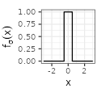
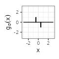
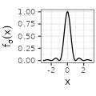
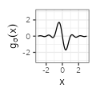
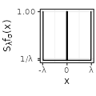
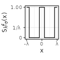
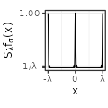
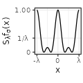

Let $$f$$ be a real function. For $$\lambda > 0$$, we are interested in the equally-spaced summation $$\sum_{k=-\infty}^{+\infty} f(.+k\lambda)$$, that can be interpreted depending on the context as a periodic mixture or as a wrapped distribution.
For some specific functions such as the Gaussian density, we derive expressions, evaluations, and approximations of the sum, further accompanied with visualization of the different shapes for various values of $$\lambda$$.

## Base functions $$f_{\sigma}$$

In the following, we consider seven types of functions $$f_{\sigma}$$, each type being parametrized by $$\sigma>0$$ representing a kind of deviation. The types are named Rectangular, Linear, Exponential, Polynomial, Gaussian, Sinc, and Sincsquare, and correspond to family of densities, except for Sinc that however still sums to one. The definition of the functions is provided in the table below. As we can see, each function is adjusted to peak at $$x=0$$ and then symmetrically fade to zero.

For each type, we complement the table with additional columns derived from the function $$f_{\sigma}$$, by considering the derivative of the functions $$g(x) := f'(x)$$ and their Fourier transforms, where we use below the conventions $$\mathcal{F}f(\xi) := \int_{-\infty}^{+\infty} f(x) e^{-2i\pi x \xi} dx$$ and $$\text{sinc}(x) := \frac{\sin(\pi x)}{\pi x}.$$

In the visual representations of the table, the value of $$\sigma$$ is set to one, as indicated in the first column, and corresponds to the case where the Fourier transform also sums to one (or equivalently where $$f(0) = 1$$).

<table border="0" cellspacing="0" cellpadding="0">
<tbody>
<tr>
<td align="center">$$\text{type}$$</td>
<td>$$f_{\sigma}(x)$$</td>
<td>$$g_{\sigma}(x)$$</td>
<td>$$\mathcal{F}f_{\sigma}(\xi)$$</td>
<td>$$\mathcal{F}g_{\sigma}(\xi)$$</td>
</tr>
<tr>
<td align="center" style="vertical-align:middle">Rectangular$$(\sigma=1)$$</td>
<td align="center">$${\scriptstyle \sigma^{-1} \mathbf{1}_{|x| \leq \sigma/2}}$$</td>
<td align="center">$${\scriptstyle \sigma^{-1} \left( \delta_{x = -\sigma/2} - \delta_{x = \sigma/2} \right) }$$</td>
<td align="center">$${\scriptstyle \text{sinc}(\sigma \xi)}$$</td>
<td align="center">$${\scriptstyle 2\pi i \xi \text{sinc}(\sigma \xi)}$$</td>
</tr>
<tr>
<td align="center" style="vertical-align:middle">Linear$$(\sigma=1)$$</td>
<td align="center">$${\scriptstyle \sigma^{-1} \left( 1- \frac{|x|}{\sigma} \right) \mathbf{1}_{|x| \leq \sigma}}$$</td>
<td align="center">$${\scriptstyle - \frac{\text{sign}(x)}{\sigma^2} \mathbf{1}_{|x| \leq \sigma}}$$</td>
<td align="center">$${\scriptstyle \text{sinc}^2(\sigma \xi)}$$</td>
<td align="center">$${\scriptstyle 2\pi i \xi \text{sinc}^2(\sigma \xi)}$$</td>
</tr>
<tr>
<td align="center" style="vertical-align:middle">Exponential$$(\sigma=1)$$</td>
<td align="center">$${\scriptstyle \sigma^{-1} e^{-\frac{2|x|}{\sigma}}}$$</td>
<td align="center">$${\scriptstyle -  \frac{2 \text{sign}(x)}{\sigma^2} e^{-\frac{2|x|}{\sigma}}}$$</td>
<td align="center">$${\scriptstyle \frac{1}{1 + \left( \pi \sigma \xi \right)^2}}$$</td>
<td align="center">$${\scriptstyle 2\pi i \xi \frac{1}{1 + \left( \pi \sigma \xi \right)^2}}$$</td>
</tr>
<tr>
<td align="center" style="vertical-align:middle">Polynomial$$(\sigma=1)$$</td>
<td align="center">$${\scriptstyle \sigma^{-1} \frac{1}{1 + \left( \pi x/\sigma \right) ^2}}$$</td>
<td align="center">$${\scriptstyle -2 \pi^2 \sigma^{-3} \frac{x}{\left( 1 + \left( \pi x/\sigma \right)^2 \right)^2} }$$</td>
<td align="center">$${\scriptstyle e^{-2 \sigma |\xi|}}$$</td>
<td align="center">$${\scriptstyle 2\pi i \xi e^{-2 \sigma |\xi|}}$$</td>
</tr>
<tr>
<td align="center" style="vertical-align:middle">Gaussian$$(\sigma=1)$$</td>
<td align="center">$${\scriptstyle \sigma^{-1} e^{-\frac{\pi x^2}{\sigma^2}}}$$</td>
<td align="center">$${\scriptstyle - 2 \pi \sigma^{-3} x e^{-\frac{\pi x^2}{\sigma^2}}}$$</td>
<td align="center">$${\scriptstyle e^{-\pi \sigma^2 \xi^2}}$$</td>
<td align="center">$${\scriptstyle 2\pi i \xi e^{-\pi \sigma^2 \xi^2}}$$</td>
</tr>
<tr>
<td align="center" style="vertical-align:middle">Sinc$$(\sigma=1)$$</td>
<td align="center">$${\scriptstyle \sigma^{-1} \text{sinc} (x / \sigma)}$$</td>
<td align="center">$${\scriptstyle \frac{1}{\sigma x} \cos \left( \frac{\pi x}{\sigma} \right) - \frac{1}{\pi x^2} \sin \left( \frac{\pi x}{\sigma} \right)}$$</td>
<td align="center">$${\scriptstyle \mathbf{1}_{\xi \in \left[ -\frac{1}{2 \sigma}, \frac{1}{2 \sigma} \right]}}$$</td>
<td align="center">$${\scriptstyle 2 \pi i \xi \mathbf{1}_{\xi \in \left[ -\frac{1}{2 \sigma}, \frac{1}{2 \sigma} \right]}}$$</td>
</tr>
<tr>
<td align="center" style="vertical-align:middle">Sincsquare$$(\sigma=1)$$</td>
<td align="center">$${\scriptstyle \sigma^{-1} \text{sinc}^2 (x / \sigma)}$$</td>
<td align="center">$${\scriptstyle \frac{\sin \left( 2 \pi x / \sigma \right)}{\pi x^2} - 2 \sigma \frac{\sin^2 \left( \pi x / \sigma \right)}{\pi^2 x^3}}$$</td>
<td align="center">$${\scriptstyle \left( 1- |\xi| \sigma \right) \mathbf{1}_{|\xi| \leq 1/\sigma}}$$</td>
<td align="center">$${\scriptstyle 2 \pi i \xi \left( 1- |\xi| \sigma \right) \mathbf{1}_{|\xi| \leq 1/\sigma}}$$</td>
</tr>
</tbody>
</table>

## Sum of the base functions $$S_{\lambda}f_{\sigma}$$

In each case, we are interested in wrapping the function around a circle of circumference $$\lambda > 0$$, that is to let, for $$x \in [-\lambda/2,\lambda/2)$$, $$S_{\lambda}f(x) := \sum_{k=-\infty}^{+\infty} f(x+k\lambda)$$. This function is extended by shifts of $$\lambda$$ on the whole real line (which, by periodicity, is also equal to $$S_{\lambda}f(x)$$ for $$x \in \mathbb{R}$$).

There are three ways to compute $$S_{\lambda}f(x)$$:
1. by *direct* approximation of the sum, 
2. by using the *Fourier* transform,
3. by determining a *closed*-form expression.

Regarding the second way, the purpose in using the Fourier transform lies in the Poisson summation formula, which states under some assumptions that: $$S_{\lambda}f(x) = \frac{1}{\lambda} \sum_{k=-\infty}^{+\infty} \mathcal{F}f \left( \frac{k}{\lambda} \right) e^{2i\pi \frac{k}{\lambda} x}$$. 
Since each $$f_{\sigma}$$ is an even and real function, we deduce that $$\mathcal{F}{f_{\sigma}}$$ is even and real too (while the transform of the derivative $$\mathcal{F}{g_{\sigma}}$$ is odd and purely imaginary), so that:

$$S_{\lambda}f_{\sigma}(x) = \frac{1}{\lambda} \mathcal{F}{f_{\sigma}} \left( 0 \right) + \frac{2}{\lambda} \sum_{k=1}^{+\infty}  \mathcal{F}{f_{\sigma}} \left( \frac{k}{\lambda} \right) \cos \left( 2\pi \frac{k}{\lambda} x \right), $$ 

$$S_{\lambda}g_{\sigma}(x) =  -\frac{4\pi}{\lambda^2} \sum_{k=1}^{+\infty} k \mathcal{F}{f_{\sigma}} \left( \frac{k}{\lambda} \right) \sin \left( 2\pi \frac{k}{\lambda} x \right).$$

The following table shows the shape of the summation for a fixed $$\sigma$$ as a function of $$\lambda$$. The $$x$$-axis is always set on $$[-\lambda, \lambda]$$ (i.e., two periods), while the $$y$$-axis is adapted to the figure. The last column shows the video for decreasing $$\lambda$$. 
The sum is here always computed with the closed-form expression (proofs are found after the table).

<table border="0" cellspacing="0" cellpadding="0">
<tbody>
<tr>
<td align="center">$$S_{\lambda}f_{\sigma}(x)$$</td>
<td>$$\lambda=30$$</td>
<td>$$\lambda=3$$</td>
<td>$$\lambda=1/3$$</td>
<td>$$\text{video}$$</td>
</tr>
<tr>
<td align="center" style="vertical-align:middle">Rectangular$$(\sigma=1)$$</td>
<td align="center"></td>
<td align="center"></td>
<td align="center"></td>
<td align="center"><video controls autoplay=1 loop=1 src="../images/2023-6-11-Periodic-mixtures/plot2/Sf/rectangular.mp4"></video></td>
</tr>
<tr>
<td align="center" style="vertical-align:middle">Linear$$(\sigma=1)$$</td>
<td align="center"></td>
<td align="center"></td>
<td align="center"></td>
<td align="center"><video controls autoplay=1 loop=1 src="../images/2023-6-11-Periodic-mixtures/plot2/Sf/linear.mp4"></video></td>
</tr>
<tr>
<td align="center" style="vertical-align:middle">Exponential$$(\sigma=1)$$</td>
<td align="center"></td>
<td align="center"></td>
<td align="center"></td>
<td align="center"><video controls autoplay=1 loop=1 src="../images/2023-6-11-Periodic-mixtures/plot2/Sf/exponential.mp4"></video></td>
</tr>
<tr>
<td align="center" style="vertical-align:middle">Polynomial$$(\sigma=1)$$</td>
<td align="center"></td>
<td align="center"></td>
<td align="center"></td>
<td align="center"><video controls autoplay=1 loop=1 src="../images/2023-6-11-Periodic-mixtures/plot2/Sf/polynomial.mp4"></video></td>
</tr>
<tr>
<td align="center" style="vertical-align:middle">Gaussian$$(\sigma=1)$$</td>
<td align="center"></td>
<td align="center"></td>
<td align="center"></td>
<td align="center"><video controls autoplay=1 loop=1 src="../images/2023-6-11-Periodic-mixtures/plot2/Sf/gaussian.mp4"></video></td>
</tr>
<tr>
<td align="center" style="vertical-align:middle">Sinc$$(\sigma=1)$$</td>
<td align="center"></td>
<td align="center"></td>
<td align="center"></td>
<td align="center"><video controls autoplay=1 loop=1 src="../images/2023-6-11-Periodic-mixtures/plot2/Sf/sinc.mp4"></video></td>
</tr>
<tr>
<td align="center" style="vertical-align:middle">Sincsquare$$(\sigma=1)$$</td>
<td align="center"></td>
<td align="center"></td>
<td align="center"></td>
<td align="center"><video controls autoplay=1 loop=1 src="../images/2023-6-11-Periodic-mixtures/plot2/Sf/sinc2.mp4"></video></td>
</tr>
</tbody>
</table>

For all types, several observations can be made on the function restricted on the interval $$[-\lambda/2, \lambda/2)$$:
- its integral sums to one by construction, for any positive values of $$\sigma$$ and $$\lambda$$,
- for $$\lambda$$ large, its distribution is almost the same as the initial base function (cf the column with $$\lambda=30$$, viewed at a distance on the x-axis),
- for $$\lambda$$ tiny, its distribution is almost the same as the uniform distribution (cf the column with $$\lambda=1/3$$, viewed at a close range on the y-axis; observe that the whole range is always close to $$1/\lambda$$).

Each type has also specific shapes for the sum $$S_{\lambda}f$$. The Rectangular and Linear types have an interesting accelerating oscillating pattern when $$\lambda \rightarrow 0$$, while are uniformly distributed almost everywhere for some values of $$\lambda$$ (such as $$\lambda = 1/3$$ in the table above). The Exponential type stabilizes without oscillations when $$\lambda \rightarrow 0$$, while keeping a peak in $$x=0$$. 
The Polynomial and Gaussian types have similar regular shapes for $$\lambda \rightarrow 0$$, that look visually extremely close to cosinus. The Sinc and Sincsquare types abruptly change their shapes for specific values of $$\lambda$$, and are exactly uniformly distributed for small values of $$\lambda$$.

## Closed-form expressions

To better understand those patterns, we derive below the closed-form expression of $$S_{\lambda}f_{\sigma}$$ and $$S_{\lambda}g_{\sigma}$$ for the different types, along with a summarizing table. 

We first define the following ($$\tilde{x}$$ is used for Rectangular, Linear, and Exponential types; $$\breve{\sigma}$$ is used for the Rectangular type; $$\tilde{\sigma}$$ is used for the Linear and the Exponential types; $$\Delta$$ is used for the Rectangular and the Linear types; $$\vartheta_3$$ is used for the Gaussian type; $$\left\lfloor z \right\rfloor_{+}$$ is used for the Sinc and the Sincsquare types):

- $$\tilde{x} \in [-\lambda/2, \lambda/2)$$ such that $$x = \tilde{x} + i\lambda$$ ($$i$$ integer), i.e. $$\tilde{x} := x - \lambda \left\lfloor \frac{x}{\lambda} + \frac{1}{2} \right\rfloor,$$
- $$\breve{\sigma} \in [-\lambda, \lambda)$$ such that $$\sigma = \breve{\sigma} + 2i\lambda$$ ($$i$$ integer), i.e. $$\breve{\sigma} := \sigma - 2 \lambda \left\lfloor \frac{\sigma}{2\lambda} + \frac{1}{2} \right\rfloor,$$
- $$\tilde{\sigma} \in [-\lambda/2, \lambda/2)$$ such that $$\sigma = \tilde{\sigma} + i\lambda$$ ($$i$$ integer), i.e. $$\tilde{\sigma} := \sigma - \lambda \left\lfloor \frac{\sigma}{\lambda} + \frac{1}{2} \right\rfloor.$$
- $$\Delta(x', \sigma') := \mathbf{1}_{(\lvert x' \rvert<\lvert \sigma' \rvert)\text{ or } (\lvert x' \rvert=\lvert \sigma' \rvert \text{ and } \sigma'>0) \text{ or } (x' = 0)}$$,
- $$\vartheta_3(z,q) := \sum_{k=-\infty}^{+\infty} q^{k^2} e^{2kiz}$$ (for $$z \in \mathbb{R}$$ and $$q > 0$$) the [Jacobi theta 3 function](https://mathworld.wolfram.com/JacobiThetaFunctions.html),
- $$\left\lfloor z \right\rfloor_{+} := \left\lfloor z \right\rfloor + 1$$ (which is the ceil function except for $$z$$ integer).

The following formulas for $$S_{\lambda}f_{\sigma}(x)$$ and $$S_{\lambda}g_{\sigma}(x)$$ are defined for $$x \in \mathbb{R}$$ and $$\sigma, \lambda > 0$$.

### For the Rectangular type

$$S_{\lambda}f_{\sigma}(x) = \frac{1}{\lambda} \left( 1 - \frac{\breve{\sigma}}{\sigma} \right) + \Delta(\tilde{x}, \breve{\sigma}/2)  \frac{(-1)^{\mathbf{1}_{\breve{\sigma} < 0}}}{\sigma}.$$

For the values for which $$S_{\lambda}g_{\sigma}$$ is defined (we don't use distributions here), we deduce:

$$S_{\lambda}g_{\sigma}(x) = 0.$$

{::options parse_block_html="true" /}

Proof (click to expand).

Please refer to the Linear case for details. This proof follows the same strategy, using $$\breve{\sigma}$$ instead of $$\tilde{\sigma}$$, because of the form of the base function. The specific section to look at in the Linear case proof is the computation of $$\frac{1}{\sigma} \left(M^{-}+M^{+}+1 \right)$$.

 

{::options parse_block_html="false" /}

### For the Linear type

$$S_{\lambda}f_{\sigma}(x) = \frac{1}{\lambda} \left( 1 - \frac{\tilde{\sigma}^2}{\sigma^2} \right) + \Delta(\tilde{x}, \tilde{\sigma})  \frac{\lvert \tilde{\sigma} \rvert - \lvert \tilde{x} \rvert}{\sigma^2}.$$

For the values for which $$S_{\lambda}g_{\sigma}$$ is defined, we deduce:

$$S_{\lambda}g_{\sigma}(x) = -\frac{\text{sign}(\tilde{x})}{\sigma^2} \Delta(\tilde{x}, \tilde{\sigma}).$$

{::options parse_block_html="true" /}

Proof (click to expand).

**Initial computations**

The indicator function present in the definition of the base function makes the calculations cumbersome.

Let $$x \in \mathbb{R}$$ and $$\sigma, \lambda > 0$$.
For ease of notation, we define:

$$M^{-}:= \left\lfloor \frac{\sigma + x}{\lambda}\right\rfloor,~M^0 := \left\lfloor \frac{x}{\lambda}\right\rfloor,~M^{+}:= \left\lfloor \frac{\sigma - x}{\lambda}\right\rfloor.$$

We let $$I$$ the set of integers $$k$$ verifying $$|x+k\lambda| \leq \sigma$$, i.e. such that $$-M^{-} \leq k \leq M^{+}$$.
This set is further partitioned into $$I^{-}$$ when $$x+k\lambda < 0$$, and $$I^{+}$$ when $$x+k\lambda \geq 0$$.
Globally, 

- $$I^{-}$$ are the elements with $$-M^{-} \leq k \leq -M^0-1$$, and
- $$I^{+}$$ are the elements with $$-M^0 \leq k \leq M^{+}$$.

Any of those three sets can be empty.

The initial formula for $$S_{\lambda}f_{\sigma}(x)$$ can be decomposed as follows:

$$
\begin{align*}
S_{\lambda}f_{\sigma}(x) =& \frac{1}{\sigma} \left[ \sum_{I^{-}} \left( 1 - \frac{-x-k\lambda}{\sigma} \right) + \sum_{I^{+}} \left( 1 - \frac{x+k\lambda}{\sigma} \right) \right] \\
=& \frac{1}{\sigma} \left[ |I| - \frac{1}{\sigma} \left( \sum_{I^{-}} \left( -x-k\lambda \right) + \sum_{I^{+}} \left( x+k\lambda \right) \right) \right] \\
=& \frac{1}{\sigma} |I| - \frac{x}{\sigma^2} \left( -|I^{-}| + |I^{+}| \right) - \frac{\lambda}{\sigma^2}  \left( -\sum_{I^{-}} k + \sum_{I^{+}} k \right).
\end{align*}
$$

Using the formula for arithmetic series, we obtain:

<!-- $$S_{\lambda}f_{\sigma}(x) =  \frac{1}{\sigma} |I| - \frac{x}{\sigma^2} \left(|I^{+}|-|I^{-}|\right) - \frac{\lambda}{2\sigma^2}  \left( \left(M^{+}-M^0 \right)|I^{+}| - \left( -M^{-}-M^0-1 \right) |I^{-}| \right)$$ -->

$$
\begin{align*}
S_{\lambda}f_{\sigma}(x) =& \frac{1}{\sigma} |I| - \frac{x}{\sigma^2} \left(|I^{+}|-|I^{-}|\right) \\
-& \frac{\lambda}{2\sigma^2} \left( \left(M^{+}-M^0 \right)|I^{+}| + \left( M^{-}+M^0+1 \right) |I^{-}| \right).
\end{align*}
$$

We have (in all cases, even when the sets are empty): 

$$\lvert I^{+} \rvert = M^{+}+M^0+1,~\lvert I^{-} \rvert = -M^0+M^{-},~\lvert I \rvert = M^{+}+M^{-}+1,$$

so that:

$$
\begin{align*}
S_{\lambda}f_{\sigma}(x) =& \frac{1}{\sigma} \left(M^{-}+M^{+}+1 \right) \\
-& \frac{\lambda}{2\sigma^2} \left(M^{+}(M^{+}+1) - 2M^0(M^0+1) + M^{-}(M^{-}+1) \right) \\
-& \frac{x}{\sigma^2} \left(M^{+}-M^{-}+1+2M^0 \right).
\end{align*}
$$

**Restriction to the $$[-\lambda/2, \lambda/2)$$ interval**

In all the following we consider $$x \in [-\lambda/2, \lambda/2)$$ only (this is enough given the periodicity). We further let $$\tilde{\sigma} \in [-\lambda/2, \lambda/2)$$ such that $$\sigma = \tilde{\sigma} + i\lambda$$ (for a certain integer $$i$$). We let $$\tilde{M}^{-}:= \left\lfloor \frac{\tilde{\sigma} + x}{\lambda}\right\rfloor$$ and $$\tilde{M}^{+}:= \left\lfloor \frac{\tilde{\sigma} - x}{\lambda}\right\rfloor.$$
Since both $$\tilde{\sigma}$$ and $$x$$ are in $$[-\lambda/2, \lambda/2)$$, all $$\tilde{M}^{-}$$, $$\tilde{M}^{0}$$, and $$\tilde{M}^{+}$$ are in $$\lbrace -1, 0 \rbrace$$ (since, before taking the floor function, the values are respectively in $$[-1, 1)$$, $$[-1/2,1/2)$$, and $$(-1,1)$$). Since $$M^0 \in \lbrace -1, 0\rbrace$$, we have $$M^0 = 0$$ if and only if $$x \geq 0$$. <!-- We deduce that: $$1+2M^0 = 1-2\mathbf{1}_{x<0}$$.-->

**Term in $$x$$**

In this section, we are interested by the following term:

$$S_1 := -\frac{x}{\sigma^2} \left(M^{+}-M^{-}+1+2M^0 \right).$$

We observe that $$M^{+}-M^{-} = \tilde{M}^{+}-\tilde{M}^{-}$$, so that:

$$S_1 = -\frac{x}{\sigma^2} \left(\tilde{M}^{+}-\tilde{M}^{-}+1-2\mathbf{1}_{x<0} \right).$$

There are six cases to consider:

*Case 1*: In the case of $$x=0$$, we have $$S_1=0$$. 

*Case 2*: In the case of $$\tilde{\sigma}=0$$ and $$x \neq 0$$, we have $$\tilde{M}^{-}=-\mathbf{1}_{x<0}$$ and $$\tilde{M}^{+}=-\mathbf{1}_{x>0}$$, so $$M^{+}-M^{-}+1+2M^0 = -\mathbf{1}_{x>0}-\mathbf{1}_{x<0}+1 = 0$$ (since $$x \neq 0$$), and finally $$S_1=0$$.

*Case 3*: In the case of $$\lvert x \rvert< \lvert \tilde{\sigma} \rvert$$ and $$\tilde{\sigma} \neq 0$$ and $$x \neq 0$$, we always obtain $$S_1=-\lvert x \rvert/\sigma^2$$.

<!-- *Case 3.1*: $$\lvert x \rvert<\lvert \tilde{\sigma} \rvert$$ and $$\tilde{\sigma}<0$$ and $$x<0$$ gives $$S_1=-\lvert x \rvert/\sigma^2$$ (we have $$\tilde{\sigma}-x<0$$, then \tilde{M}^{+}=\tilde{M}^{-}=-1$$).

*Case 3.2*: $$\lvert x \rvert<\lvert \tilde{\sigma} \rvert$$ and $$\tilde{\sigma}<0$$ and $$x>0$$ gives $$S_1=-\lvert x \rvert/\sigma^2$$ (we have $$\tilde{\sigma}+x<0$$, then \tilde{M}^{+}=\tilde{M}^{-}=-1$$).

*Case 3.3*: $$\lvert x \rvert<\lvert \tilde{\sigma} \rvert$$ and $$\tilde{\sigma}>0$$ and $$x<0$$ gives $$S_1=-\lvert x \rvert/\sigma^2$$ (we have $$\tilde{\sigma}+x>0$$, then \tilde{M}^{+}=\tilde{M}^{-}=0$$).

*Case 3.4*: $$\lvert x \rvert<\lvert \tilde{\sigma} \rvert$$ and $$\tilde{\sigma}>0$$ and $$x>0$$ gives $$S_1=-\lvert x \rvert/\sigma^2$$ (we have $$\tilde{\sigma}-x>0$$, then \tilde{M}^{+}=\tilde{M}^{-}=0$$). -->

*Case 4*: In the case of $$\lvert x \rvert>\lvert \tilde{\sigma} \rvert$$ and $$\tilde{\sigma} \neq 0$$ and $$x \neq 0$$, we always obtain $$S_1=0$$.

<!-- *Case 4.1*: $$\lvert x \rvert>\lvert \tilde{\sigma} \rvert$$ and $$\tilde{\sigma}<0$$ and $$x<0$$ gives $$S_1=0$$ (we have $$\tilde{\sigma}-x>0$$, then $$\tilde{M}^{+}=0$$, $$\tilde{M}^{-}=-1$$).

*Case 4.2*: $$\lvert x \rvert>\lvert \tilde{\sigma} \rvert$$ and $$\tilde{\sigma}<0$$ and $$x>0$$ gives $$S_1=0$$ (we have $$\tilde{\sigma}+x>0$$, then $$\tilde{M}^{+}=-1$$, $$\tilde{M}^{-}=0$$).

*Case 4.3*: $$\lvert x \rvert>\lvert \tilde{\sigma} \rvert$$ and $$\tilde{\sigma}>0$$ and $$x<0$$ gives $$S_1=0$$ (we have $$\tilde{\sigma}+x<0, then $$\tilde{M}^{+}=0$$, $$\tilde{M}^{-}=-1$$).

*Case 4.4*: $$\lvert x \rvert>\lvert \tilde{\sigma} \rvert$$ and $$\tilde{\sigma}>0$$ and $$x>0$$ gives $$S_1=0$$ (we have $$\tilde{\sigma}-x<0, then $$\tilde{M}^{+}=-1$$, $$\tilde{M}^{-}=0$$). -->

*Case 5*: In the case of $$\lvert x \rvert=\lvert \tilde{\sigma} \rvert$$ and $$\tilde{\sigma} > 0$$, we get $$\tilde{M}^{+}=\tilde{M}^{-}=0$$, so $$S_1=-\lvert x \rvert/\sigma^2$$.

*Case 6*: In the case of $$\lvert x \rvert=\lvert \tilde{\sigma} \rvert$$ and $$\tilde{\sigma} < 0$$, the two sub-cases gives $$S_1=0$$.

Merging all the cases, we finally obtain (for $$x \in [-\lambda/2, \lambda/2)$$):

$$S_1 = -\frac{\lvert x \rvert}{\sigma^2} \mathbf{1}_{(\lvert x \rvert<\lvert \tilde{\sigma} \rvert)\text{ or } (\lvert x \rvert=\lvert\tilde{\sigma}\rvert \text{ and } \tilde{\sigma}>0)}.$$

**Constant terms**

In this section, we are interested by the following term:

$$
\begin{align*}
S_2 :=& \frac{1}{\sigma} \left(M^{-}+M^{+}+1 \right)
- \frac{\lambda}{2\sigma^2} \left(M^{+}(M^{+}+1) - 2M^0(M^0+1) + M^{-}(M^{-}+1) \right).
\end{align*}
$$

Since $$M^0(M^0+1)=\tilde{M}^{-}(\tilde{M}^{-}+1)=\tilde{M}^{+}(\tilde{M}^{+}+1)=0$$, $$M^{-}=\tilde{M}^{-}+i$$, and $$M^{+}=\tilde{M}^{+}+i$$, we have:

$$
\begin{align*}
S_2 =& \frac{1}{\sigma} \left(\tilde{M}^{+} + \tilde{M}^{-}+ 2i +1 \right) 
- \frac{\lambda}{2\sigma^2} \left(\left(2\tilde{M}^{+}i + i^2 + i\right) + \left(2\tilde{M}^{-}i + i^2+ i\right) \right) \\
=& \frac{1}{\sigma} \left(\tilde{M}^{+} + \tilde{M}^{-}+ 2i +1 \right)
-\frac{\lambda i}{\sigma^2} \left(\tilde{M}^{+} + \tilde{M}^{-} + i + 1 \right).
\end{align*}
$$

We next replace the value of $$i=\frac{\sigma - \tilde{\sigma}}{\lambda}$$:

$$
\begin{align*}
S_2 =& \frac{1}{\sigma} \left(\tilde{M}^{+} + \tilde{M}^{-} + 2i +1 \right)
-\frac{1}{\sigma} \left(\tilde{M}^{+} + \tilde{M}^{-} + i + 1 \right)
+\frac{\tilde{\sigma}}{\sigma^2} \left(\tilde{M}^{+} + \tilde{M}^{-} + i + 1 \right)\\
=& \frac{1}{\lambda} - \frac{\tilde{\sigma}^2}{\lambda\sigma^2} + \frac{\tilde{\sigma}}{\sigma^2} \left(\tilde{M}^{+} + \tilde{M}^{-} + 1 \right).
\end{align*}
$$

<!-- =& \frac{i}{\sigma} + \frac{\tilde{\sigma}}{\sigma^2} \left(\tilde{M}^{+} + \tilde{M}^{-} + i + 1 \right)\\
=& \frac{i}{\sigma} + \frac{i\tilde{\sigma}}{\sigma^2} + \frac{\tilde{\sigma}}{\sigma^2} \left(\tilde{M}^{+} + \tilde{M}^{-} + 1 \right)\\-->

We compute $$\tilde{M}^{+} + \tilde{M}^{-} + 1 \in \lbrace -1,0,1 \rbrace $$ as in the previous section and obtain:

$$\tilde{M}^{+} + \tilde{M}^{-} + 1 = \mathbf{1}_{(\lvert x \rvert<\lvert \tilde{\sigma} \rvert)\text{ or } (\lvert x \rvert=\lvert\tilde{\sigma}\rvert \text{ and } \tilde{\sigma}>0) \text{ or } (x = 0)} \left( 2 \mathbf{1}_{\tilde{\sigma} \geq 0} -1 \right),$$

so finally the constant term is:

$$
\begin{align*}
S_2 =& \frac{1}{\lambda} - \frac{\tilde{\sigma}^2}{\lambda\sigma^2} + \frac{\lvert \tilde{\sigma} \rvert}{\sigma^2} \mathbf{1}_{(\lvert x \rvert<\lvert \tilde{\sigma} \rvert)\text{ or } (\lvert x \rvert=\lvert\tilde{\sigma}\rvert \text{ and } \tilde{\sigma}>0) \text{ or } (x = 0)}.
\end{align*}
$$

<!-- S_2 =& \frac{1}{\lambda} + \frac{\lvert \tilde{\sigma} \rvert}{\sigma^2} \left( -\frac{\lvert \tilde{\sigma} \rvert }{\lambda} +  \mathbf{1}_{(\lvert x \rvert<\lvert \tilde{\sigma} \rvert)\text{ or } (\lvert x \rvert=\lvert\tilde{\sigma}\rvert \text{ and } \tilde{\sigma}>0) \text{ or } (x = 0)} \right) -->

**Final form**

We let $$\Delta$$ the following condition:

$$\Delta := \Delta(x, \tilde{\sigma}) := \mathbf{1}_{(\lvert x \rvert<\lvert \tilde{\sigma} \rvert)\text{ or } (\lvert x \rvert=\lvert\tilde{\sigma}\rvert \text{ and } \tilde{\sigma}>0) \text{ or } (x = 0)}.$$

$$S_{\lambda}f_{\sigma}(x)$$ is the sum of the terms $$S_1$$ and $$S_2$$ computed previously:

$$
\begin{align*}
S_{\lambda}f_{\sigma}(x) =& -\frac{\lvert x \rvert}{\sigma^2} \Delta + \frac{1}{\lambda} - \frac{\tilde{\sigma}^2}{\lambda\sigma^2} + \frac{\lvert \tilde{\sigma} \rvert}{\sigma^2} \Delta \\
=& \frac{1}{\lambda} \left( 1 - \frac{\tilde{\sigma}^2}{\sigma^2} \right) + \Delta  \frac{\lvert \tilde{\sigma} \rvert - \lvert x \rvert}{\sigma^2}.
\end{align*}
$$

The form for the derivative is directly deduced.

 

{::options parse_block_html="false" /}

### For the Exponential type

$$S_{\lambda}f_{\sigma}(x) = \frac{1}{\sigma} \frac{\cosh \left( \frac{\lambda}{\sigma} - \frac{2\lvert \tilde{x} \rvert}{\sigma} \right) }{\sinh \left( \frac{\lambda}{\sigma}\right)}.$$

For the values for which $$S_{\lambda}g_{\sigma}$$ is defined ($$\tilde{x} \neq 0$$ in this case), we deduce:

$$S_{\lambda}g_{\sigma}(x) = -\frac{\text{sign}(\tilde{x})}{2} \frac{\sinh \left( \frac{\lambda}{\sigma} - \frac{2\lvert \tilde{x} \rvert}{\sigma} \right)}{\sinh \left( \frac{\lambda}{\sigma}\right)}.$$

{::options parse_block_html="true" /}

Proof (click to expand).

Let $$x \in \mathbb{R}$$ and $$\sigma, \lambda > 0$$.
As for the linear case, we define $$M^0 := \left\lfloor \frac{x}{\lambda}\right\rfloor$$.

The sum $$S_{\lambda}f_{\sigma}(x)$$ can be written:

$$
\begin{align*}
S_{\lambda}f_{\sigma}(x) =& \frac{1}{\sigma} \left[ \sum_{k=-\infty}^{-M^0-1} e^{2\frac{x+k\lambda}{\sigma}} + \sum_{k=-M^0}^{+\infty} e^{2\frac{-x-k\lambda}{\sigma}} \right] \\
=& \frac{1}{\sigma} \left[ e^{\frac{2x}{\sigma}} \frac{-e^{-\frac{2\lambda M^0}{\sigma}}}{1 - e^{\frac{2\lambda}{\sigma}}} +  e^{-\frac{2x}{\sigma}} \frac{e^{\frac{2\lambda M^0}{\sigma}}}{1 - e^{\frac{-2\lambda}{\sigma}}} \right].
\end{align*}
$$

Restricting on $$x \in [0, \lambda/2]$$, we have $$M^0=0$$, so on this interval:

$$S_{\lambda}f_{\sigma}(x) = \frac{1}{\sigma} \left[ - \frac{e^{\frac{2x}{\sigma}}}{1 - e^{\frac{2\lambda}{\sigma}}} +   \frac{e^{-\frac{2x}{\sigma}}}{1 - e^{\frac{-2\lambda}{\sigma}}} \right]$$

Since the function is even, we deduce for $$x \in [-\lambda/2, \lambda/2)$$:

$$S_{\lambda}f_{\sigma}(x) = \frac{1}{\sigma} \left[-\frac{e^{\frac{2\lvert x \rvert}{\sigma}}}{1 - e^{\frac{2\lambda}{\sigma}}} + \frac{e^{-\frac{2\lvert x \rvert}{\sigma}}}{1 - e^{-\frac{2\lambda}{\sigma}}} \right],$$

which is extended on the whole real line using $$\tilde{x}$$.
By multiplying the first term by $$\frac{e^{-\frac{\lambda}{\sigma}}}{e^{-\frac{\lambda}{\sigma}}}$$ and the second term by $$\frac{e^{\frac{\lambda}{\sigma}}}{e^{\frac{\lambda}{\sigma}}}$$, we deduce:

$$S_{\lambda}f_{\sigma}(x) = \frac{1}{\sigma} \frac{\cosh \left( \frac{\lambda}{\sigma} - \frac{2\lvert \tilde{x} \rvert}{\sigma} \right) }{\sinh \left( \frac{\lambda}{\sigma}\right)}.$$

By taking the derivative, we finally obtain:

$$S_{\lambda}g_{\sigma}(x) = \frac{-\text{sign}(\tilde{x})}{2} \frac{\sinh \left( \frac{\lambda}{\sigma} - \frac{2 \lvert \tilde{x} \rvert}{\sigma} \right)}{\sinh \left( \frac{\lambda}{\sigma}\right)}.$$

 

{::options parse_block_html="false" /}

### For the Polynomial type

$$S_{\lambda}f_{\sigma}(x) = \frac{1}{\lambda} \frac{\sinh \left( \frac{2 \sigma}{\lambda} \right)}{\cosh \left( \frac{2 \sigma}{\lambda} \right)-\cos \left( \frac{2\pi x}{\lambda} \right)},$$

$$S_{\lambda}g_{\sigma}(x) = - \frac{2 \pi}{\lambda^2} \frac{\sinh \left( \frac{2 \sigma}{\lambda} \right) \sin \left( \frac{2\pi x}{\lambda} \right)}{\left( \cosh \left( \frac{2 \sigma}{\lambda} \right) - \cos \left( \frac{2\pi x}{\lambda} \right) \right)^2}.$$

{::options parse_block_html="true" /}

Proof (click to expand).

Using the Poisson summation formula, we have for $$x \in \mathbb{R}$$, with $$A:=\frac{2\pi x}{\lambda}$$ and $$B:= \frac{2 \sigma}{\lambda}$$:

$$
\begin{align*}
S_{\lambda}f_{\sigma}(x) =& \frac{1}{\lambda} \sum_{k=-\infty}^{+\infty} e^{- \lvert k \rvert B} e^{ikA}\\
=& \frac{1}{\lambda} \left[ \sum_{k=1}^{+\infty} \left( e^{-B-iA} \right)^k + \sum_{k=1}^{+\infty} \left( e^{-B+iA} \right)^k + 1 \right] \\
=& \frac{1}{\lambda} \left[ \frac{e^{-B-iA}}{1 - e^{-B-iA}} + \frac{e^{-B+iA}}{1 - e^{-B+iA}} + 1 \right] \\
=& \frac{1}{\lambda} \left[ \frac{(1 - e^{-B+iA})e^{-B-iA} + (1 - e^{-B-iA})e^{-B+iA}}{(1 - e^{-B-iA})(1 - e^{-B+iA})} + 1 \right] \\
=& \frac{1}{\lambda} \left[ \frac{e^{-B-iA} + e^{-B+iA} - 2e^{-2B}}{1 - e^{-B-iA}-e^{-B+iA}+e^{-2B}} + 1 \right] \\
=& \frac{1}{\lambda} \left[ \frac{e^{-iA} + e^{+iA} - 2e^{-B}}{e^B - e^{-iA}-e^{+iA}+e^{-B}} + \frac{e^B - e^{-iA}-e^{+iA}+e^{-B}}{e^B - e^{-iA}-e^{+iA}+e^{-B}} \right] \\
=& \frac{1}{\lambda} \frac{e^B-e^{-B}}{e^B+e^{-B}-e^{iA}-e^{-iA}} \\
=& \frac{1}{\lambda} \frac{\sinh(B)}{\cosh(B)-\cos(A)} \\
\end{align*}
$$

The derivative can be deduced easily.

 

{::options parse_block_html="false" /}

### For the Gaussian type

$$S_{\lambda}f_{\sigma}(x) = \frac{1}{\lambda} \vartheta_3 \left( \frac{\pi x}{\lambda}, e^{-\frac{\pi \sigma^2}{\lambda^2}} \right),$$

$$S_{\lambda}g_{\sigma}(x) = \frac{\pi}{\lambda^2} \vartheta_3' \left( \frac{\pi x}{\lambda}, e^{-\frac{\pi \sigma^2}{\lambda^2}} \right).$$

{::options parse_block_html="true" /}

Proof (click to expand).

Using the Poisson summation formula, we have for $$x \in \mathbb{R}$$, with $$z:=\frac{\pi x}{\lambda}$$ and $$q:= e^{-\frac{\pi\sigma^2}{\lambda^2}}$$ (in particular $$q>0$$):

$$
\begin{align*}
S_{\lambda}f_{\sigma}(x) =& \frac{1}{\lambda} + \frac{2}{\lambda} \sum_{k=1}^{+\infty} e^{-\pi \sigma^2 \frac{k^2}{\lambda^2}} \cos \left( 2\pi \frac{k}{\lambda} x \right)\\
=& \frac{1}{\lambda} + \frac{2}{\lambda} \sum_{k=1}^{+\infty} q^{k^2} \cos \left( 2kz \right) \\
=& \frac{1}{\lambda} \sum_{k=-\infty}^{+\infty} q^{k^2} e^{2kiz} \\
=& \frac{1}{\lambda} \vartheta_3(z,q).\\
\end{align*}
$$

The derivative in $$z$$ of the Jacobi theta 3 function is given by:

$$\vartheta_3'(z,q) = -4 \sum_{k=1}^{+\infty} k q^{k^2} \sin \left( 2kz \right),$$

and the derivative in $$x$$ of $$S_{\lambda}f_{\sigma}(x)$$ is:

$$S_{\lambda}g_{\sigma}(x) = \frac{\pi}{\lambda^2} \vartheta_3' \left( \frac{\pi x}{\lambda}, e^{-\frac{\pi \sigma^2}{\lambda^2}} \right).$$

 

{::options parse_block_html="false" /}

### For the Sinc type

$$S_{\lambda}f_{\sigma}(x) = \frac{1}{\lambda \sin \left( \frac{\pi x}{\lambda} \right)} \sin \left( \left( 2 \left\lfloor\frac{\lambda}{2\sigma}\right\rfloor + 1\right) \frac{\pi x}{\lambda} \right),$$

$$S_{\lambda}g_{\sigma}(x) = -\frac{\pi}{\lambda^2 \sin^2 \left( \frac{\pi x}{\lambda} \right)} \left[  \left\lfloor\frac{\lambda}{2\sigma}\right\rfloor_{+} \sin \left( \left\lfloor\frac{\lambda}{2\sigma}\right\rfloor \frac{2\pi x}{\lambda}  \right) - \left\lfloor\frac{\lambda}{2\sigma}\right\rfloor \sin \left( \left\lfloor\frac{\lambda}{2\sigma}\right\rfloor_{+} \frac{2\pi x}{\lambda}  \right) \right].$$

Note that those functions are extended by continuity for all undefined $$x$$, e.g. in $$x=0$$.

{::options parse_block_html="true" /}

Proof (click to expand).

Using the Poisson summation formula, we have for $$x \neq \lambda n$$ (this case can be directly done separately):

$$
\begin{align*}
S_{\lambda}f_{\sigma}(x) =& \frac{1}{\lambda} + \frac{2}{\lambda} \sum_{k=1}^{+\infty} \mathbf{1}_{\frac{k}{\lambda} \in \left[ -\frac{1}{2 \sigma}, \frac{1}{2 \sigma} \right]} \cos \left( 2\pi \frac{k}{\lambda} x \right)\\
=& \frac{1}{\lambda} + \frac{2}{\lambda} \sum_{k=1}^{\left\lfloor\frac{\lambda}{2\sigma}\right\rfloor} \cos \left( 2\pi \frac{k}{\lambda} x \right) \\
=& \frac{1}{\lambda} + \frac{2}{\lambda} \frac{1}{2} \left[ -1 + \frac{\sin \left( \left( 2 \left\lfloor\frac{\lambda}{2\sigma}\right\rfloor + 1\right) \frac{\pi x}{\lambda} \right) }{\sin \left( \frac{\pi x}{\lambda} \right)} \right] \\
=& \frac{1}{\lambda} \frac{\sin \left( \left( 2 \left\lfloor\frac{\lambda}{2\sigma}\right\rfloor + 1\right) \frac{\pi x}{\lambda} \right) }{\sin \left( \frac{\pi x}{\lambda} \right)}.
\end{align*}
$$

Defining $$A:=\frac{\pi}{\lambda}$$ and $$B:=2 \left\lfloor\frac{\lambda}{2\sigma}\right\rfloor + 1$$,

$$
\begin{align*}
S_{\lambda}f_{\sigma}(x)= \frac{1}{\lambda} \frac{\sin \left( ABx \right) }{\sin \left( Ax\right)},
\end{align*}
$$

so by taking the derivate, we obtain:

$$
\begin{align*}
S_{\lambda}g_{\sigma}(x) =& \frac{A}{\lambda \sin^2 \left( Ax \right)} \left[ B \cos \left( ABx \right) \sin \left( Ax \right) - \sin \left( ABx \right) \cos \left( Ax \right) \right].
\end{align*}
$$

We further use the identity:

$$B \cos(ABx)\sin(Ax) - \sin(ABx)\cos(Ax) = \frac{1}{2} \left[ (B-1) \sin(A(B+1)x) - (B+1) \sin (A(B-1)x) \right]$$

to derive:

$$
\begin{align*}
S_{\lambda}g_{\sigma}(x) =& \frac{A}{2 \lambda \sin^2 \left( Ax \right)} \left[ (B-1) \sin(A(B+1)x) - (B+1) \sin (A(B-1)x) \right]\\
=& \frac{A}{\lambda \sin^2 \left( Ax \right)} \left[ \left\lfloor\frac{\lambda}{2\sigma}\right\rfloor \sin(A(B+1)x) - \left( \left\lfloor\frac{\lambda}{2\sigma}\right\rfloor + 1 \right) \sin (A(B-1)x) \right] \\
=& \frac{\pi}{\lambda^2 \sin^2 \left( \frac{\pi x}{\lambda} \right)} \left[ \left\lfloor\frac{\lambda}{2\sigma}\right\rfloor \sin \left( \left( \left\lfloor\frac{\lambda}{2\sigma}\right\rfloor + 1 \right) \frac{2\pi x}{\lambda}  \right) - \left( \left\lfloor\frac{\lambda}{2\sigma}\right\rfloor + 1 \right) \sin \left( \left\lfloor\frac{\lambda}{2\sigma}\right\rfloor \frac{2\pi x}{\lambda}  \right) \right].
\end{align*}
$$

 

{::options parse_block_html="false" /}

### For the Sincsquare type

$$
\begin{align*}
S_{\lambda}f_{\sigma}(x) =& \frac{1}{\lambda \sin \left( \frac{\pi x}{\lambda} \right)} \sin \left( \left( 2 \left\lfloor\frac{\lambda}{\sigma}\right\rfloor + 1\right) \frac{\pi x}{\lambda} \right) \\
-& \frac{\sigma}{2\lambda^2 \sin^2 \left( \frac{\pi x}{\lambda} \right)} \left( \left\lfloor\frac{\lambda}{\sigma}\right\rfloor_{+} \cos \left( \left\lfloor\frac{\lambda}{\sigma}\right\rfloor \frac{2 \pi x}{\lambda} \right) - \left\lfloor\frac{\lambda}{\sigma}\right\rfloor \cos \left( \left\lfloor\frac{\lambda}{\sigma}\right\rfloor_{+} \frac{2 \pi x}{\lambda} \right) - 1 \right).
\end{align*}
$$

For the derivative, we first define:

$$D_c := \cos \left( \left\lfloor\frac{\lambda}{\sigma}\right\rfloor \frac{2 \pi x}{\lambda} \right) + \left\lfloor\frac{\lambda}{\sigma}\right\rfloor \left( \cos \left( \left\lfloor\frac{\lambda}{\sigma}\right\rfloor \frac{2 \pi x}{\lambda} \right)- \cos \left( \left\lfloor\frac{\lambda}{\sigma}\right\rfloor_{+} \frac{2 \pi x}{\lambda} \right) \right) - 1,$$

$$D_s := \left\lfloor\frac{\lambda}{\sigma}\right\rfloor_{+} \left\lfloor\frac{\lambda}{\sigma}\right\rfloor \left( \sin \left( \left\lfloor\frac{\lambda}{\sigma}\right\rfloor \frac{2 \pi x}{\lambda} \right)- \sin \left( \left\lfloor\frac{\lambda}{\sigma}\right\rfloor_{+} \frac{2 \pi x}{\lambda} \right) \right),$$

and we have:
        
$$
\begin{align*}
S_{\lambda}g_{\sigma}(x) =& -\frac{\pi}{\lambda^2 \sin^2 \left( \frac{\pi x}{\lambda}\right)} \left[ \left\lfloor\frac{\lambda}{\sigma}\right\rfloor_{+} \sin \left( \left\lfloor\frac{\lambda}{\sigma}\right\rfloor \frac{2 \pi x}{\lambda} \right) - \left\lfloor\frac{\lambda}{\sigma}\right\rfloor \sin \left( \left\lfloor\frac{\lambda}{\sigma}\right\rfloor_{+} \frac{2 \pi x}{\lambda} \right) \right]\\
&+ \frac{\pi \sigma}{\lambda^3 \sin^3 \left( \frac{\pi x}{\lambda} \right)} \left[ \cos \left( \frac{\pi x}{\lambda} \right) D_c  + \sin \left( \frac{\pi x}{\lambda} \right) D_s \right].
\end{align*}
$$

Note that those functions are extended by continuity for all undefined $$x$$, e.g. in $$x=0$$, as for the Sinc type.

{::options parse_block_html="true" /}

Proof (click to expand).

Using the Poisson summation formula, we have for $$x \neq \lambda n$$ (this case can be directly done separately):

$$
\begin{align*}
S_{\lambda}f_{\sigma}(x) =& \frac{1}{\lambda} + \frac{2}{\lambda} \sum_{k=1}^{+\infty} \left( 1 - \frac{k}{\lambda} \sigma \right) \mathbf{1}_{\frac{k}{\lambda} \leq \frac{1}{\sigma}} \cos \left( 2\pi \frac{k}{\lambda} x \right)\\
=& \frac{1}{\lambda} + \frac{2}{\lambda} \sum_{k=1}^{\left\lfloor\frac{\lambda}{\sigma}\right\rfloor} \left( 1 - \frac{k \sigma}{\lambda}  \right) \cos \left( 2\pi \frac{k}{\lambda} x \right) \\
=& \frac{1}{\lambda} + \frac{2}{\lambda} \sum_{k=1}^{\left\lfloor\frac{\lambda}{\sigma}\right\rfloor} \cos \left( 2\pi \frac{k}{\lambda} x \right) - \frac{2\sigma}{\lambda^2} \sum_{k=1}^{\left\lfloor\frac{\lambda}{\sigma}\right\rfloor} k \cos \left( 2\pi \frac{k}{\lambda} x \right).
\end{align*}
$$

The two first terms correspond to the Sinc case above with $$\sigma/2$$, while the other term is a [classical sum](https://math.stackexchange.com/questions/364631). With $$N:=\left\lfloor\frac{\lambda}{\sigma}\right\rfloor$$ and $$A := 2 \pi x / \lambda$$, we obtain:

$$
\begin{align*}
S_{\lambda}f_{\sigma}(x) =& \left[ \frac{1}{\lambda \sin \left( A/2 \right)} \sin \left( \left( 2 N + 1\right) A/2 \right) \right] - \frac{2\sigma}{\lambda^2} \sum_{k=1}^{N} k \cos \left( Ak\right)\\
=& \left[ \frac{1}{\lambda \sin \left( A/2 \right)} \sin \left( \left( 2 N + 1\right) A/2 \right) \right] - \frac{2\sigma}{\lambda^2} \frac{1}{4 \sin^2 \left(A/2 \right)} \left( \left(N + 1\right) \cos \left(N A \right) - N \cos \left( \left(N+1 \right) A \right) -1 \right) \\
=& \frac{1}{\lambda \sin \left( A/2 \right)} \sin \left( \left( 2 N + 1\right) A/2 \right) - \frac{\sigma}{2\lambda^2 \sin^2 \left(A/2 \right)} \left( (N+1) \cos \left( N A \right) - N \cos \left( \left(N+1 \right) A \right) - 1 \right).
\end{align*}
$$

The derivative is then obtained term by term.

 

{::options parse_block_html="false" /}

## Dynamics

We are interested in the dynamics of $$S_{\lambda}f_{\sigma}$$ when $$\lambda \to 0$$ (with $$\sigma > 0$$ assumed to be fixed).

To simplify and gain a deeper comprehension of the closed-form expressions, we perform the following normalizations and scalings:
- the sum is normalized using the *shift* $$1 / \lambda$$, that is common for all types, and a *scaling* term $$N(\lambda, \sigma)$$ that changes from type to type,
- the *time* is defined by $$t := \sigma/\lambda$$,
- the *space* is scaled with: $$z = x/ \lambda$$.

The normalized sum is given, as a function of $$t > 0$$ and $$z \in \mathbb{R}$$, by:

$$Z_t f_{\sigma}(z) := N(\lambda, \sigma) \left( S_{\lambda}f_{\sigma}(x) - \frac{1}{\lambda} \right).$$

As before, we explore the different types separately.

For the rest of the section, we define:
- $$\lbrace t \rbrace \in [0, 1)$$ the *fractional* part, i.e. $$\lbrace t \rbrace := t - \left\lfloor t \right\rfloor$$,
- $$\lbrace t \rbrace_{-} \in [-1/2, 1/2)$$ the shifted fractional part, i.e. $$\lbrace t \rbrace_{-} := t -  \left\lfloor t + \frac{1}{2} \right\rfloor$$,
- $$\mathbf{\Lambda}(t, z) := \mathbf{1}_{(\lvert t - 1/2 \rvert + \lvert z \rvert< 1/2)\text{ or } (\lvert t - 1/2 \rvert + \lvert z \rvert = 1/2 \text{ and } t < 1/2)}$$,
- $$\mathbf{\Delta}(t, z) := \mathbf{1}_{\lvert t - 1/2 \rvert + \lvert z \rvert \leq 1/2}$$.

The following formulas for $$Z_t f_{\sigma}(z)$$ are defined for $$t > 0$$ and $$z \in \mathbb{R}$$.

### For the Rectangular type

Using the normalization $$N(\lambda, \sigma) = \sigma$$, we have:

$$
\begin{align*}
  Z_t f_{\sigma}(z) = \left( 1-2 \lbrace t/2 \rbrace \right) + \left(1-\mathbf{\Lambda}(\lbrace t/2 \rbrace, \lbrace z \rbrace_{-})\right) (-1)^{\mathbf{1}_{\lbrace t/2 \rbrace < 1/2}}.
\end{align*}
$$

{::options parse_block_html="true" /}

Proof (click to expand).

For $$\lambda > 0$$, we consider $$x \in [-\lambda/2, \lambda/2)$$, or equivalently $$z \in [-1/2, 1/2)$$.
The closed-form expression for the rectangular type verifies:

$$S_{\lambda}f_{\sigma}(x) - \frac{1}{\lambda} = - \frac{\breve{\sigma}}{\lambda\sigma} + \Delta(x, \breve{\sigma}/2)  \frac{(-1)^{\mathbf{1}_{\breve{\sigma}/\lambda < 0}}}{\sigma}.$$

Using the normalization: $$N(\lambda, \sigma) = \sigma$$, and since $$\breve{\sigma}/\lambda = t - 2 \left\lfloor \frac{t}{2} + \frac{1}{2} \right\rfloor$$, we obtain:

$$
\begin{align*}
Z_t f_{\sigma}(z) =& - \breve{\sigma}/\lambda + \Delta(x, \breve{\sigma}/2) (-1)^{\mathbf{1}_{\breve{\sigma} < 0}} \\
=& -t + 2 \left\lfloor t/2 + 1/2 \right\rfloor + \Delta(x, \breve{\sigma}/2) (-1)^{\mathbf{1}_{t - 2 \left\lfloor t/2 + 1/2 \right\rfloor < 0}}.
\end{align*}
$$

**Case when $$t \in (0, 1) \cup [2, 3) \cup [4, 5) \cup \ldots$$**

In this case, we have $$t - 2 \left\lfloor t/2+1/2 \right\rfloor = 2 \lbrace t/2 \rbrace$$ and:

$$
\begin{align*}
Z_t f_{\sigma}(z) =& -2 \lbrace t/2 \rbrace + \Delta(x, \breve{\sigma}/2) (-1)^{\mathbf{1}_{2 \lbrace t/2 \rbrace < 0}} \\
=& -2 \lbrace t/2 \rbrace + \Delta(x, \breve{\sigma}/2).
\end{align*}
$$

**Case when $$t \in [1, 2) \cup [3, 4) \cup [5, 6) \cup \ldots$$**

In this case, we have $$t - 2 \left\lfloor t/2+1/2 \right\rfloor = 2 \lbrace t/2 \rbrace - 2$$ and:

$$
\begin{align*}
Z_t f_{\sigma}(z) =& -2 \lbrace t/2 \rbrace + 2 + \Delta(x, \breve{\sigma}/2) (-1)^{\mathbf{1}_{2 \lbrace t/2 \rbrace - 2 < 0}} \\
=& -2 \lbrace t/2 \rbrace + 2 - \Delta(x, \breve{\sigma}/2).
\end{align*}
$$

**In all cases, we obtain:**

$$
\begin{align*}
  Z_t f_{\sigma}(z) =&
    \begin{cases}
      -2 \lbrace t/2 \rbrace + 1 & \text{if } \Delta(x, \breve{\sigma}/2)=1\\
      -2 \lbrace t/2 \rbrace + 2 \mathbf{1}_{\lbrace t/2 \rbrace \geq 1/2} & \text{otherwise}.
    \end{cases}
\end{align*}
$$

**Simplification of $$\Delta$$**
 
From the original definition of $$\Delta$$, by dividing each element of the condition by $$\lambda$$, using that $$\breve{\sigma}/(2\lambda) = t/2 - \left\lfloor t/2 + 1/2 \right\rfloor$$, and $$\lvert t/2 - \left\lfloor t/2 + 1/2 \right\rfloor \rvert = 1/2 - \lvert \lbrace t/2 \rbrace - 1/2 \rvert$$, we obtain:

$$
\begin{align*}
\Delta(x, \breve{\sigma}/2) =& \mathbf{1}_{(\lvert x \rvert<\lvert \breve{\sigma}/2 \rvert)\text{ or } (\lvert x \rvert=\lvert \breve{\sigma}/2 \rvert \text{ and } \breve{\sigma}/2 >0) \text{ or } (x = 0)}\\
=& \mathbf{1}_{(\lvert z \rvert<\lvert \breve{\sigma}/(2\lambda) \rvert)\text{ or } (\lvert z \rvert=\lvert \breve{\sigma}/(2\lambda) \rvert \text{ and } \breve{\sigma}/(2\lambda) >0) \text{ or } (z = 0)} \\
=& \mathbf{1}_{(\lvert z \rvert< 1/2 - \lvert \lbrace t/2 \rbrace - 1/2 \rvert)\text{ or } (\lvert z \rvert=1/2 - \lvert \lbrace t/2 \rbrace - 1/2 \rvert \text{ and } t/2 - \left\lfloor t/2 + 1/2 \right\rfloor >0) \text{ or } (z = 0)} \\
=& \mathbf{1}_{(\lvert z \rvert + \lvert \lbrace t/2 \rbrace - 1/2 \rvert < 1/2)\text{ or } (\lvert z \rvert + \lvert \lbrace t/2 \rbrace - 1/2 \rvert =1/2 \text{ and } t/2 - \left\lfloor t/2 + 1/2 \right\rfloor >0) \text{ or } (z = 0)} \\
=& \mathbf{1}_{(\lvert z \rvert + \lvert \lbrace t/2 \rbrace - 1/2 \rvert < 1/2)\text{ or } (\lvert z \rvert + \lvert \lbrace t/2 \rbrace - 1/2 \rvert =1/2 \text{ and } t/2 - \left\lfloor t/2 + 1/2 \right\rfloor \geq 0)} \\
=& \mathbf{1}_{(\lvert z \rvert + \lvert \lbrace t/2 \rbrace - 1/2 \rvert < 1/2)\text{ or } (\lvert z \rvert + \lvert \lbrace t/2 \rbrace - 1/2 \rvert =1/2 \text{ and } \lbrace t/2 \rbrace < 1/2)}
\end{align*}
$$

We let $$\mathbf{\Lambda}(t, z) := \mathbf{1}_{(\lvert t - 1/2 \rvert + \lvert z \rvert< 1/2)\text{ or } (\lvert t - 1/2 \rvert + \lvert z \rvert = 1/2 \text{ and } t < 1/2)}$$.

**Final form**

$$
\begin{align*}
Z_t f_{\sigma}(z) =& -2 \lbrace t/2 \rbrace + \mathbf{\Lambda}(\lbrace t/2 \rbrace, z) + 2 (1-\mathbf{\Lambda}(\lbrace t/2 \rbrace, z)) \mathbf{1}_{\lbrace t/2 \rbrace \geq 1/2}\\
=& \left( 1-2 \lbrace t/2 \rbrace \right) + \left( \mathbf{\Lambda}(\lbrace t/2 \rbrace, z) + 2 (1-\mathbf{\Lambda}(\lbrace t/2 \rbrace, z)) \mathbf{1}_{\lbrace t/2 \rbrace \geq 1/2} - 1 \right) \\
=& \left( 1-2 \lbrace t/2 \rbrace \right) + \left(1-\mathbf{\Lambda}(\lbrace t/2 \rbrace, z)\right) (-1)^{\mathbf{1}_{\lbrace t/2 \rbrace < 1/2}}.
\end{align*}
$$

 

{::options parse_block_html="false" /}

We observe that under this form, the normalized sum $$Z_t f_{\sigma}(z)$$ does not depend on $$\sigma$$ (given $$t$$ and $$z$$). The function is also $$2$$-periodic in time and $$1$$-periodic in space.

Restricting on the single period $$z \in [-1/2, 1/2)$$, we observe in the following video:
- (left) the mapping $$z \mapsto Z_t f_{\sigma}(z)$$ over time, with marked points for $$z=-1/2$$ (blue), $$z=\pm 1/4$$ (green), $$z=\pm 1/8$$ (yellow) and $$z=0$$ (gray); we observe [TODO] as expected a shape composed with linear segments,
- (center) the mapping $$\lbrace t \rbrace \mapsto Z_t f_{\sigma}(z)$$ for the $$6$$ previous marked points over time; we observe [TODO] as expected different shapes composed with quadratic arcs,
- (right) the condition $$(t, z) \mapsto \mathbf{\Delta}(t, z)$$ represented by [TODO] a gray square (that in also $$1$$-periodic), with the marked points and the space segment $$[-1/2, 1/2)$$ over time; we observe as expected a change in the behavior of each marked point when entering or leaving the gray zone.

<video controls autoplay=1 loop=1 src="../images/2023-6-11-Periodic-mixtures/plot3/function_of_time.mp4"></video>

Additional videos of the mapping $$t \mapsto Z_t f_{\sigma}(z)$$ over space, and of the unnormalized mapping $$x \mapsto S_{\lambda}f_{\sigma}(x)$$ over time are provided by expanding the following tab.

{::options parse_block_html="true" /}

Additional videos (click to expand).

- Mapping $$t \mapsto Z_t f_{\sigma}(z)$$ over space. Note that the colors of this video are not linked with the colors of the previous video.

<video controls autoplay=1 loop=1 src="../images/2023-6-11-Periodic-mixtures/plot3/function_of_space.mp4"></video>

- Mapping $$x \mapsto S_{\lambda}f_{\sigma}(x)$$ over time. In this unnormalized form, the $$y$$-axis is going up at a constant speed, while the $$y$$-range is shrinking. As expected, the shape is equivalent to $$z \mapsto Z_t f_{\sigma}(z)$$ over time. 

<video controls autoplay=1 loop=1 src="../images/2023-6-11-Periodic-mixtures/plot3/unnormalized.mp4"></video>

 

{::options parse_block_html="false" /}

### For the Linear type

Using the normalization $$N(\lambda, \sigma) = \sigma^2 / \lambda = \sigma t$$, we have:

$$
\begin{align*}
  Z_t f_{\sigma}(z) =&
    \begin{cases}
      -\lbrace t \rbrace \left( \lbrace t \rbrace - 1 \right) - \lvert \lbrace z \rbrace_{-} \rvert & \text{if } \mathbf{\Delta}(\lbrace t \rbrace, \lbrace z \rbrace_{-})=1\\
      -\lbrace t \rbrace^{2}_{-} & \text{otherwise}
    \end{cases} \\
  =& - \min \left( \lbrace t \rbrace \left( \lbrace t \rbrace - 1 \right) + \lvert \lbrace z \rbrace_{-} \rvert, \lbrace t \rbrace^{2}_{-} \right).
\end{align*}
$$

{::options parse_block_html="true" /}

Proof (click to expand).

For $$\lambda > 0$$, we consider $$x \in [-\lambda/2, \lambda/2)$$, or equivalently $$z \in [-1/2, 1/2)$$.
The closed-form expression for the linear type verifies:

$$
\begin{align*}
S_{\lambda}f_{\sigma}(x) - \frac{1}{\lambda} = -\frac{1}{\lambda} \left( 1 - \frac{\lambda}{\sigma}  \left\lfloor \frac{\sigma}{\lambda} + \frac{1}{2} \right\rfloor \right)^2 + \Delta(x, \tilde{\sigma}) \left( \left\lvert \sigma^{-1} - \frac{\lambda}{\sigma^2} \left\lfloor \frac{\sigma}{\lambda} + \frac{1}{2} \right\rfloor \right\rvert - \frac{\lvert x \rvert}{\sigma^2} \right).
\end{align*}
$$

Using the normalization: $$N(\lambda, \sigma) = \frac{\sigma^2}{\lambda}$$, we obtain:

$$
\begin{align*}
Z_t f_{\sigma}(z) =& -\frac{\sigma^2}{\lambda^2} \left( 1 - \frac{\lambda}{\sigma}  \left\lfloor \frac{\sigma}{\lambda} + \frac{1}{2} \right\rfloor \right)^2 + \Delta(x, \tilde{\sigma}) \left( \left\lvert \frac{\sigma}{\lambda} - \left\lfloor \frac{\sigma}{\lambda} + \frac{1}{2} \right\rfloor \right\rvert - \frac{\lvert x \rvert}{\lambda} \right) \\
=& -t^2 \left( 1 - \frac{1}{t}  \left\lfloor t + \frac{1}{2} \right\rfloor \right)^2 + \Delta(x, \tilde{\sigma}) \left( \left\lvert t - \left\lfloor t + \frac{1}{2} \right\rfloor \right\rvert - \lvert z \rvert \right).
\end{align*}
$$

**Form depending whether the condition $$\Delta$$ is fulfilled or not**

When the condition $$\Delta$$ is not fulfilled:

$$
\begin{align*}
Z_t f_{\sigma}(z) = -t^2 \left( 1 - \frac{1}{t}  \left\lfloor t + \frac{1}{2} \right\rfloor \right)^2
= - \left(t -  \left\lfloor t + \frac{1}{2} \right\rfloor \right)^2
= - \lbrace t \rbrace^{2}_{-}.
\end{align*}
$$

When the condition $$\Delta$$ is fulfilled:

$$
\begin{align*}
Z_t f_{\sigma}(z) =& - \left( t^2 - 2 t \left\lfloor t + \frac{1}{2} \right\rfloor+ \left\lfloor t + \frac{1}{2} \right\rfloor^2 \right) + \left\lvert t - \left\lfloor t + \frac{1}{2} \right\rfloor \right\rvert  - \lvert z \rvert
\end{align*}
$$

We further separate in two cases. Either $$t \in (0, 1/2] \cup [1, 3/2] \cup \ldots$$, and on those intervals, we have $$t - \left\lfloor t + \frac{1}{2} \right\rfloor \geq 0$$ and $$\left\lfloor t + \frac{1}{2} \right\rfloor = \left\lfloor t \right\rfloor$$. Otherwise, for $$t \in [1/2, 1] \cup [3/2, 2] \cup \ldots$$, we have $$t - \left\lfloor t + \frac{1}{2} \right\rfloor \leq 0$$, and $$\left\lfloor t + \frac{1}{2} \right\rfloor = \left\lfloor t \right\rfloor + 1$$. In both cases, we obtain (when the condition $$\Delta$$ is fulfilled):

$$
\begin{align*}
Z_t f_{\sigma}(z) = - \left( t - \left\lfloor t \right\rfloor \right) \left( t-\left\lfloor t \right\rfloor-1 \right) - \lvert z \rvert
= - \lbrace t \rbrace \left( \lbrace t \rbrace - 1 \right) - \lvert z \rvert.
\end{align*}
$$

**Condition $$\Delta$$ as a function of $$t$$ and $$z$$**

From the original definition of $$\Delta$$, by dividing each element of the condition by $$\lambda$$, and further using that (*): 

$$\lvert t - \left\lfloor t + 1/2 \right\rfloor \rvert = 1/2 - \lvert t - \left\lfloor t \right\rfloor - 1/2 \rvert = 1/2 - \lvert \lbrace t \rbrace - 1/2 \rvert,$$

we obtain:

$$
\begin{align*}
\Delta(x, \tilde{\sigma}) =& \mathbf{1}_{(\lvert x \rvert<\lvert \tilde{\sigma} \rvert)\text{ or } (\lvert x \rvert=\lvert \tilde{\sigma} \rvert \text{ and } \tilde{\sigma} >0) \text{ or } (x = 0)} \\
=& \mathbf{1}_{(\lvert z \rvert<\lvert t - \left\lfloor t + 1/2 \right\rfloor \rvert)\text{ or } (\lvert z \rvert=\lvert t - \left\lfloor t + 1/2 \right\rfloor \rvert \text{ and } t - \left\lfloor t + 1/2 \right\rfloor >0) \text{ or } (z = 0)} \\
=& \mathbf{1}_{(\lvert z \rvert< 1/2 - \lvert \lbrace t \rbrace - 1/2 \rvert )\text{ or } (\lvert z \rvert= 1/2 - \lvert \lbrace t \rbrace - 1/2 \rvert \text{ and } t - \left\lfloor t + 1/2 \right\rfloor >0) \text{ or } (z = 0)}.
\end{align*}
$$

We let $$\mathbf{\Delta}(t, z) := \mathbf{1}_{\lvert t - 1/2 \rvert + \lvert z \rvert \leq 1/2}.$$
We have $$\mathbf{\Delta}(\lbrace t \rbrace, z) = \Delta(x, \tilde{\sigma})$$ when $$\lvert t - 1/2 \rvert + \lvert z \rvert < 1/2$$. There is also equality when $$z = 0$$. In the remaining case where $$\lvert t - 1/2 \rvert + \lvert z \rvert = 1/2$$, we may have $$\mathbf{\Delta}(\lbrace t \rbrace, z) \neq \Delta(x, \tilde{\sigma})$$, but in this case the term that is multiplied by $$\Delta$$ is always null, since in that case $$\left\lvert t - \left\lfloor t + \frac{1}{2} \right\rfloor \right\rvert - \lvert z \rvert = 0$$.

**Global form**

For $$\lambda > 0$$, and $$x \in [-\lambda/2, \lambda/2)$$, we have $$z \in [-1/2, 1/2)$$ and:

$$Z_t f_{\sigma}(z) = - (1 - \mathbf{\Delta}(\lbrace t \rbrace, z)) \lbrace t \rbrace^{2}_{-} - \mathbf{\Delta}(\lbrace t \rbrace, z) \left( \lbrace t \rbrace \left( \lbrace t \rbrace - 1 \right) + \lvert z \rvert \right).$$

In the general case where $$x \in \mathbb{R}$$, we have $$\lbrace z \rbrace_{-} \in [-1/2, 1/2)$$ and:

$$Z_t f_{\sigma}(z) = - (1 - \mathbf{\Delta}(\lbrace t \rbrace, \lbrace z \rbrace_{-})) \lbrace t \rbrace^{2}_{-} - \mathbf{\Delta}(\lbrace t \rbrace, \lbrace z \rbrace_{-}) \left( \lbrace t \rbrace \left( \lbrace t \rbrace - 1 \right) + \lvert \lbrace z \rbrace_{-} \rvert \right).$$

**Form as a minimum**

We are looking at which condition we have: $$\lbrace t \rbrace \left( \lbrace t \rbrace -1 \right) + \lvert \lbrace z \rbrace_{-} \rvert \leq \lbrace t \rbrace^{2}_{-}$$. Using the formula (*) again, we have:

$$
\begin{align*}
\lbrace t \rbrace \left( \lbrace t \rbrace -1 \right) + \lvert \lbrace z \rbrace_{-} \rvert \leq& \lbrace t \rbrace^{2}_{-} \\
=& \left( t - \left\lfloor t + 1/2 \right\rfloor \right)^{2} \\
=& \left( 1/2 - \lvert \lbrace t \rbrace - 1/2 \rvert \right)^{2} \\
=& 1/4 - \lvert \lbrace t \rbrace - 1/2 \rvert + \lbrace t \rbrace^2 - \lbrace t \rbrace + 1/4 \\
\end{align*}
$$

It follows that $$\lbrace t \rbrace \left( \lbrace t \rbrace -1 \right) + \lvert \lbrace z \rbrace_{-} \rvert \leq \lbrace t \rbrace^{2}_{-}$$ is equivalent to $$\mathbf{\Delta}(\lbrace t \rbrace, \lbrace z \rbrace_{-}) = 1$$, from which the form as a minimum follows.

 

{::options parse_block_html="false" /}

We observe again that under this form, the normalized sum $$Z_t f_{\sigma}(z)$$ does not depend on $$\sigma$$ (given $$t$$ and $$z$$). For this type, the function is also $$1$$-periodic both in time and in space.

Restricting on the single period $$z \in [-1/2, 1/2)$$, we observe in the following video:
- (left) the mapping $$z \mapsto Z_t f_{\sigma}(z)$$ over time, with marked points for $$z=-1/2$$ (blue), $$z=\pm 1/4$$ (green), $$z=\pm 1/8$$ (yellow) and $$z=0$$ (gray); we observe as expected a shape composed with linear segments,
- (center) the mapping $$\lbrace t \rbrace \mapsto Z_t f_{\sigma}(z)$$ for the $$6$$ previous marked points over time; we observe as expected different shapes composed with quadratic arcs,
- (right) the condition $$(t, z) \mapsto \mathbf{\Delta}(t, z)$$ represented by a gray square (that in also $$1$$-periodic), with the marked points and the space segment $$[-1/2, 1/2)$$ over time; we observe as expected a change in the behavior of each marked point when entering or leaving the gray zone.

<video controls autoplay=1 loop=1 src="../images/2023-6-11-Periodic-mixtures/plot3/function_of_time.mp4"></video>

Additional videos of the mapping $$t \mapsto Z_t f_{\sigma}(z)$$ over space, and of the unnormalized mapping $$x \mapsto S_{\lambda}f_{\sigma}(x)$$ over time are provided by expanding the following tab.

{::options parse_block_html="true" /}

Additional videos (click to expand).

- Mapping $$t \mapsto Z_t f_{\sigma}(z)$$ over space. Note that the colors of this video are not linked with the colors of the previous video.

<video controls autoplay=1 loop=1 src="../images/2023-6-11-Periodic-mixtures/plot3/function_of_space.mp4"></video>

- Mapping $$x \mapsto S_{\lambda}f_{\sigma}(x)$$ over time. In this unnormalized form, the $$y$$-axis is going up at a constant speed, while the $$y$$-range is shrinking. As expected, the shape is equivalent to $$z \mapsto Z_t f_{\sigma}(z)$$ over time. 

<video controls autoplay=1 loop=1 src="../images/2023-6-11-Periodic-mixtures/plot3/unnormalized.mp4"></video>

 

{::options parse_block_html="false" /}

### References

- [Wikipedia page on classic Fourier transforms](https://en.wikipedia.org/wiki/Fourier_transform#Square-integrable_functions,_one-dimensional),
- [Wikipedia page on the Poisson summation formula](https://en.wikipedia.org/wiki/Poisson_summation_formula).

