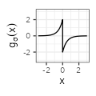
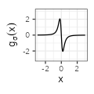

Period mixtures (draft)

f

<table border="0" cellspacing="0" cellpadding="0">
<tbody>
<tr>
<td align="center">$$\text{type}$$</td>
<td>$$~~~~~~~~~~~f_{\sigma}(x)~~~~~~~~~~~$$</td>
<td>$$~~~~~~~~~~~g_{\sigma}(x)~~~~~~~~~~~$$</td>
<td>$$~~~~~~~~~~~\mathcal{F}f_{\sigma}(\xi)~~~~~~~~~~~$$</td>
<td>$$~~~~~~~~~~~\mathcal{F}g_{\sigma}(\xi)~~~~~~~~~~~$$</td>
</tr>
<tr>
<td align="center">Linear</td>
<td align="center">$${\scriptstyle \sigma^{-1} \left( 1- \frac{|x|}{\sigma} \right) \mathbf{1}_{|x| \leq \sigma}}$$</td>
<td align="center">$${\scriptstyle - \text{sign}(x) \frac{1}{\sigma^2} \mathbf{1}_{|x| \leq \sigma}}$$</td>
<td align="center">$${\scriptstyle \text{sinc}^2(\sigma \xi)}$$</td>
<td align="center">$${\scriptstyle 2\pi i \xi \text{sinc}^2(\sigma \xi)}$$</td>
</tr>
<tr>
<td align="center">Exponential</td>
<td align="center">$${\scriptstyle \frac{1}{2\sigma} e^{-\frac{|x|}{\sigma}}}$$</td>
<td align="center">$${\scriptstyle - \text{sign}(x) \frac{1}{2 \sigma^2} e^{-\frac{|x|}{\sigma}}}$$</td>
<td align="center">$${\scriptstyle \frac{1}{1 + \left( 2 \pi \sigma \xi \right)^2}}$$</td>
<td align="center">$${\scriptstyle 2\pi i \xi \frac{1}{1 + \left( 2 \pi \sigma \xi \right)^2}}$$</td>
</tr>
<tr>
<td align="center">Polynomial</td>
<td align="center">$${\scriptstyle \sigma^{-1} \pi^{-1} \frac{1}{1 + \left( x/\sigma \right) ^2}}$$</td>
<td align="center">$${\scriptstyle -2 \sigma^{-3} \pi^{-1} \frac{1}{\left( 1 + \left( x/\sigma \right)^2 \right)^2} x}$$</td>
<td align="center">$${\scriptstyle e^{-2\pi \sigma |\xi|}}$$</td>
<td align="center">$${\scriptstyle 2\pi i \xi e^{-2\pi \sigma |\xi|}}$$</td>
</tr>
<tr>
<td align="center">Gaussian</td>
<td align="center">$${\scriptstyle \left( 2 \pi \right)^{-1/2} \sigma^{-1} e^{-\frac{x^2}{2\sigma^2}}}$$</td>
<td align="center">$${\scriptstyle - \left( 2 \pi \right)^{-1/2} \sigma^{-3} e^{-\frac{x^2}{2\sigma^2}} x}$$</td>
<td align="center">$${\scriptstyle e^{-\frac{(2 \pi \sigma \xi)^2}{2}}}$$</td>
<td align="center">$${\scriptstyle 2\pi i \xi e^{-\frac{(2 \pi \sigma \xi)^2}{2}}}$$</td>
</tr>
<tr>
<td align="center">Sinc</td>
<td align="center">$${\scriptstyle \pi^{-1} x^{-1} \sin (x / \sigma)}$$</td>
<td align="center">$${\scriptstyle \frac{x \cos \left(  x / \sigma \right) - \sigma \sin \left( x / \sigma \right)}{\sigma \pi x^{2} }}$$</td>
<td align="center">$${\scriptstyle \mathbf{1}_{\xi \in \left[ -\frac{1}{2 \pi \sigma}, \frac{1}{2 \pi \sigma} \right]}}$$</td>
<td align="center">$${\scriptstyle 2 \pi i \xi \mathbf{1}_{\xi \in \left[ -\frac{1}{2 \pi \sigma}, \frac{1}{2 \pi \sigma} \right]}}$$</td>
</tr>
</tbody>
</table>

